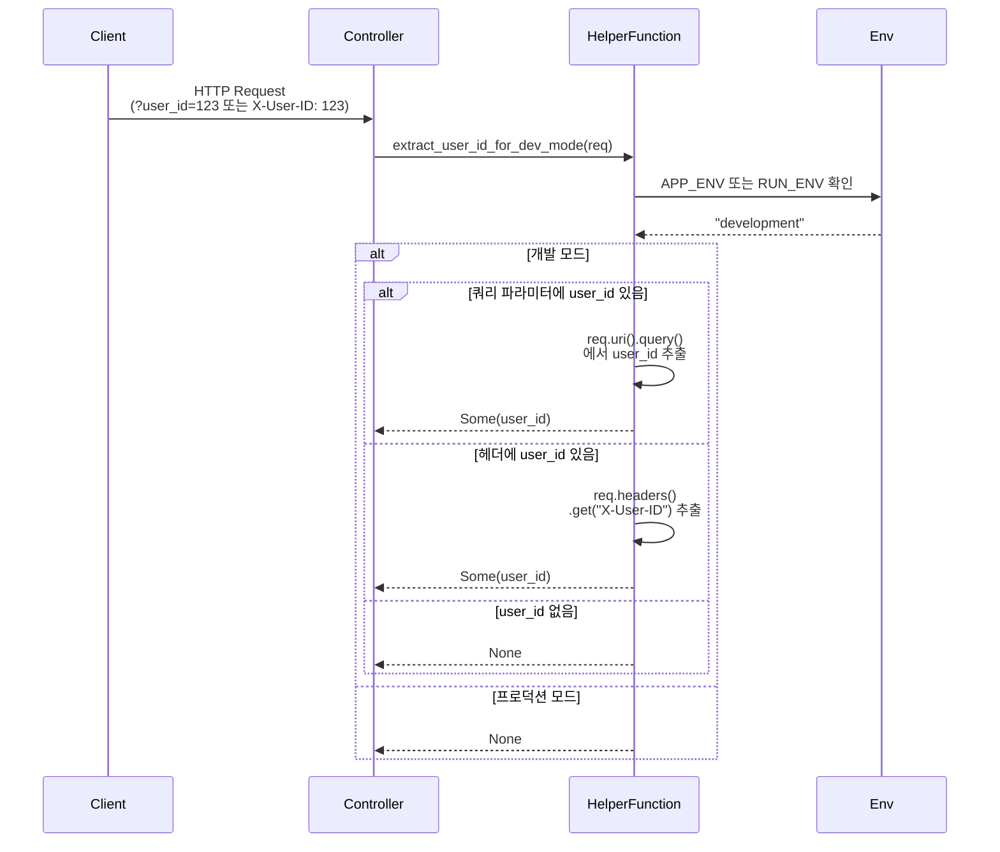
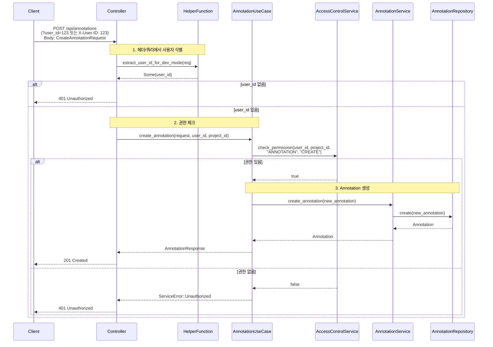
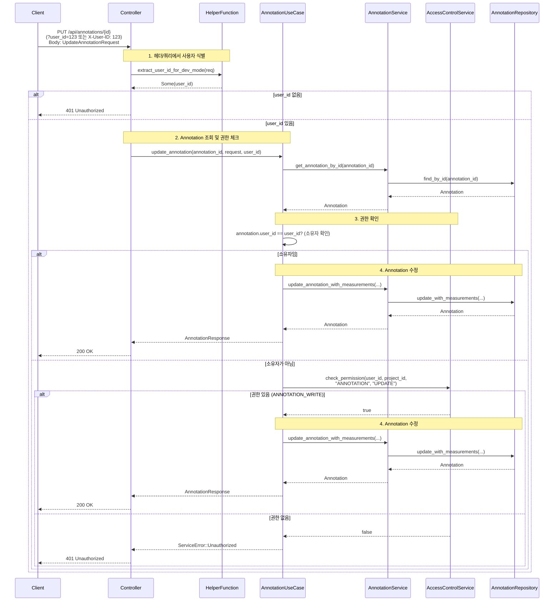
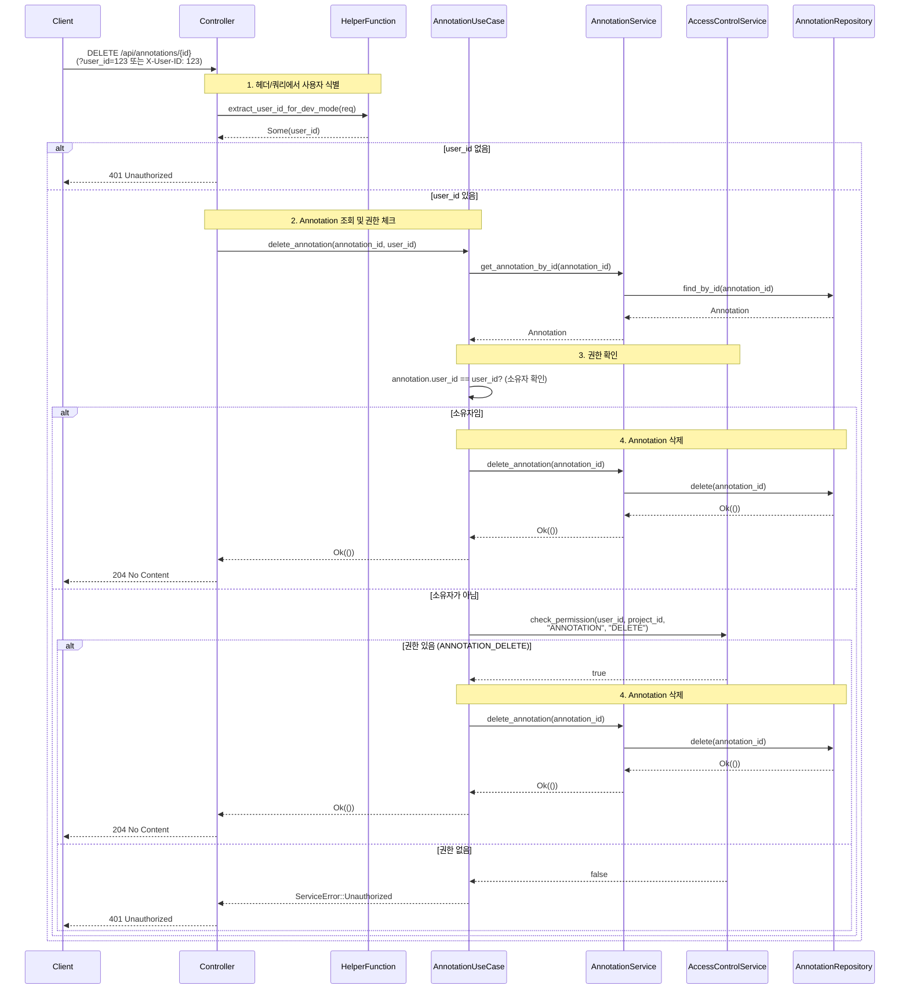
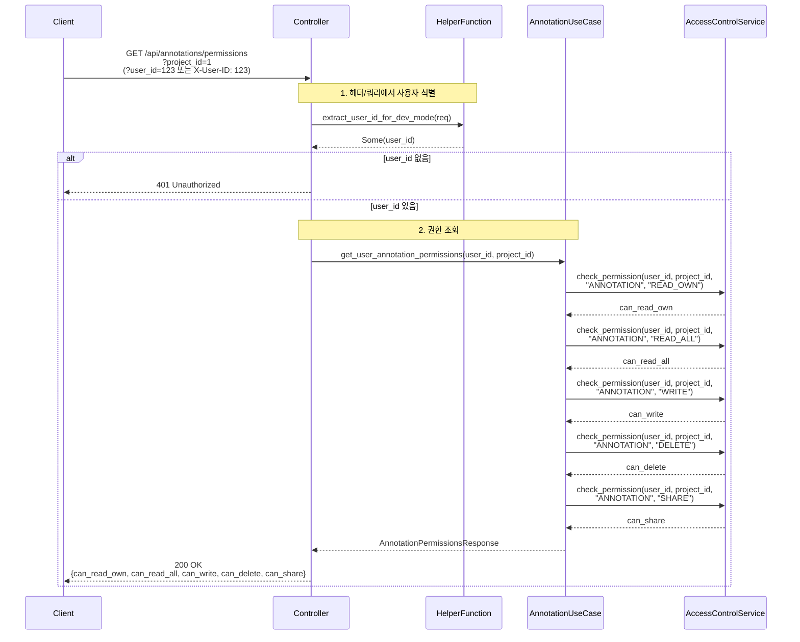

<!-- 3042b81c-de6e-4989-8795-a5a696c4e800 d1fec80b-f59d-462d-9687-ba1731edd9ba -->
# Annotation 권한 관리 구현 계획

> **전략**: 2단계 접근 방식
> - **Phase 1 (현재 작업)**: 간단한 헬퍼 함수로 시작 (빠른 구현)
> - **Phase 2 (미래 확장)**: AuthenticatedUser Extractor로 확장 (확장성 확보)

## 1. 개발 모드 user_id 추출 헬퍼 함수 (Phase 1)

### 1.1 헬퍼 함수 생성

- **파일**: `pacs-server/src/presentation/controllers/annotation_controller.rs`
- **함수명**: `AnnotationController::extract_user_id_for_dev_mode()`
- **내용**:
  - 개발 모드에서만 동작 (`APP_ENV=development` 또는 `RUN_ENV=development`)
  - 쿼리 파라미터 `?user_id=xxx` 또는 헤더 `X-User-ID: xxx`에서 `user_id` 추출
  - 프로덕션 모드에서는 `None` 반환
  - 우선순위: 쿼리 파라미터 → 헤더
  - 반환 타입: `Option<i32>`

### 1.2 구현 세부사항

#### 1.2.1 개발 모드 확인
- `std::env::var("APP_ENV")` 또는 `std::env::var("RUN_ENV")` 확인
- 값이 `"development"`일 때만 허용

#### 1.2.2 쿼리 파라미터 추출
- `HttpRequest.uri().query()`에서 `user_id` 파라미터 추출
- `parse::<i32>()`로 변환

#### 1.2.3 헤더 추출
- `HttpRequest.headers().get("X-User-ID")`에서 추출
- `to_str()` 후 `parse::<i32>()`로 변환

### 1.3 시퀀스 다이어그램

### 1.4 미래 확장 계획 (Phase 2)

> **참고**: Phase 2에서는 이 헬퍼 함수를 `AuthenticatedUser` Extractor로 확장할 예정입니다.
> - 내부 JWT 토큰 검증 추가
> - SSO 인증 서버 연동 추가
> - 컨트롤러 코드 변경 최소화 (헬퍼 함수 호출 → Extractor 사용으로 변경)

## 2. Annotation 생성 권한 제어

### 2.1 Controller 수정

- **파일**: `pacs-server/src/presentation/controllers/annotation_controller.rs`
- **변경사항**:
  - `create_annotation` 함수에서 `extract_user_id_for_dev_mode()` 호출
  - 하드코딩된 `user_id` 제거 (line 62)
  - 헬퍼 함수에서 `user_id` 추출
  - `user_id`가 `None`이면 `401 Unauthorized` 반환

### 2.2 헤더에서 사용자 식별

- **과정**: 
  1. `extract_user_id_for_dev_mode()` 호출하여 개발 모드에서 `user_id` 추출
  2. 개발 모드가 아니거나 `user_id`가 없으면 `401 Unauthorized` 반환
  3. Controller에서 추출한 `user_id`를 UseCase에 전달

### 2.3 UseCase 수정

- **파일**: `pacs-server/src/application/use_cases/annotation_use_case.rs`
- **변경사항**:
  - `create_annotation` 메서드에 `user_id: i32` 파라미터 추가
  - 권한 체크 로직 추가
  - `AccessControlService.check_permission(user_id, project_id, "ANNOTATION", "CREATE")` 호출
  - 권한 없으면 `ServiceError::Unauthorized` 반환

### 2.4 권한 체크 로직

- **필요 권한**: `ANNOTATION:CREATE` 또는 `ANNOTATION_WRITE` capability
- **체크 위치**: UseCase 레이어에서 비즈니스 로직 실행 전

### 2.5 시퀀스 다이어그램

## 3. Annotation 수정 권한 제어

### 3.1 Controller 수정

- **파일**: `pacs-server/src/presentation/controllers/annotation_controller.rs`
- **변경사항**:
  - `update_annotation` 함수에서 `extract_user_id_for_dev_mode()` 호출
  - 헬퍼 함수에서 `user_id` 추출
  - `user_id`가 `None`이면 `401 Unauthorized` 반환

### 3.2 헤더에서 사용자 식별

- **과정**: 
  1. `extract_user_id_for_dev_mode()` 호출하여 개발 모드에서 `user_id` 추출
  2. 개발 모드가 아니거나 `user_id`가 없으면 `401 Unauthorized` 반환
  3. Controller에서 추출한 `user_id`를 UseCase에 전달

### 3.3 UseCase 수정

- **파일**: `pacs-server/src/application/use_cases/annotation_use_case.rs`
- **변경사항**:
  - `update_annotation` 메서드에 `user_id: i32` 파라미터 추가
  - 권한 체크 로직 추가
  - Annotation 소유자 확인 또는 `ANNOTATION:UPDATE` 권한 확인
  - 소유자이거나 `ANNOTATION_WRITE` capability가 있으면 허용
  - 권한 없으면 `ServiceError::Unauthorized` 반환

### 3.4 권한 체크 로직

- **소유자**: Annotation의 `user_id`와 요청한 사용자의 `user_id`가 일치
- **권한**: `ANNOTATION:UPDATE` 또는 `ANNOTATION_WRITE` capability
- **우선순위**: 소유자 확인 → 권한 확인

### 3.5 시퀀스 다이어그램

## 4. Annotation 삭제 권한 제어

### 4.1 Controller 수정

- **파일**: `pacs-server/src/presentation/controllers/annotation_controller.rs`
- **변경사항**:
  - `delete_annotation` 함수에서 `extract_user_id_for_dev_mode()` 호출
  - 헬퍼 함수에서 `user_id` 추출
  - `user_id`가 `None`이면 `401 Unauthorized` 반환

### 4.2 헤더에서 사용자 식별

- **과정**: 
  1. `extract_user_id_for_dev_mode()` 호출하여 개발 모드에서 `user_id` 추출
  2. 개발 모드가 아니거나 `user_id`가 없으면 `401 Unauthorized` 반환
  3. Controller에서 추출한 `user_id`를 UseCase에 전달

### 4.3 UseCase 수정

- **파일**: `pacs-server/src/application/use_cases/annotation_use_case.rs`
- **변경사항**:
  - `delete_annotation` 메서드에 `user_id: i32` 파라미터 추가
  - 권한 체크 로직 추가
  - Annotation 소유자 확인 또는 `ANNOTATION:DELETE` 권한 확인
  - 소유자이거나 `ANNOTATION_DELETE` capability가 있으면 허용
  - 권한 없으면 `ServiceError::Unauthorized` 반환

### 4.4 권한 체크 로직

- **소유자**: Annotation의 `user_id`와 요청한 사용자의 `user_id`가 일치
- **권한**: `ANNOTATION:DELETE` 또는 `ANNOTATION_DELETE` capability
- **우선순위**: 소유자 확인 → 권한 확인

### 4.5 시퀀스 다이어그램

## 5. 사용자 Annotation 권한 조회 API

### 5.1 DTO 추가

- **파일**: `pacs-server/src/application/dto/annotation_dto.rs`
- **내용**:
  - `AnnotationPermissionsResponse` 구조체 추가
  - 필드: `can_read_own`, `can_read_all`, `can_write`, `can_delete`, `can_share`
  - `#[derive(Serialize, ToSchema)]` 추가

### 5.2 UseCase 메서드 추가

- **파일**: `pacs-server/src/application/use_cases/annotation_use_case.rs`
- **내용**:
  - `get_user_annotation_permissions(user_id: i32, project_id: i32)` 메서드 추가
  - `AccessControlService`를 사용하여 각 권한 확인
  - 권한별 capability 체크:
    - `can_read_own`: `ANNOTATION_READ_OWN`
    - `can_read_all`: `ANNOTATION_READ_ALL`
    - `can_write`: `ANNOTATION_WRITE`
    - `can_delete`: `ANNOTATION_DELETE`
    - `can_share`: `ANNOTATION_SHARE` (선택사항)

### 5.3 Controller 엔드포인트 추가

- **파일**: `pacs-server/src/presentation/controllers/annotation_controller.rs`
- **내용**:
  - `GET /api/annotations/permissions?project_id={project_id}` 엔드포인트 추가
  - `extract_user_id_for_dev_mode()` 호출하여 `user_id` 추출
  - `user_id`가 `None`이면 `401 Unauthorized` 반환
  - UseCase 메서드 호출하여 권한 정보 반환
  - OpenAPI 문서화 추가

### 5.4 시퀀스 다이어그램

## 6. 설정 및 환경 변수

### 6.1 개발 모드 감지

- **방법**: `APP_ENV` 또는 `RUN_ENV` 환경 변수 확인
- **기본값**: `"development"`일 때만 bypass 허용
- **구현 위치**: `annotation_controller.rs`의 `extract_user_id_for_dev_mode()` 함수 내부

## 7. 에러 처리

### 7.1 권한 없음 에러

- **에러 타입**: `ServiceError::Unauthorized`
- **HTTP 상태 코드**: `401 Unauthorized`
- **응답 형식**: `{"error": "Unauthorized", "message": "Insufficient permissions"}`

### 7.2 user_id 없음 에러

- **조건**: 개발 모드가 아니거나 헤더/쿼리에서 `user_id`를 추출할 수 없을 때
- **HTTP 상태 코드**: `401 Unauthorized`
- **응답 형식**: `{"error": "Unauthorized", "message": "User ID is required"}`

## 8. 테스트

### 8.1 단위 테스트

- `extract_user_id_for_dev_mode()` 헬퍼 함수 테스트 (개발 모드 bypass 테스트 포함)
- UseCase 권한 체크 로직 테스트

### 8.2 통합 테스트

- Annotation 생성/수정/삭제 권한 체크 테스트
- 권한 조회 API 테스트
- 개발 모드 bypass 테스트

## 주요 변경 파일 목록

1. `pacs-server/src/presentation/controllers/annotation_controller.rs` (수정)
   - `extract_user_id_for_dev_mode()` 헬퍼 함수 추가
   - `create_annotation`, `update_annotation`, `delete_annotation` 수정
   - `get_annotation_permissions` 엔드포인트 추가
2. `pacs-server/src/application/use_cases/annotation_use_case.rs` (수정)
   - `create_annotation`, `update_annotation`, `delete_annotation`에 `user_id` 파라미터 추가 및 권한 체크
   - `get_user_annotation_permissions` 메서드 추가
3. `pacs-server/src/application/dto/annotation_dto.rs` (수정)
   - `AnnotationPermissionsResponse` 구조체 추가

## 구현 순서

1. 개발 모드 user_id 추출 헬퍼 함수 구현 (Phase 1)
2. Annotation 생성 권한 제어
3. Annotation 수정 권한 제어
4. Annotation 삭제 권한 제어
5. 사용자 권한 조회 API
6. 테스트 작성

## Phase 2 확장 계획 (미래)

### AuthenticatedUser Extractor 구현

- **파일**: `pacs-server/src/presentation/extractors/auth_extractor.rs` (신규)
- **내용**:
  - `AuthenticatedUser` 구조체 정의 (Claims 포함)
  - `FromRequest` trait 구현하여 HttpRequest에서 자동 추출
  - 개발 모드일 때 쿼리 파라미터 `?user_id=xxx`로 bypass 지원 (Phase 1 헬퍼 함수 로직 재사용)
  - 내부 JWT 토큰 검증 추가
  - SSO 인증 서버 연동 추가
- **마이그레이션**: 컨트롤러에서 헬퍼 함수 호출 → `AuthenticatedUser` Extractor 사용으로 변경