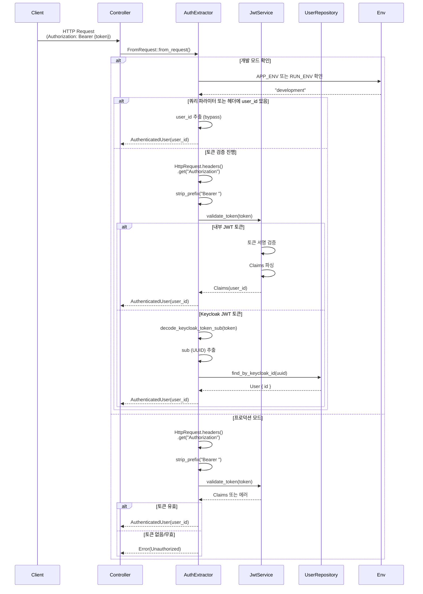
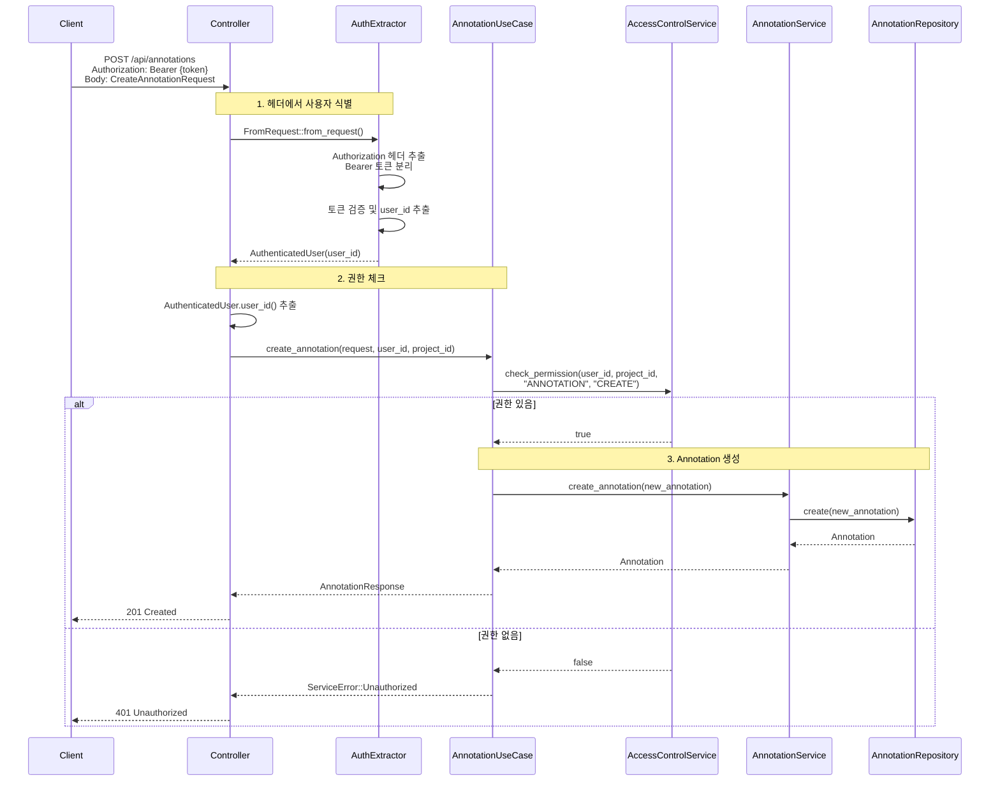
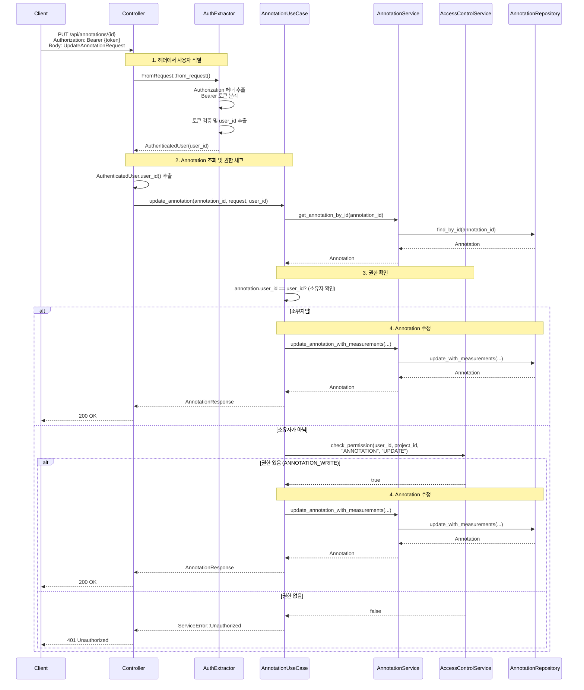

<!-- 3042b81c-de6e-4989-8795-a5a696c4e800 abb28ac6-826b-4c1b-9e84-2c3846bb2b84 -->
# Annotation 권한 관리 구현 계획

## 1. 인증 토큰에서 사용자 식별 정보 추출

### 1.1 AuthenticatedUser Extractor 생성

- **파일**: `pacs-server/src/presentation/extractors/auth_extractor.rs` (신규)
- **내용**:
  - `AuthenticatedUser` 구조체 정의 (Claims 포함)
  - `FromRequest` trait 구현하여 HttpRequest에서 자동 추출
  - 개발 모드일 때 쿼리 파라미터 `?user_id=xxx`로 bypass 지원
  - 개발 모드 감지: `APP_ENV=development` 또는 `RUN_ENV=development` 확인

### 1.2 헤더에서 토큰 추출 및 검증 과정

#### 1.2.1 Authorization 헤더 추출

- `HttpRequest.headers().get("Authorization")` 사용
- 헤더가 없으면 `None` 반환

#### 1.2.2 Bearer 토큰 분리

- 헤더 값 형식: `"Bearer {token}"`
- `strip_prefix("Bearer ")`로 토큰 문자열 추출
- Bearer 접두사가 없으면 에러 반환

#### 1.2.3 토큰 검증

- `JwtService.validate_token(token)` 호출
- 내부 JWT 토큰인 경우: Claims에서 `user_id()` 추출
- Keycloak 토큰인 경우: `decode_keycloak_token_sub()`로 `sub` 추출 후 DB 조회

#### 1.2.4 사용자 ID 매핑

- 내부 JWT: Claims에서 직접 `user_id` 추출
- Keycloak JWT: `sub` (UUID) → `UserRepository.find_by_keycloak_id()` → `user.id`

### 1.3 개발 모드 Bypass 로직

- **조건**: 
  - `APP_ENV=development` 또는 `RUN_ENV=development`일 때만 허용
  - 쿼리 파라미터 `?user_id=xxx` 또는 헤더 `X-User-Id: xxx`로 전달 가능
- **구현 위치**: `auth_extractor.rs`의 `FromRequest` 구현 내부
- **우선순위**: 

  1. 개발 모드 + 쿼리 파라미터/헤더로 전달된 `user_id` (개발 모드일 때만)
  2. Authorization 헤더에서 추출한 토큰 검증
  3. 토큰이 없거나 유효하지 않으면 에러 반환

### 1.4 시퀀스 다이어그램

## 2. Annotation 생성 권한 제어

### 2.1 Controller 수정

- **파일**: `pacs-server/src/presentation/controllers/annotation_controller.rs`
- **변경사항**:
  - `create_annotation` 함수에 `AuthenticatedUser` 파라미터 추가
  - 하드코딩된 `user_id` 제거 (line 62)
  - `AuthenticatedUser`에서 `user_id` 추출

### 2.2 헤더에서 사용자 식별

- **과정**: 

  1. HTTP 요청의 `Authorization` 헤더에서 토큰 추출
  2. `AuthenticatedUser` Extractor가 자동으로 토큰 검증 및 사용자 식별
  3. Controller에서 `AuthenticatedUser.user_id()`로 사용자 ID 획득

- **구현**: `AuthenticatedUser` Extractor가 `FromRequest` trait으로 자동 처리

### 2.3 UseCase 수정

- **파일**: `pacs-server/src/application/use_cases/annotation_use_case.rs`
- **변경사항**:
  - `create_annotation` 메서드에 권한 체크 로직 추가
  - `AccessControlService.check_permission(user_id, project_id, "ANNOTATION", "CREATE")` 호출
  - 권한 없으면 `ServiceError::Unauthorized` 반환

### 2.4 권한 체크 로직

- **필요 권한**: `ANNOTATION:CREATE` 또는 `ANNOTATION_WRITE` capability
- **체크 위치**: UseCase 레이어에서 비즈니스 로직 실행 전

### 2.5 시퀀스 다이어그램

## 3. Annotation 수정 권한 제어

### 3.1 Controller 수정

- **파일**: `pacs-server/src/presentation/controllers/annotation_controller.rs`
- **변경사항**:
  - `update_annotation` 함수에 `AuthenticatedUser` 파라미터 추가 (line 987)
  - `user_id` 추출

### 3.2 헤더에서 사용자 식별

- **과정**: 

  1. HTTP 요청의 `Authorization` 헤더에서 토큰 추출
  2. `AuthenticatedUser` Extractor가 자동으로 토큰 검증 및 사용자 식별
  3. Controller에서 `AuthenticatedUser.user_id()`로 사용자 ID 획득

- **구현**: `AuthenticatedUser` Extractor가 `FromRequest` trait으로 자동 처리

### 3.3 UseCase 수정

- **파일**: `pacs-server/src/application/use_cases/annotation_use_case.rs`
- **변경사항**:
  - `update_annotation` 메서드에 권한 체크 로직 추가
  - Annotation 소유자 확인 또는 `ANNOTATION:UPDATE` 권한 확인
  - 소유자이거나 `ANNOTATION_WRITE` capability가 있으면 허용
  - 권한 없으면 `ServiceError::Unauthorized` 반환

### 3.4 권한 체크 로직

- **소유자**: Annotation의 `user_id`와 요청한 사용자의 `user_id`가 일치
- **권한**: `ANNOTATION:UPDATE` 또는 `ANNOTATION_WRITE` capability
- **우선순위**: 소유자 확인 → 권한 확인

### 3.5 시퀀스 다이어그램

## 4. Annotation 삭제 권한 제어

### 4.1 Controller 수정

- **파일**: `pacs-server/src/presentation/controllers/annotation_controller.rs`
- **변경사항**:
- `delete_annotation` 함수에 `AuthenticatedUser` 파라미터 추가 (line 1042)
- `user_id` 추출

### 4.2 UseCase 수정

- **파일**: `pacs-server/src/application/use_cases/annotation_use_case.rs`
- **변경사항**:
- `delete_annotation` 메서드에 권한 체크 로직 추가
- Annotation 소유자 확인 또는 `ANNOTATION:DELETE` 권한 확인
- 소유자이거나 `ANNOTATION_DELETE` capability가 있으면 허용
- 권한 없으면 `ServiceError::Unauthorized` 반환

### 4.3 권한 체크 로직

- **소유자**: Annotation의 `user_id`와 요청한 사용자의 `user_id`가 일치
- **권한**: `ANNOTATION:DELETE` 또는 `ANNOTATION_DELETE` capability
- **우선순위**: 소유자 확인 → 권한 확인

## 5. 사용자 Annotation 권한 조회 API

### 5.1 DTO 추가

- **파일**: `pacs-server/src/application/dto/annotation_dto.rs`
- **내용**:
- `AnnotationPermissionsResponse` 구조체 추가
- 필드: `can_read_own`, `can_read_all`, `can_write`, `can_delete`, `can_share`

### 5.2 UseCase 메서드 추가

- **파일**: `pacs-server/src/application/use_cases/annotation_use_case.rs`
- **내용**:
- `get_user_annotation_permissions(user_id: i32, project_id: i32)` 메서드 추가
- `AccessControlService`를 사용하여 각 권한 확인
- 권한별 capability 체크:
  - `can_read_own`: `ANNOTATION_READ_OWN`
  - `can_read_all`: `ANNOTATION_READ_ALL`
  - `can_write`: `ANNOTATION_WRITE`
  - `can_delete`: `ANNOTATION_DELETE`
  - `can_share`: `ANNOTATION_SHARE` (선택사항)

### 5.3 Controller 엔드포인트 추가

- **파일**: `pacs-server/src/presentation/controllers/annotation_controller.rs`
- **내용**:
- `GET /api/annotations/permissions?project_id={project_id}` 엔드포인트 추가
- `AuthenticatedUser`에서 `user_id` 추출
- UseCase 메서드 호출하여 권한 정보 반환
- OpenAPI 문서화 추가

## 6. 설정 및 환경 변수

### 6.1 개발 모드 감지

- **방법**: `APP_ENV` 또는 `RUN_ENV` 환경 변수 확인
- **기본값**: `development`일 때만 bypass 허용
- **구현 위치**: `auth_extractor.rs`에서 `std::env::var("APP_ENV")` 또는 `std::env::var("RUN_ENV")` 확인

## 7. 에러 처리

### 7.1 권한 없음 에러

- **에러 타입**: `ServiceError::Unauthorized`
- **HTTP 상태 코드**: `401 Unauthorized`
- **응답 형식**: `{"error": "Unauthorized", "message": "Insufficient permissions"}`

### 7.2 인증 실패 에러

- **에러 타입**: `AuthError::MissingToken` 또는 `AuthError::InvalidToken`
- **HTTP 상태 코드**: `401 Unauthorized`
- **응답 형식**: `{"error": "Unauthorized", "message": "Missing or invalid token"}`

## 8. 테스트

### 8.1 단위 테스트

- `auth_extractor.rs` 테스트 (개발 모드 bypass 테스트 포함)
- UseCase 권한 체크 로직 테스트

### 8.2 통합 테스트

- Annotation 생성/수정/삭제 권한 체크 테스트
- 권한 조회 API 테스트
- 개발 모드 bypass 테스트

## 주요 변경 파일 목록

1. `pacs-server/src/presentation/extractors/auth_extractor.rs` (신규)
2. `pacs-server/src/presentation/extractors/mod.rs` (신규)
3. `pacs-server/src/presentation/controllers/annotation_controller.rs` (수정)
4. `pacs-server/src/application/use_cases/annotation_use_case.rs` (수정)
5. `pacs-server/src/application/dto/annotation_dto.rs` (수정)
6. `pacs-server/src/presentation/mod.rs` (수정 - extractors 모듈 export)
7. `pacs-server/src/main.rs` (수정 - extractors 모듈 등록)

## 구현 순서

1. AuthenticatedUser Extractor 구현 (개발 모드 bypass 포함)
2. Annotation 생성 권한 제어
3. Annotation 수정 권한 제어
4. Annotation 삭제 권한 제어
5. 사용자 권한 조회 API
6. 테스트 작성

### To-dos

- [ ] AuthenticatedUser Extractor 구현 - 개발 모드에서 쿼리 파라미터로 user_id bypass 지원
- [ ] Annotation 생성 권한 제어 추가 - Controller와 UseCase에 권한 체크 로직 추가
- [ ] Annotation 수정 권한 제어 추가 - 소유자 또는 ANNOTATION_WRITE 권한 확인
- [ ] Annotation 삭제 권한 제어 추가 - 소유자 또는 ANNOTATION_DELETE 권한 확인
- [ ] 사용자 Annotation 권한 조회 API 구현 - GET /api/annotations/permissions 엔드포인트 추가
- [ ] 권한 제어 통합 테스트 작성 - 생성/수정/삭제 권한 체크 및 개발 모드 bypass 테스트