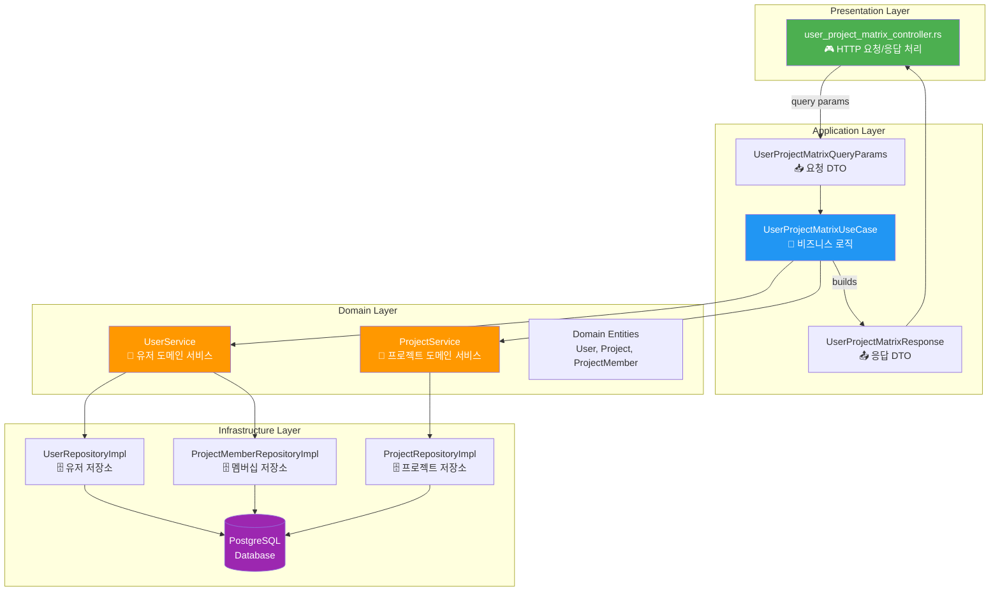

# 아키텍처 다이어그램

## 🏗️ User-Project Matrix API 아키텍처

이 다이어그램은 Clean Architecture 기반의 레이어 구조를 보여줍니다.



## 📚 레이어별 상세 설명

### 1. Presentation Layer (표현 계층)

**역할**: HTTP 요청/응답 처리

**파일**: `pacs-server/src/presentation/controllers/user_project_matrix_controller.rs`

**책임**:
- HTTP 요청 파싱
- 쿼리 파라미터 검증
- HTTP 응답 생성 (JSON)
- 에러 핸들링 (500 Internal Server Error)

**코드 예시**:
```rust
pub async fn get_matrix<U, P>(
    query: web::Query<UserProjectMatrixQueryParams>,
    use_case: web::Data<Arc<UserProjectMatrixUseCase<U, P>>>,
) -> impl Responder
where
    U: UserService,
    P: ProjectService,
{
    match use_case.get_matrix(query.into_inner()).await {
        Ok(response) => HttpResponse::Ok().json(response),
        Err(e) => HttpResponse::InternalServerError().json(json!({
            "error": format!("Failed to get matrix: {}", e)
        })),
    }
}
```

---

### 2. Application Layer (응용 계층)

**역할**: 비즈니스 로직 조율

**파일**: `pacs-server/src/application/use_cases/user_project_matrix_use_case.rs`

**책임**:
- 비즈니스 로직 실행
- 여러 도메인 서비스 조율
- DTO 변환 (Domain Entity → Response DTO)
- 트랜잭션 관리 (필요 시)

**주요 로직**:
1. 파라미터 기본값 설정 및 검증
2. 유저/프로젝트 병렬 조회 (`tokio::try_join!`)
3. 멤버십 일괄 조회
4. 매트릭스 구조 생성
5. 페이지네이션 정보 계산

**코드 예시**:
```rust
pub async fn get_matrix(
    &self,
    params: UserProjectMatrixQueryParams,
) -> Result<UserProjectMatrixResponse, ServiceError> {
    // 1. 파라미터 기본값 설정
    let user_page = params.user_page.unwrap_or(1);
    let user_page_size = params.user_page_size.unwrap_or(10).min(50);
    
    // 2. 병렬 조회
    let ((users, user_total_count), (projects, project_total_count)) = 
        tokio::try_join!(
            self.user_service.get_users_with_sorting(...),
            self.project_service.get_projects_with_status_filter(...)
        )?;
    
    // 3. 멤버십 일괄 조회
    let memberships = self.user_service
        .get_memberships_batch(&user_ids, &project_ids)
        .await?;
    
    // 4. 매트릭스 구조 생성
    let matrix_rows = build_matrix(users, projects, memberships);
    
    // 5. 응답 생성
    Ok(UserProjectMatrixResponse {
        matrix: matrix_rows,
        projects: project_infos,
        pagination: calculate_pagination(...),
    })
}
```

---

### 3. Domain Layer (도메인 계층)

**역할**: 핵심 비즈니스 규칙

**파일**:
- `pacs-server/src/domain/services/user_service.rs`
- `pacs-server/src/domain/services/project_service.rs`

**책임**:
- 도메인 로직 캡슐화
- 엔티티 생성/수정 규칙
- 비즈니스 규칙 검증

**UserService 주요 메서드**:
```rust
pub trait UserService: Send + Sync {
    async fn get_users_with_sorting(
        &self,
        page: i32,
        page_size: i32,
        sort_by: &str,
        sort_order: &str,
        search: Option<&str>,
        user_ids: Option<&[i32]>,
    ) -> Result<(Vec<User>, i64), ServiceError>;
    
    async fn get_memberships_batch(
        &self,
        user_ids: &[i32],
        project_ids: &[i32],
    ) -> Result<HashMap<(i32, i32), MembershipInfo>, ServiceError>;
}
```

**ProjectService 주요 메서드**:
```rust
pub trait ProjectService: Send + Sync {
    async fn get_projects_with_status_filter(
        &self,
        status: Option<ProjectStatus>,
        project_ids: Option<Vec<i32>>,
        page: i32,
        page_size: i32,
    ) -> Result<(Vec<Project>, i64), ServiceError>;
}
```

---

### 4. Infrastructure Layer (인프라 계층)

**역할**: 외부 시스템 연동 (DB, 파일, API 등)

**파일**:
- `pacs-server/src/infrastructure/repositories/user_repository_impl.rs`
- `pacs-server/src/infrastructure/repositories/project_repository_impl.rs`
- `pacs-server/src/infrastructure/repositories/project_member_repository_impl.rs`

**책임**:
- 데이터베이스 쿼리 실행
- SQL 작성 및 최적화
- 연결 풀 관리
- 트랜잭션 처리

**코드 예시**:
```rust
impl UserRepository for UserRepositoryImpl {
    async fn find_with_sorting(
        &self,
        page: i32,
        page_size: i32,
        sort_by: &str,
        sort_order: &str,
        search: Option<&str>,
    ) -> Result<Vec<User>, sqlx::Error> {
        let offset = (page - 1) * page_size;
        
        let query = format!(
            "SELECT id, username, email, full_name, created_at
             FROM security_user
             WHERE ($1::text IS NULL OR username ILIKE $1 OR email ILIKE $1)
             ORDER BY {} {}
             LIMIT $2 OFFSET $3",
            sort_by, sort_order
        );
        
        sqlx::query_as::<_, User>(&query)
            .bind(search.map(|s| format!("%{}%", s)))
            .bind(page_size)
            .bind(offset)
            .fetch_all(&self.pool)
            .await
    }
}
```

---

## 🔄 데이터 흐름

### 요청 → 응답 흐름

```
1. HTTP Request
   ↓
2. Controller (Presentation)
   - 쿼리 파라미터 파싱
   ↓
3. DTO (Application)
   - UserProjectMatrixQueryParams
   ↓
4. UseCase (Application)
   - 비즈니스 로직 실행
   ↓
5. Services (Domain)
   - UserService, ProjectService
   ↓
6. Repositories (Infrastructure)
   - UserRepository, ProjectRepository, ProjectMemberRepository
   ↓
7. Database (PostgreSQL)
   - SQL 쿼리 실행
   ↓
8. Domain Entities
   - User, Project, ProjectMember
   ↓
9. DTO (Application)
   - UserProjectMatrixResponse
   ↓
10. Controller (Presentation)
    - JSON 응답 생성
    ↓
11. HTTP Response
```

---

## 🎯 Clean Architecture 원칙

### 1. 의존성 규칙 (Dependency Rule)

**원칙**: 외부 레이어는 내부 레이어에 의존할 수 있지만, 내부 레이어는 외부 레이어에 의존하면 안 됨

```
Presentation → Application → Domain ← Infrastructure
```

- ✅ Controller는 UseCase에 의존
- ✅ UseCase는 Service에 의존
- ✅ Infrastructure는 Domain에 의존
- ❌ Domain은 Infrastructure에 의존하지 않음 (인터페이스 사용)

### 2. 인터페이스 분리 (Interface Segregation)

**원칙**: 도메인 레이어는 인터페이스(trait)만 정의하고, 구현은 인프라 레이어에서

```rust
// Domain Layer (인터페이스)
pub trait UserService: Send + Sync {
    async fn get_users(...) -> Result<Vec<User>, ServiceError>;
}

// Infrastructure Layer (구현)
pub struct UserServiceImpl {
    repository: Arc<dyn UserRepository>,
}

impl UserService for UserServiceImpl {
    async fn get_users(...) -> Result<Vec<User>, ServiceError> {
        // 구현
    }
}
```

### 3. 단일 책임 원칙 (Single Responsibility)

각 레이어는 하나의 책임만 가짐:

- **Presentation**: HTTP 처리
- **Application**: 비즈니스 로직 조율
- **Domain**: 핵심 비즈니스 규칙
- **Infrastructure**: 외부 시스템 연동

---

## 📦 파일 구조

```
pacs-server/src/
├── presentation/
│   └── controllers/
│       └── user_project_matrix_controller.rs  # HTTP 요청/응답
│
├── application/
│   ├── dto/
│   │   └── user_project_matrix_dto.rs         # DTO 정의
│   └── use_cases/
│       └── user_project_matrix_use_case.rs    # 비즈니스 로직
│
├── domain/
│   ├── entities/
│   │   ├── user.rs                            # User 엔티티
│   │   ├── project.rs                         # Project 엔티티
│   │   └── project_member.rs                  # ProjectMember 엔티티
│   ├── services/
│   │   ├── user_service.rs                    # UserService trait
│   │   └── project_service.rs                 # ProjectService trait
│   └── repositories/
│       ├── user_repository.rs                 # UserRepository trait
│       ├── project_repository.rs              # ProjectRepository trait
│       └── project_member_repository.rs       # ProjectMemberRepository trait
│
└── infrastructure/
    └── repositories/
        ├── user_repository_impl.rs            # UserRepository 구현
        ├── project_repository_impl.rs         # ProjectRepository 구현
        └── project_member_repository_impl.rs  # ProjectMemberRepository 구현
```

---

## 🔗 관련 문서

- [README](./README.md) - API 개요
- [처리 흐름 다이어그램](./sequence-diagram.md) - API 처리 흐름
- [데이터베이스 스키마](./database-schema.md) - DB 구조

