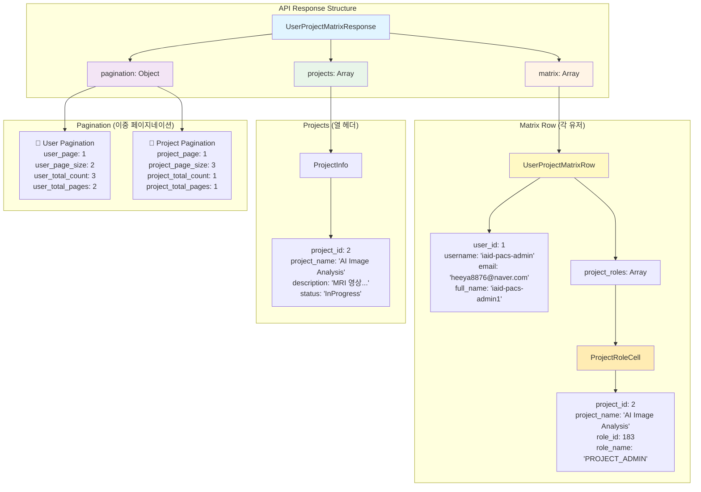

# 데이터 구조 다이어그램

## 📦 API 응답 데이터 구조

이 다이어그램은 User-Project Matrix API의 응답 데이터 구조를 시각화합니다.



## 📋 실제 응답 예시

```json
{
  "matrix": [
    {
      "user_id": 1,
      "username": "iaid-pacs-admin",
      "email": "heeya8876@naver.com",
      "full_name": "iaid-pacs-admin1",
      "project_roles": [
        {
          "project_id": 2,
          "project_name": "AI Image Analysis Project",
          "role_id": 183,
          "role_name": "PROJECT_ADMIN"
        }
      ]
    },
    {
      "user_id": 6,
      "username": "kukkuk989",
      "email": "kukkuk989@protonmail.com",
      "full_name": "정희수",
      "project_roles": [
        {
          "project_id": 2,
          "project_name": "AI Image Analysis Project",
          "role_id": 183,
          "role_name": "PROJECT_ADMIN"
        }
      ]
    }
  ],
  "projects": [
    {
      "project_id": 2,
      "project_name": "AI Image Analysis Project",
      "description": "MRI 영상 기반 병변 탐지 연구 프로젝트",
      "status": "InProgress"
    }
  ],
  "pagination": {
    "user_page": 1,
    "user_page_size": 2,
    "user_total_count": 3,
    "user_total_pages": 2,
    "project_page": 1,
    "project_page_size": 3,
    "project_total_count": 1,
    "project_total_pages": 1
  }
}
```

## 🔍 데이터 구조 설명

### 1. UserProjectMatrixResponse (최상위)

최상위 응답 객체로 3개의 주요 필드를 포함합니다:

- **matrix**: 유저별 프로젝트 역할 정보 (행 데이터)
- **projects**: 프로젝트 정보 목록 (열 헤더 데이터)
- **pagination**: 이중 페이지네이션 정보

### 2. Matrix (행 데이터)

각 행은 하나의 유저를 나타내며, 다음 정보를 포함합니다:

- **유저 기본 정보**: `user_id`, `username`, `email`, `full_name`
- **프로젝트 역할 목록**: `project_roles` 배열
  - 각 프로젝트에 대한 역할 정보 (ProjectRoleCell)
  - 역할이 없으면 `role_id: null`, `role_name: null`

### 3. Projects (열 헤더)

테이블의 열 헤더로 사용될 프로젝트 정보:

- **프로젝트 기본 정보**: `project_id`, `project_name`, `description`, `status`
- UI에서 열 헤더를 렌더링할 때 사용

### 4. Pagination (이중 페이지네이션)

유저와 프로젝트 각각의 페이지네이션 정보:

- **유저 페이지네이션**: `user_page`, `user_page_size`, `user_total_count`, `user_total_pages`
- **프로젝트 페이지네이션**: `project_page`, `project_page_size`, `project_total_count`, `project_total_pages`

## 🎨 UI 렌더링 예시

### HTML 테이블 구조

```html
<table>
  <thead>
    <tr>
      <th>User</th>
      <!-- projects 배열로 열 헤더 생성 -->
      <th>AI Image Analysis Project</th>
      <th>Medical Research Project</th>
    </tr>
  </thead>
  <tbody>
    <!-- matrix 배열로 행 생성 -->
    <tr>
      <td>iaid-pacs-admin</td>
      <!-- project_roles 배열로 셀 생성 -->
      <td>PROJECT_ADMIN</td>
      <td>(no role)</td>
    </tr>
    <tr>
      <td>kukkuk989</td>
      <td>MEMBER</td>
      <td>VIEWER</td>
    </tr>
  </tbody>
</table>
```

### React 컴포넌트 예시

```tsx
interface MatrixData {
  matrix: UserProjectMatrixRow[];
  projects: ProjectInfo[];
  pagination: UserProjectMatrixPagination;
}

function MatrixTable({ data }: { data: MatrixData }) {
  return (
    <table>
      <thead>
        <tr>
          <th>User</th>
          {data.projects.map(project => (
            <th key={project.project_id}>{project.project_name}</th>
          ))}
        </tr>
      </thead>
      <tbody>
        {data.matrix.map(row => (
          <tr key={row.user_id}>
            <td>{row.username}</td>
            {row.project_roles.map(cell => (
              <td key={cell.project_id}>
                {cell.role_name || '(no role)'}
              </td>
            ))}
          </tr>
        ))}
      </tbody>
    </table>
  );
}
```

## 💡 데이터 매핑 로직

### 1. 행-열 매핑

```typescript
// matrix의 각 행(유저)에 대해
for (const userRow of data.matrix) {
  // project_roles 배열의 순서는 projects 배열과 동일
  // project_roles[0] → projects[0]
  // project_roles[1] → projects[1]
  // ...
}
```

### 2. 역할 표시 로직

```typescript
function getRoleDisplay(cell: ProjectRoleCell): string {
  if (cell.role_id === null || cell.role_name === null) {
    return '(no role)';
  }
  return cell.role_name;
}
```

### 3. 셀 스타일링 로직

```typescript
function getCellStyle(cell: ProjectRoleCell): string {
  if (cell.role_name === 'PROJECT_ADMIN') return 'bg-red-100';
  if (cell.role_name === 'MEMBER') return 'bg-blue-100';
  if (cell.role_name === 'VIEWER') return 'bg-gray-100';
  return 'bg-white'; // no role
}
```

## 🔗 관련 문서

- [README](./README.md) - API 개요
- [처리 흐름 다이어그램](./sequence-diagram.md) - API 처리 흐름
- [클라이언트 가이드](./client-guide.md) - 클라이언트 구현 가이드

