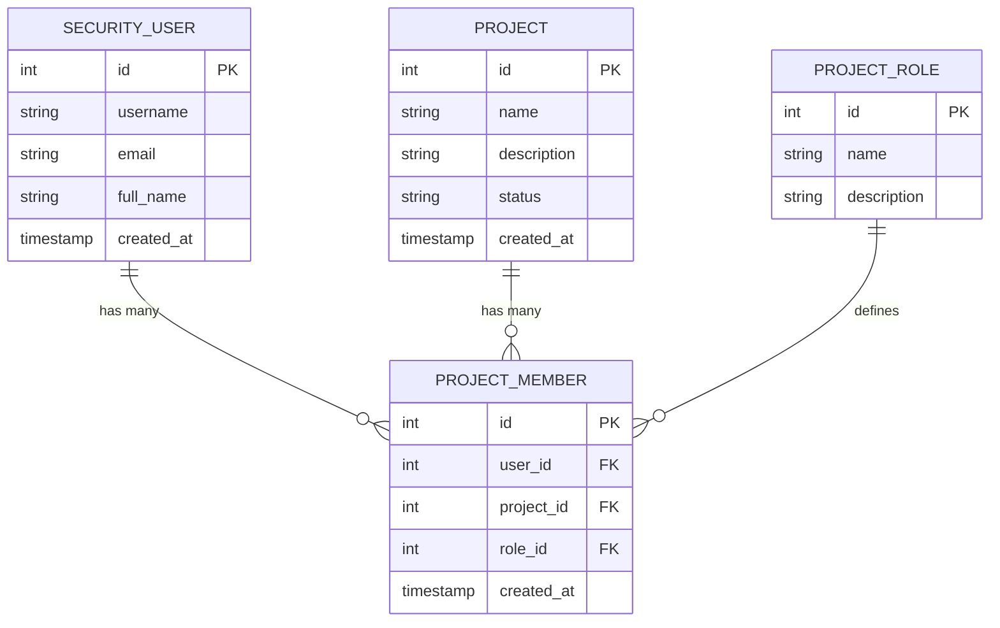

# 데이터베이스 스키마

## 🗄️ User-Project Matrix API 데이터베이스 구조

이 문서는 API가 사용하는 데이터베이스 테이블과 관계를 설명합니다.

## 📊 ERD (Entity Relationship Diagram)



---

## 📋 테이블 상세

### 1. security_user (유저 테이블)

**목적**: 시스템 사용자 정보 저장

| 컬럼명 | 타입 | 제약조건 | 설명 |
|--------|------|----------|------|
| `id` | INTEGER | PRIMARY KEY | 유저 고유 ID |
| `username` | VARCHAR(255) | UNIQUE, NOT NULL | 유저명 (로그인 ID) |
| `email` | VARCHAR(255) | UNIQUE, NOT NULL | 이메일 주소 |
| `full_name` | VARCHAR(255) | NULL | 실명 (선택사항) |
| `password_hash` | VARCHAR(255) | NOT NULL | 비밀번호 해시 |
| `is_active` | BOOLEAN | DEFAULT TRUE | 활성화 여부 |
| `created_at` | TIMESTAMP | DEFAULT NOW() | 생성 시간 |
| `updated_at` | TIMESTAMP | DEFAULT NOW() | 수정 시간 |

**인덱스**:
```sql
-- 기본 키
CREATE UNIQUE INDEX idx_security_user_id ON security_user(id);

-- 유니크 제약
CREATE UNIQUE INDEX idx_security_user_username ON security_user(username);
CREATE UNIQUE INDEX idx_security_user_email ON security_user(email);

-- 검색 최적화
CREATE INDEX idx_security_user_username_email ON security_user(username, email);

-- 정렬 최적화
CREATE INDEX idx_security_user_created_at ON security_user(created_at);
```

**샘플 데이터**:
```sql
INSERT INTO security_user (id, username, email, full_name) VALUES
(1, 'iaid-pacs-admin', 'heeya8876@naver.com', 'iaid-pacs-admin1'),
(6, 'kukkuk989', 'kukkuk989@protonmail.com', '정희수'),
(10, 'john_doe', 'john@example.com', 'John Doe');
```

---

### 2. project (프로젝트 테이블)

**목적**: 프로젝트 정보 저장

| 컬럼명 | 타입 | 제약조건 | 설명 |
|--------|------|----------|------|
| `id` | INTEGER | PRIMARY KEY | 프로젝트 고유 ID |
| `name` | VARCHAR(255) | NOT NULL | 프로젝트명 |
| `description` | TEXT | NULL | 프로젝트 설명 |
| `status` | VARCHAR(50) | NOT NULL | 프로젝트 상태 |
| `created_by` | INTEGER | FK → security_user(id) | 생성자 ID |
| `created_at` | TIMESTAMP | DEFAULT NOW() | 생성 시간 |
| `updated_at` | TIMESTAMP | DEFAULT NOW() | 수정 시간 |

**프로젝트 상태 (status)**:
- `Preparing`: 준비 중
- `InProgress`: 진행 중
- `Completed`: 완료
- `Archived`: 보관됨

**인덱스**:
```sql
-- 기본 키
CREATE UNIQUE INDEX idx_project_id ON project(id);

-- 상태 필터링 최적화
CREATE INDEX idx_project_status ON project(status);

-- 생성자 조회 최적화
CREATE INDEX idx_project_created_by ON project(created_by);
```

**샘플 데이터**:
```sql
INSERT INTO project (id, name, description, status) VALUES
(2, 'AI Image Analysis Project', 'MRI 영상 기반 병변 탐지 연구 프로젝트', 'InProgress'),
(3, 'Medical Research Project', '의료 영상 연구 프로젝트', 'Preparing'),
(5, 'CT Scan Analysis', 'CT 스캔 자동 분석 시스템', 'InProgress');
```

---

### 3. project_member (프로젝트 멤버 테이블)

**목적**: 유저-프로젝트-역할 관계 저장 (다대다 관계)

| 컬럼명 | 타입 | 제약조건 | 설명 |
|--------|------|----------|------|
| `id` | INTEGER | PRIMARY KEY | 멤버십 고유 ID |
| `user_id` | INTEGER | FK → security_user(id) | 유저 ID |
| `project_id` | INTEGER | FK → project(id) | 프로젝트 ID |
| `role_id` | INTEGER | FK → project_role(id) | 역할 ID |
| `created_at` | TIMESTAMP | DEFAULT NOW() | 생성 시간 |
| `updated_at` | TIMESTAMP | DEFAULT NOW() | 수정 시간 |

**제약조건**:
```sql
-- 유니크 제약 (한 유저는 한 프로젝트에 하나의 역할만 가질 수 있음)
ALTER TABLE project_member 
ADD CONSTRAINT uq_project_member_user_project 
UNIQUE (user_id, project_id);

-- 외래 키 제약
ALTER TABLE project_member 
ADD CONSTRAINT fk_project_member_user 
FOREIGN KEY (user_id) REFERENCES security_user(id) ON DELETE CASCADE;

ALTER TABLE project_member 
ADD CONSTRAINT fk_project_member_project 
FOREIGN KEY (project_id) REFERENCES project(id) ON DELETE CASCADE;

ALTER TABLE project_member 
ADD CONSTRAINT fk_project_member_role 
FOREIGN KEY (role_id) REFERENCES project_role(id) ON DELETE SET NULL;
```

**인덱스** (매우 중요!):
```sql
-- 복합 인덱스 (일괄 조회 최적화)
CREATE INDEX idx_project_member_user_project 
ON project_member(user_id, project_id);

-- 역할 조인 최적화
CREATE INDEX idx_project_member_role 
ON project_member(role_id);

-- 프로젝트별 멤버 조회 최적화
CREATE INDEX idx_project_member_project 
ON project_member(project_id);

-- 유저별 프로젝트 조회 최적화
CREATE INDEX idx_project_member_user 
ON project_member(user_id);
```

**샘플 데이터**:
```sql
INSERT INTO project_member (user_id, project_id, role_id) VALUES
(1, 2, 183),  -- iaid-pacs-admin → AI Image Analysis → PROJECT_ADMIN
(1, 3, 184),  -- iaid-pacs-admin → Medical Research → MEMBER
(6, 2, 183),  -- kukkuk989 → AI Image Analysis → PROJECT_ADMIN
(6, 5, 185),  -- kukkuk989 → CT Scan Analysis → VIEWER
(10, 3, 184); -- john_doe → Medical Research → MEMBER
```

---

### 4. project_role (역할 테이블)

**목적**: 프로젝트 역할 정의

| 컬럼명 | 타입 | 제약조건 | 설명 |
|--------|------|----------|------|
| `id` | INTEGER | PRIMARY KEY | 역할 고유 ID |
| `name` | VARCHAR(100) | UNIQUE, NOT NULL | 역할명 |
| `description` | TEXT | NULL | 역할 설명 |
| `permissions` | JSONB | NULL | 권한 목록 (JSON) |
| `created_at` | TIMESTAMP | DEFAULT NOW() | 생성 시간 |

**인덱스**:
```sql
-- 기본 키
CREATE UNIQUE INDEX idx_project_role_id ON project_role(id);

-- 역할명 조회 최적화
CREATE UNIQUE INDEX idx_project_role_name ON project_role(name);
```

**샘플 데이터**:
```sql
INSERT INTO project_role (id, name, description) VALUES
(183, 'PROJECT_ADMIN', '프로젝트 관리자 - 모든 권한'),
(184, 'MEMBER', '프로젝트 멤버 - 읽기/쓰기 권한'),
(185, 'VIEWER', '프로젝트 뷰어 - 읽기 전용 권한');
```

---

## 🔍 주요 쿼리

### 1. 유저 목록 조회 (정렬, 검색, 페이지네이션)

```sql
SELECT id, username, email, full_name, created_at
FROM security_user
WHERE ($1::text IS NULL OR username ILIKE $1 OR email ILIKE $1)
ORDER BY username ASC
LIMIT $2 OFFSET $3;

-- 파라미터:
-- $1: '%search%' (검색어, NULL이면 전체 조회)
-- $2: 10 (페이지 크기)
-- $3: 0 (오프셋)
```

### 2. 프로젝트 목록 조회 (상태 필터, 페이지네이션)

```sql
SELECT id, name, description, status, created_at
FROM project
WHERE ($1::text IS NULL OR status = $1)
ORDER BY created_at DESC
LIMIT $2 OFFSET $3;

-- 파라미터:
-- $1: 'InProgress' (상태, NULL이면 전체 조회)
-- $2: 10 (페이지 크기)
-- $3: 0 (오프셋)
```

### 3. 멤버십 일괄 조회 (핵심 쿼리!)

```sql
SELECT 
    pm.user_id,
    pm.project_id,
    pm.role_id,
    pr.name as role_name
FROM project_member pm
LEFT JOIN project_role pr ON pm.role_id = pr.id
WHERE pm.user_id IN (1, 2, 3, 4, 5, 6, 7, 8, 9, 10)
  AND pm.project_id IN (1, 2, 3, 4, 5, 6, 7, 8, 9, 10);

-- 인덱스 사용: idx_project_member_user_project
-- 예상 실행 시간: ~50ms (인덱스 사용 시)
```

### 4. 유저 총 개수 조회

```sql
SELECT COUNT(*) as total
FROM security_user
WHERE ($1::text IS NULL OR username ILIKE $1 OR email ILIKE $1);

-- 파라미터:
-- $1: '%search%' (검색어, NULL이면 전체 조회)
```

### 5. 프로젝트 총 개수 조회

```sql
SELECT COUNT(*) as total
FROM project
WHERE ($1::text IS NULL OR status = $1);

-- 파라미터:
-- $1: 'InProgress' (상태, NULL이면 전체 조회)
```

---

## 🎯 쿼리 최적화 팁

### 1. EXPLAIN ANALYZE 사용

```sql
EXPLAIN ANALYZE
SELECT pm.user_id, pm.project_id, pm.role_id, pr.name as role_name
FROM project_member pm
LEFT JOIN project_role pr ON pm.role_id = pr.id
WHERE pm.user_id IN (1, 2, 3, 4, 5, 6, 7, 8, 9, 10)
  AND pm.project_id IN (1, 2, 3, 4, 5, 6, 7, 8, 9, 10);
```

**확인 사항**:
- Index Scan 사용 여부
- Seq Scan이 있으면 인덱스 추가 고려
- Join 방식 (Hash Join vs Nested Loop)
- 실행 시간 (Planning Time + Execution Time)

### 2. 인덱스 사용 확인

```sql
-- 인덱스 사용 통계
SELECT 
    schemaname,
    tablename,
    indexname,
    idx_scan,
    idx_tup_read,
    idx_tup_fetch
FROM pg_stat_user_indexes
WHERE tablename IN ('security_user', 'project', 'project_member', 'project_role')
ORDER BY idx_scan DESC;
```

### 3. 테이블 통계 업데이트

```sql
-- 통계 정보 업데이트 (쿼리 플래너 최적화)
ANALYZE security_user;
ANALYZE project;
ANALYZE project_member;
ANALYZE project_role;
```

---

## 🔗 관련 문서

- [README](./README.md) - API 개요
- [성능 최적화 전략](./performance-optimization.md) - 성능 최적화
- [처리 흐름 다이어그램](./sequence-diagram.md) - API 처리 흐름

