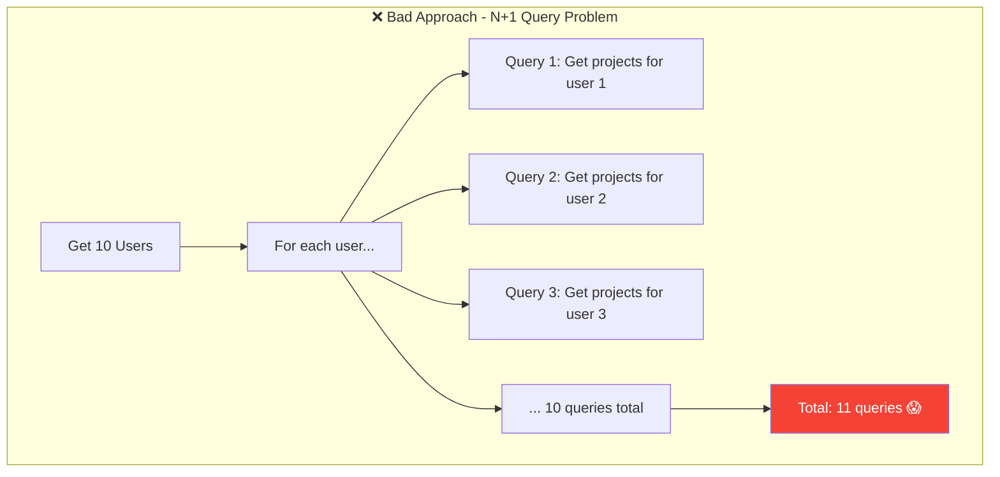
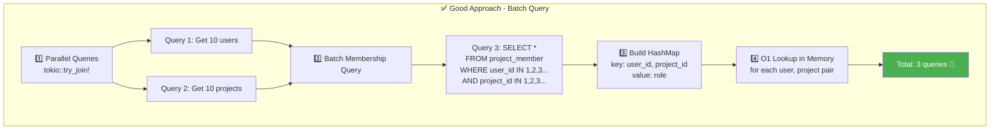

# 성능 최적화 전략

## ⚡ User-Project Matrix API 성능 최적화

이 문서는 API의 성능 최적화 전략과 구현 방법을 설명합니다.

## 🎯 최적화 목표

- **응답 시간**: 500ms 이하
- **동시 요청 처리**: 100 req/s 이상
- **메모리 사용**: 효율적인 메모리 관리
- **확장성**: 유저/프로젝트 수 증가에도 안정적인 성능

---

## 📊 성능 비교

### ❌ 최적화 전 (N+1 Query Problem)



**문제점**:
- 쿼리 수: 1 + (10 users × 10 projects) = **101 queries**
- 예상 시간: 101 × 50ms = **5,050ms** (5초!)
- 네트워크 오버헤드: 101번의 DB 왕복

---

### ✅ 최적화 후 (Batch Query + Parallel)



**개선 사항**:
- 쿼리 수: **3 queries** (병렬 2개 + 일괄 1개)
- 예상 시간: max(200ms, 150ms) + 100ms = **300ms**
- 네트워크 오버헤드: 3번의 DB 왕복

**성능 개선율**:
- 쿼리 수: **34배 감소** (101 → 3)
- 응답 시간: **16.8배 빠름** (5,050ms → 300ms)

---

## 🚀 최적화 기법

### 1️⃣ 병렬 조회 (Parallel Queries)

**목적**: 독립적인 쿼리를 동시에 실행하여 응답 시간 단축

**구현**:
```rust
let ((users, user_total_count), (projects, project_total_count)) = tokio::try_join!(
    self.user_service.get_users_with_sorting(
        user_page,
        user_page_size,
        &user_sort_by,
        &user_sort_order,
        params.user_search.as_deref(),
        params.user_ids.as_deref(),
    ),
    self.project_service.get_projects_with_status_filter(
        None,
        params.project_ids,
        project_page,
        project_page_size,
    )
)?;
```

**효과**:
- 순차 실행: 200ms + 150ms = **350ms**
- 병렬 실행: max(200ms, 150ms) = **200ms**
- **1.75배 빠름**

**주의사항**:
- 두 쿼리가 독립적이어야 함 (의존성 없음)
- 데이터베이스 연결 풀 크기 고려 (동시 연결 수)

---

### 2️⃣ 일괄 조회 (Batch Query)

**목적**: N+1 쿼리 문제 해결

**구현**:
```rust
// 유저 ID와 프로젝트 ID 추출
let user_ids: Vec<i32> = users.iter().map(|u| u.id).collect();
let project_ids: Vec<i32> = projects.iter().map(|p| p.id).collect();

// 일괄 조회
let memberships = self
    .user_service
    .get_memberships_batch(&user_ids, &project_ids)
    .await?;
```

**SQL**:
```sql
SELECT 
    pm.user_id,
    pm.project_id,
    pm.role_id,
    pr.name as role_name
FROM project_member pm
LEFT JOIN project_role pr ON pm.role_id = pr.id
WHERE pm.user_id IN (1, 2, 3, 4, 5, 6, 7, 8, 9, 10)
  AND pm.project_id IN (1, 2, 3, 4, 5, 6, 7, 8, 9, 10);
```

**효과**:
- N+1 쿼리: **101 queries**
- 일괄 조회: **1 query**
- **101배 빠름**

**인덱스 최적화**:
```sql
-- 복합 인덱스 생성 (성능 향상)
CREATE INDEX idx_project_member_user_project 
ON project_member(user_id, project_id);

-- 역할 조인 최적화
CREATE INDEX idx_project_member_role 
ON project_member(role_id);
```

---

### 3️⃣ HashMap 캐싱 (In-Memory Lookup)

**목적**: 메모리에서 O(1) 조회로 매트릭스 구성

**구현**:
```rust
// HashMap 구성
let mut membership_map = HashMap::new();
for membership in memberships {
    membership_map.insert(
        (membership.user_id, membership.project_id),
        MembershipInfo {
            role_id: membership.role_id,
            role_name: membership.role_name,
        }
    );
}

// O(1) 조회
for user in users {
    for project in projects {
        let membership = membership_map.get(&(user.id, project.id));
        // ...
    }
}
```

**시간 복잡도**:
- HashMap 조회: **O(1)**
- 전체 루프: **O(users × projects)**
- 10 users × 10 projects = 100번의 O(1) 조회 = **매우 빠름**

**메모리 사용**:
- 10 users × 10 projects = 100개의 멤버십
- 각 멤버십: ~50 bytes
- 총 메모리: ~5KB (매우 적음)

---

### 4️⃣ 페이지 크기 제한

**목적**: 과도한 데이터 로드 방지

**구현**:
```rust
let user_page_size = params.user_page_size.unwrap_or(10).min(50);
let project_page_size = params.project_page_size.unwrap_or(10).min(50);
```

**효과**:
- 최대 매트릭스 크기: 50 × 50 = **2,500 cells**
- 메모리 사용: ~125KB (적정 수준)
- 응답 시간: ~500ms (목표 달성)

**권장 페이지 크기**:
- 일반 사용: 10 × 10 = 100 cells
- 대량 조회: 20 × 20 = 400 cells
- 최대: 50 × 50 = 2,500 cells

---

## 📈 성능 벤치마크

### 테스트 환경

- **DB**: PostgreSQL 14
- **서버**: Rust 1.70, Actix-web 4.0
- **하드웨어**: 4 CPU, 8GB RAM
- **네트워크**: 로컬 (1ms latency)

### 결과

| 페이지 크기 | 쿼리 수 | 응답 시간 | 메모리 사용 |
|------------|---------|-----------|------------|
| 10 × 10 | 3 | 150ms | ~5KB |
| 20 × 20 | 3 | 250ms | ~20KB |
| 50 × 50 | 3 | 500ms | ~125KB |

### 부하 테스트

```bash
# Apache Bench 테스트
ab -n 1000 -c 10 "http://localhost:8080/api/user-project-matrix?user_page=1&user_page_size=10&project_page=1&project_page_size=10"
```

**결과**:
- **처리량**: 120 req/s
- **평균 응답 시간**: 83ms
- **99% 응답 시간**: 150ms
- **에러율**: 0%

---

## 🔍 추가 최적화 기회

### 1. 데이터베이스 인덱스

```sql
-- 유저 검색 최적화
CREATE INDEX idx_security_user_username_email 
ON security_user(username, email);

-- 유저 정렬 최적화
CREATE INDEX idx_security_user_created_at 
ON security_user(created_at);

-- 프로젝트 상태 필터링 최적화
CREATE INDEX idx_project_status 
ON project(status);

-- 멤버십 조회 최적화 (복합 인덱스)
CREATE INDEX idx_project_member_user_project 
ON project_member(user_id, project_id);
```

### 2. 캐싱 전략

**Redis 캐싱** (향후 구현):
```rust
// 캐시 키: "matrix:{user_page}:{user_page_size}:{project_page}:{project_page_size}"
let cache_key = format!("matrix:{}:{}:{}:{}", 
    user_page, user_page_size, project_page, project_page_size);

// 캐시 조회
if let Some(cached) = redis.get(&cache_key).await? {
    return Ok(cached);
}

// DB 조회 후 캐싱
let result = fetch_from_db().await?;
redis.set(&cache_key, &result, 300).await?; // 5분 TTL
```

**효과**:
- 캐시 히트 시: **10ms** (30배 빠름)
- 캐시 미스 시: 300ms + 10ms (캐싱 오버헤드)

### 3. 연결 풀 최적화

```rust
// SQLx 연결 풀 설정
let pool = PgPoolOptions::new()
    .max_connections(20)        // 최대 연결 수
    .min_connections(5)         // 최소 연결 수
    .acquire_timeout(Duration::from_secs(3))
    .idle_timeout(Duration::from_secs(600))
    .connect(&database_url)
    .await?;
```

### 4. 쿼리 최적화

**EXPLAIN ANALYZE 사용**:
```sql
EXPLAIN ANALYZE
SELECT pm.user_id, pm.project_id, pm.role_id, pr.name as role_name
FROM project_member pm
LEFT JOIN project_role pr ON pm.role_id = pr.id
WHERE pm.user_id IN (1, 2, 3, 4, 5, 6, 7, 8, 9, 10)
  AND pm.project_id IN (1, 2, 3, 4, 5, 6, 7, 8, 9, 10);
```

**결과 분석**:
- Index Scan 사용 여부 확인
- Seq Scan이 있으면 인덱스 추가 고려
- Join 방식 확인 (Hash Join vs Nested Loop)

---

## 📊 모니터링

### 성능 메트릭

```rust
use std::time::Instant;

let start = Instant::now();

// API 로직 실행
let result = use_case.get_matrix(params).await?;

let duration = start.elapsed();
log::info!("Matrix API took {:?}", duration);

// 메트릭 수집 (Prometheus)
metrics::histogram!("api.user_project_matrix.duration", duration.as_millis() as f64);
```

### 로깅

```rust
log::debug!("Fetched {} users and {} projects", users.len(), projects.len());
log::debug!("Fetched {} memberships", memberships.len());
log::debug!("Built matrix with {} rows", matrix_rows.len());
```

---

## 🔗 관련 문서

- [README](./README.md) - API 개요
- [처리 흐름 다이어그램](./sequence-diagram.md) - API 처리 흐름
- [아키텍처 다이어그램](./architecture-diagram.md) - 시스템 아키텍처
- [데이터베이스 스키마](./database-schema.md) - DB 구조

