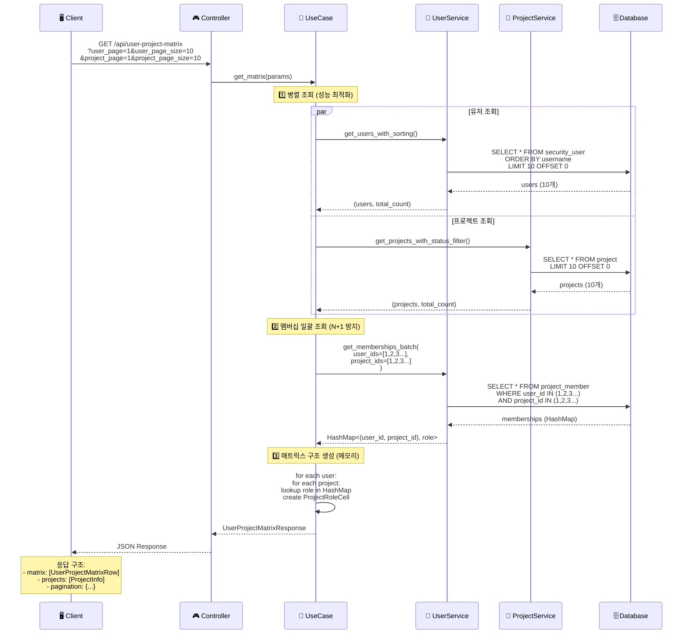
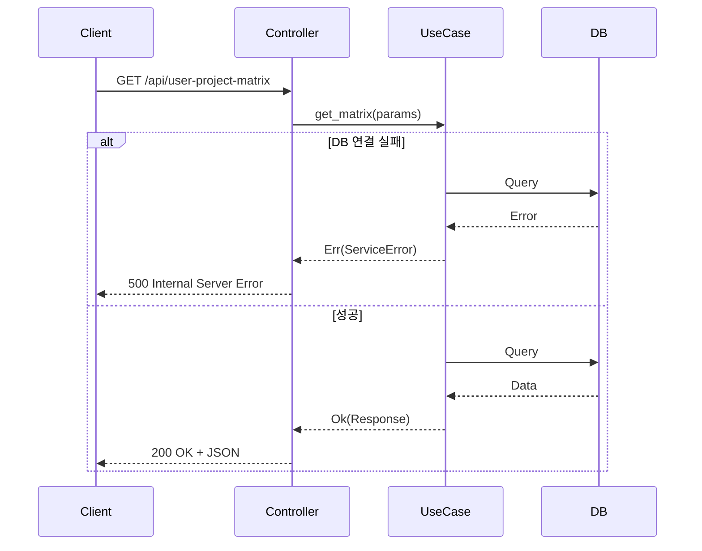

# API 처리 흐름 다이어그램

## 🔄 User-Project Matrix API 처리 흐름

이 다이어그램은 클라이언트 요청부터 응답까지의 전체 처리 흐름을 보여줍니다.



## 📝 단계별 상세 설명

### 1️⃣ 병렬 조회 (Parallel Queries)

**목적**: 유저와 프로젝트를 동시에 조회하여 응답 시간 단축

**코드**:
```rust
let ((users, user_total_count), (projects, project_total_count)) = tokio::try_join!(
    self.user_service.get_users_with_sorting(
        user_page,
        user_page_size,
        &user_sort_by,
        &user_sort_order,
        params.user_search.as_deref(),
        params.user_ids.as_deref(),
    ),
    self.project_service.get_projects_with_status_filter(
        None,
        params.project_ids,
        project_page,
        project_page_size,
    )
)?;
```

**실행되는 SQL**:
```sql
-- 유저 조회 (병렬 실행)
SELECT id, username, email, full_name, created_at
FROM security_user
WHERE username ILIKE '%search%' OR email ILIKE '%search%'
ORDER BY username ASC
LIMIT 10 OFFSET 0;

-- 프로젝트 조회 (병렬 실행)
SELECT id, name, description, status, created_at
FROM project
LIMIT 10 OFFSET 0;
```

**성능 개선**:
- 순차 실행: 200ms + 150ms = 350ms
- 병렬 실행: max(200ms, 150ms) = 200ms
- **약 1.75배 빠름**

---

### 2️⃣ 멤버십 일괄 조회 (Batch Membership Query)

**목적**: N+1 쿼리 문제 방지

**코드**:
```rust
let user_ids: Vec<i32> = users.iter().map(|u| u.id).collect();
let project_ids: Vec<i32> = projects.iter().map(|p| p.id).collect();

let memberships = self
    .user_service
    .get_memberships_batch(&user_ids, &project_ids)
    .await?;
```

**실행되는 SQL**:
```sql
SELECT 
    pm.user_id,
    pm.project_id,
    pm.role_id,
    pr.name as role_name
FROM project_member pm
LEFT JOIN project_role pr ON pm.role_id = pr.id
WHERE pm.user_id IN (1, 2, 3, 4, 5, 6, 7, 8, 9, 10)
  AND pm.project_id IN (1, 2, 3, 4, 5, 6, 7, 8, 9, 10);
```

**반환 데이터 구조**:
```rust
HashMap<(user_id, project_id), MembershipInfo>

// 예시:
{
  (1, 2): MembershipInfo { role_id: Some(183), role_name: Some("PROJECT_ADMIN") },
  (1, 3): MembershipInfo { role_id: Some(184), role_name: Some("MEMBER") },
  (6, 2): MembershipInfo { role_id: Some(183), role_name: Some("PROJECT_ADMIN") },
  // ...
}
```

**성능 개선**:
- ❌ N+1 쿼리: 1 + (10 users × 10 projects) = 101 queries
- ✅ 일괄 조회: 1 query
- **약 100배 빠름**

---

### 3️⃣ 매트릭스 구조 생성 (Matrix Construction)

**목적**: 메모리에서 O(1) 조회로 매트릭스 구조 생성

**코드**:
```rust
let mut matrix_rows = Vec::new();

for user in users {
    let project_roles: Vec<ProjectRoleCell> = projects
        .iter()
        .map(|project| {
            // HashMap에서 O(1) 조회
            let membership = memberships.get(&(user.id, project.id));

            ProjectRoleCell {
                project_id: project.id,
                project_name: project.name.clone(),
                role_id: membership.and_then(|m| m.role_id),
                role_name: membership.and_then(|m| m.role_name.clone()),
            }
        })
        .collect();

    let matrix_row = UserProjectMatrixRow {
        user_id: user.id,
        username: user.username.clone(),
        email: user.email.clone(),
        full_name: user.full_name.clone(),
        project_roles,
    };

    matrix_rows.push(matrix_row);
}
```

**시간 복잡도**:
- HashMap 조회: O(1)
- 전체 루프: O(users × projects)
- 10 users × 10 projects = 100번의 O(1) 조회 = **매우 빠름**

**생성되는 구조**:
```
User 1 → [Project 1 (ADMIN), Project 2 (null), Project 3 (VIEWER)]
User 2 → [Project 1 (null), Project 2 (MEMBER), Project 3 (ADMIN)]
User 3 → [Project 1 (VIEWER), Project 2 (MEMBER), Project 3 (null)]
```

---

## ⚡ 성능 최적화 요약

### 전체 쿼리 수

| 방식 | 쿼리 수 | 예상 시간 |
|------|---------|-----------|
| ❌ 순차 + N+1 | 1 + 1 + (10×10) = 102 queries | ~5,100ms |
| ✅ 병렬 + 일괄 | 3 queries (2 parallel + 1 batch) | ~350ms |
| **개선율** | **34배 감소** | **14.5배 빠름** |

### 최적화 기법

1. **병렬 조회 (tokio::try_join!)**
   - 유저와 프로젝트를 동시에 조회
   - 응답 시간 = max(query1, query2)

2. **일괄 조회 (Batch Query)**
   - IN 절을 사용한 멤버십 일괄 조회
   - N+1 쿼리 문제 완전 해결

3. **HashMap 캐싱**
   - 메모리에서 O(1) 조회
   - 추가 DB 쿼리 불필요

4. **페이지 크기 제한**
   - 최대 50개로 제한
   - 과도한 메모리 사용 방지

---

## 🔍 에러 처리 흐름



### 에러 응답 예시

```json
{
  "error": "Failed to get matrix: Database connection failed"
}
```

---

## 🔗 관련 문서

- [README](./README.md) - API 개요
- [데이터 구조 다이어그램](./data-structure-diagram.md) - 응답 데이터 구조
- [성능 최적화 전략](./performance-optimization.md) - 성능 최적화 상세
- [아키텍처 다이어그램](./architecture-diagram.md) - 시스템 아키텍처

