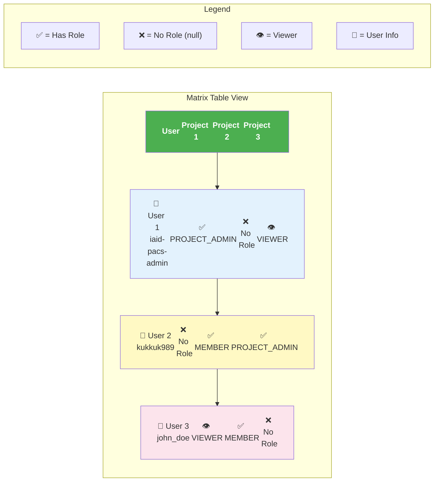

# 매트릭스 테이블 시각화

## 📋 User-Project Matrix 테이블 형태

이 다이어그램은 API 응답 데이터가 실제 UI에서 어떻게 표시되는지 보여줍니다.



## 📊 실제 테이블 예시

### HTML 구조

```html
<table class="matrix-table">
  <thead>
    <tr>
      <th>User</th>
      <th>AI Image Analysis Project</th>
      <th>Medical Research Project</th>
      <th>CT Scan Analysis</th>
    </tr>
  </thead>
  <tbody>
    <tr>
      <td>
        <div class="user-info">
          <div class="username">iaid-pacs-admin</div>
          <div class="email">heeya8876@naver.com</div>
        </div>
      </td>
      <td><span class="role-badge admin">PROJECT_ADMIN</span></td>
      <td><span class="no-role">-</span></td>
      <td><span class="role-badge viewer">VIEWER</span></td>
    </tr>
    <tr>
      <td>
        <div class="user-info">
          <div class="username">kukkuk989</div>
          <div class="email">kukkuk989@protonmail.com</div>
        </div>
      </td>
      <td><span class="no-role">-</span></td>
      <td><span class="role-badge member">MEMBER</span></td>
      <td><span class="role-badge admin">PROJECT_ADMIN</span></td>
    </tr>
    <tr>
      <td>
        <div class="user-info">
          <div class="username">john_doe</div>
          <div class="email">john@example.com</div>
        </div>
      </td>
      <td><span class="role-badge viewer">VIEWER</span></td>
      <td><span class="role-badge member">MEMBER</span></td>
      <td><span class="no-role">-</span></td>
    </tr>
  </tbody>
</table>
```

## 🎨 시각적 표현

### 역할별 색상 코드

| 역할 | 배경색 | 텍스트 색 | 의미 |
|------|--------|-----------|------|
| **PROJECT_ADMIN** | `#ffebee` | `#c62828` | 프로젝트 관리자 (모든 권한) |
| **MEMBER** | `#e3f2fd` | `#1565c0` | 프로젝트 멤버 (읽기/쓰기) |
| **VIEWER** | `#f5f5f5` | `#616161` | 뷰어 (읽기 전용) |
| **No Role** | `transparent` | `#9e9e9e` | 역할 없음 |

### 셀 상태

```
┌─────────────────────────────────────────────────────────┐
│ User Info          │ Project 1  │ Project 2  │ Project 3│
├─────────────────────────────────────────────────────────┤
│ 👤 iaid-pacs-admin │ 🔴 ADMIN   │ ⚪ -       │ 🔵 VIEWER│
│ 📧 heeya8876@...   │            │            │          │
├─────────────────────────────────────────────────────────┤
│ 👤 kukkuk989       │ ⚪ -       │ 🔵 MEMBER  │ 🔴 ADMIN │
│ 📧 kukkuk989@...   │            │            │          │
├─────────────────────────────────────────────────────────┤
│ 👤 john_doe        │ 🔵 VIEWER  │ 🔵 MEMBER  │ ⚪ -     │
│ 📧 john@...        │            │            │          │
└─────────────────────────────────────────────────────────┘

Legend:
🔴 = PROJECT_ADMIN (관리자)
🔵 = MEMBER / VIEWER (멤버/뷰어)
⚪ = No Role (역할 없음)
```

## 💡 UI/UX 권장사항

### 1. 인터랙티브 기능

- **셀 클릭**: 역할 변경 모달 열기
- **행 호버**: 해당 유저의 모든 역할 하이라이트
- **열 호버**: 해당 프로젝트의 모든 멤버 하이라이트
- **정렬**: 열 헤더 클릭으로 정렬 변경

### 2. 필터링 옵션

- **유저 검색**: 이름/이메일로 검색
- **역할 필터**: 특정 역할만 표시
- **프로젝트 필터**: 특정 프로젝트만 표시
- **상태 필터**: 활성/비활성 유저

### 3. 페이지네이션

```
┌─────────────────────────────────────────────────────────┐
│ Users: Page 1 of 3 (25 total)                          │
│ [◀ Previous] [1] [2] [3] [Next ▶]                      │
│                                                         │
│ Projects: Page 1 of 2 (15 total)                       │
│ [◀ Previous] [1] [2] [Next ▶]                          │
└─────────────────────────────────────────────────────────┘
```

### 4. 반응형 디자인

**데스크톱 (>1200px)**:
- 전체 매트릭스 표시
- 고정 헤더 (스크롤 시)
- 호버 효과

**태블릿 (768px - 1200px)**:
- 가로 스크롤
- 축소된 셀 크기
- 간소화된 유저 정보

**모바일 (<768px)**:
- 카드 형태로 변환
- 유저별 아코디언
- 프로젝트 목록 표시

## 🔍 데이터 매핑

### API 응답 → 테이블 렌더링

```typescript
// API 응답
{
  "matrix": [
    {
      "user_id": 1,
      "username": "iaid-pacs-admin",
      "email": "heeya8876@naver.com",
      "project_roles": [
        { "project_id": 2, "role_name": "PROJECT_ADMIN" },
        { "project_id": 3, "role_name": null }
      ]
    }
  ],
  "projects": [
    { "project_id": 2, "project_name": "AI Image Analysis" },
    { "project_id": 3, "project_name": "Medical Research" }
  ]
}

// 테이블 렌더링
<tr>
  <td>iaid-pacs-admin (heeya8876@naver.com)</td>
  <td>PROJECT_ADMIN</td>  <!-- project_roles[0] → projects[0] -->
  <td>-</td>              <!-- project_roles[1] → projects[1] -->
</tr>
```

### 매핑 로직

```typescript
// 1. 열 헤더 생성
const headers = data.projects.map(p => p.project_name);

// 2. 행 생성
const rows = data.matrix.map(user => ({
  userInfo: `${user.username} (${user.email})`,
  cells: user.project_roles.map(cell => cell.role_name || '-')
}));

// 3. 테이블 렌더링
<table>
  <thead>
    <tr>
      <th>User</th>
      {headers.map(h => <th>{h}</th>)}
    </tr>
  </thead>
  <tbody>
    {rows.map(row => (
      <tr>
        <td>{row.userInfo}</td>
        {row.cells.map(cell => <td>{cell}</td>)}
      </tr>
    ))}
  </tbody>
</table>
```

## 🔗 관련 문서

- [README](./README.md) - API 개요
- [데이터 구조 다이어그램](./data-structure-diagram.md) - 응답 데이터 구조
- [클라이언트 가이드](./client-guide.md) - 클라이언트 구현 가이드

