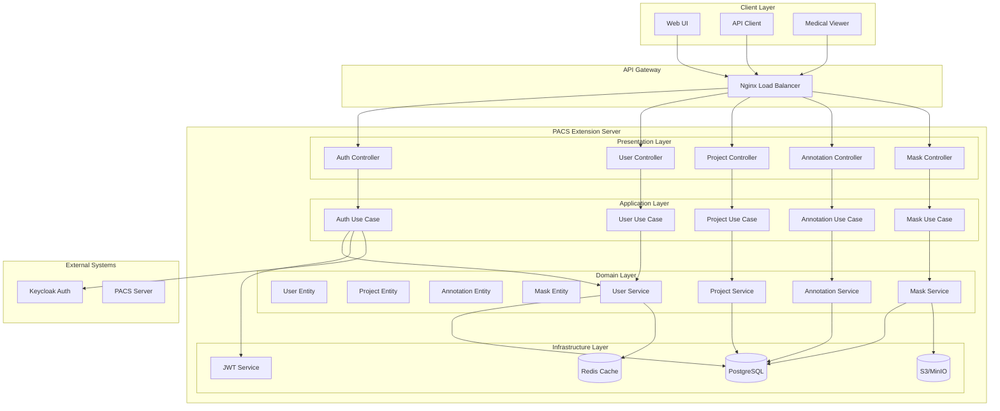
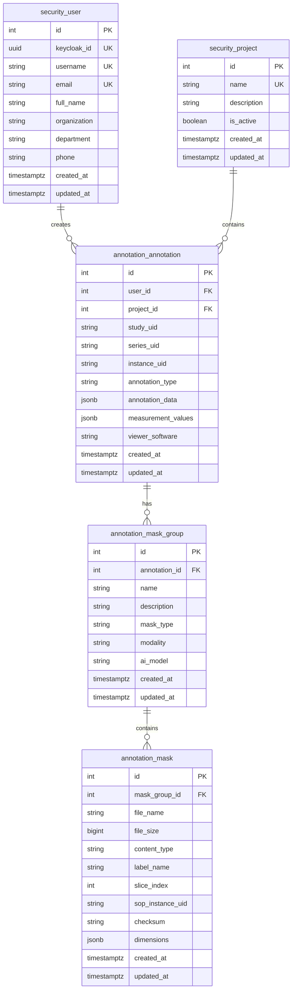
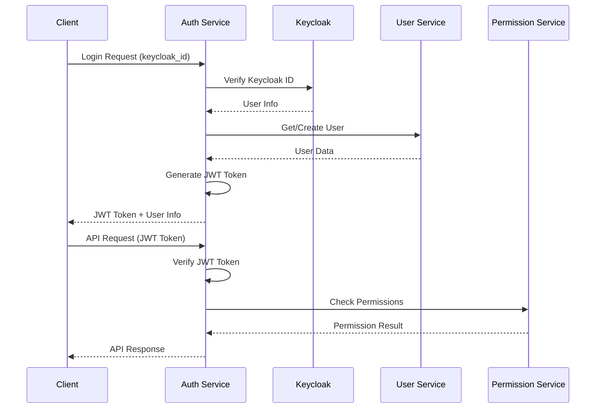
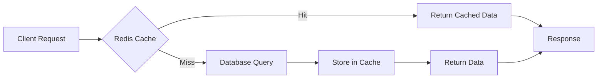

# PACS Extension Server 아키텍처 개요

## 개요

PACS Extension Server는 Clean Architecture 원칙을 기반으로 설계된 의료 영상 관리 및 뷰어 통합 환경을 위한 마이크로서비스입니다. 이 문서는 시스템의 전체 아키텍처, 설계 원칙, 그리고 주요 컴포넌트에 대해 설명합니다.

## 아키텍처 원칙

### 1. Clean Architecture

시스템은 4계층 Clean Architecture 패턴을 따릅니다:

```
┌─────────────────────────────────────────────────────────────┐
│                    Presentation Layer                       │
│                 (HTTP Controllers, Routes)                  │
└─────────────────────────────────────────────────────────────┘
                                │
                                ▼
┌─────────────────────────────────────────────────────────────┐
│                    Application Layer                        │
│              (Use Cases, DTOs, Orchestration)              │
└─────────────────────────────────────────────────────────────┘
                                │
                                ▼
┌─────────────────────────────────────────────────────────────┐
│                    Domain Layer                             │
│            (Entities, Services, Repository Traits)         │
└─────────────────────────────────────────────────────────────┘
                                │
                                ▼
┌─────────────────────────────────────────────────────────────┐
│                 Infrastructure Layer                        │
│        (Database, External Services, Repository Impl)      │
└─────────────────────────────────────────────────────────────┘
```

### 2. 의존성 규칙

- **내부 계층은 외부 계층을 알지 못함**: Domain 계층은 다른 계층에 의존하지 않음
- **의존성은 내부를 향함**: 외부 계층이 내부 계층에 의존
- **인터페이스 분리**: 구체적인 구현체가 아닌 추상화에 의존

### 3. 단일 책임 원칙

각 계층과 컴포넌트는 명확한 단일 책임을 가집니다:

- **Domain**: 비즈니스 로직과 규칙
- **Application**: 유스케이스 오케스트레이션
- **Infrastructure**: 외부 시스템 연동
- **Presentation**: HTTP 요청/응답 처리

## 시스템 아키텍처

### 전체 시스템 다이어그램



## 계층별 상세 구조

### 1. Presentation Layer

HTTP 요청을 받아 Application Layer로 전달하고 응답을 반환합니다.

#### 주요 컴포넌트

- **Controllers**: HTTP 엔드포인트 처리
- **Middleware**: 인증, CORS, 로깅 등
- **DTOs**: 요청/응답 데이터 변환
- **OpenAPI**: API 문서화

#### 예시: UserController

```rust
#[derive(OpenApi)]
#[openapi(
    paths(update_user),
    components(schemas(UpdateUserRequest, UserResponse))
)]
pub struct UserController;

impl UserController {
    #[openapi(
        operation_id = "update_user",
        summary = "사용자 프로필 업데이트",
        description = "사용자의 프로필 정보를 업데이트합니다."
    )]
    pub async fn update_user(
        path: web::Path<i32>,
        request: web::Json<UpdateUserRequest>,
        user_use_case: web::Data<Arc<UserUseCase>>,
    ) -> Result<HttpResponse, ServiceError> {
        let user_id = path.into_inner();
        let update_request = request.into_inner();
        
        let user = user_use_case
            .update_user(user_id, update_request)
            .await?;
            
        Ok(HttpResponse::Ok().json(UserResponse::from(user)))
    }
}
```

### 2. Application Layer

비즈니스 유스케이스를 오케스트레이션하고 Domain Layer와 상호작용합니다.

#### 주요 컴포넌트

- **Use Cases**: 비즈니스 유스케이스 구현
- **DTOs**: 계층 간 데이터 전송
- **Services**: Application 서비스

#### 예시: UserUseCase

```rust
pub struct UserUseCase {
    user_service: Arc<dyn UserService>,
    user_repository: Arc<dyn UserRepository>,
}

impl UserUseCase {
    pub async fn update_user(
        &self,
        user_id: i32,
        request: UpdateUserRequest,
    ) -> Result<User, ServiceError> {
        // 1. 사용자 존재 확인
        let existing_user = self.user_service
            .get_user_by_id(user_id)
            .await?;
            
        // 2. 이메일 중복 검사 (이메일이 변경된 경우)
        if let Some(email) = &request.email {
            if email != &existing_user.email {
                self.user_service
                    .check_email_uniqueness(email)
                    .await?;
            }
        }
        
        // 3. UpdateUser 엔티티 생성
        let mut update_user = UpdateUser::new(user_id);
        if let Some(email) = request.email {
            update_user = update_user.email(email);
        }
        if let Some(full_name) = request.full_name {
            update_user = update_user.full_name(full_name);
        }
        // ... 다른 필드들
        
        // 4. 사용자 업데이트
        let updated_user = self.user_repository
            .update(&update_user)
            .await?;
            
        Ok(updated_user)
    }
}
```

### 3. Domain Layer

비즈니스 로직과 규칙을 포함하는 핵심 계층입니다.

#### 주요 컴포넌트

- **Entities**: 비즈니스 객체
- **Value Objects**: 불변 값 객체
- **Services**: 도메인 서비스
- **Repository Traits**: 데이터 접근 인터페이스

#### 예시: User Entity

```rust
#[derive(Debug, Clone, Serialize, Deserialize, ToSchema)]
pub struct User {
    pub id: i32,
    pub keycloak_id: Uuid,
    pub username: String,
    pub email: String,
    pub full_name: Option<String>,
    pub organization: Option<String>,
    pub department: Option<String>,
    pub phone: Option<String>,
    pub created_at: DateTime<Utc>,
    pub updated_at: Option<DateTime<Utc>>,
}

#[derive(Debug, Clone)]
pub struct UpdateUser {
    pub id: i32,
    pub email: Option<String>,
    pub full_name: Option<String>,
    pub organization: Option<String>,
    pub department: Option<String>,
    pub phone: Option<String>,
}

impl UpdateUser {
    pub fn new(id: i32) -> Self {
        Self {
            id,
            email: None,
            full_name: None,
            organization: None,
            department: None,
            phone: None,
        }
    }
    
    pub fn email(mut self, email: String) -> Self {
        self.email = Some(email);
        self
    }
    
    // ... 다른 필드들
}
```

#### 예시: UserService Trait

```rust
#[async_trait]
pub trait UserService: Send + Sync {
    async fn create_user(&self, new_user: NewUser) -> Result<User, ServiceError>;
    async fn get_user_by_id(&self, id: i32) -> Result<User, ServiceError>;
    async fn get_user_by_username(&self, username: &str) -> Result<User, ServiceError>;
    async fn update_user(&self, update_user: &UpdateUser) -> Result<User, ServiceError>;
    async fn check_email_uniqueness(&self, email: &str) -> Result<(), ServiceError>;
}
```

### 4. Infrastructure Layer

외부 시스템과의 연동을 담당합니다.

#### 주요 컴포넌트

- **Repository Implementations**: 데이터베이스 구현
- **External Services**: S3, Keycloak 등 외부 서비스
- **Configuration**: 설정 관리
- **Database Migrations**: 스키마 관리

#### 예시: UserRepositoryImpl

```rust
pub struct UserRepositoryImpl {
    pool: PgPool,
}

#[async_trait]
impl UserRepository for UserRepositoryImpl {
    async fn update(&self, update_user: &UpdateUser) -> Result<User, ServiceError> {
        let mut query = sqlx::QueryBuilder::new("UPDATE security_user SET ");
        let mut params = Vec::new();
        let mut field_count = 0;

        // 동적 필드 업데이트
        if let Some(email) = &update_user.email {
            if field_count > 0 {
                query.push(", ");
            }
            query.push("email = $");
            query.push(field_count + 1);
            params.push(email);
            field_count += 1;
        }

        if let Some(full_name) = &update_user.full_name {
            if field_count > 0 {
                query.push(", ");
            }
            query.push("full_name = $");
            query.push(field_count + 1);
            params.push(full_name);
            field_count += 1;
        }

        // ... 다른 필드들

        if field_count == 0 {
            return Err(ServiceError::ValidationError("No fields to update".to_string()));
        }

        query.push(" WHERE id = $");
        query.push(field_count + 1);
        params.push(update_user.id);
        query.push(" RETURNING *");

        let user = query
            .build_query_as::<User>()
            .bind_all(&params)
            .fetch_one(&self.pool)
            .await?;

        Ok(user)
    }
}
```

## 데이터베이스 설계

### 주요 테이블



## 보안 아키텍처

### 인증 및 권한 부여



### 보안 계층

1. **네트워크 보안**: HTTPS, TLS 1.3
2. **인증**: JWT + Keycloak
3. **권한 부여**: RBAC (Role-Based Access Control)
4. **데이터 보안**: 암호화된 저장, 전송
5. **API 보안**: Rate Limiting, CORS, Input Validation

## 성능 최적화

### 캐싱 전략



### 데이터베이스 최적화

- **인덱싱**: 자주 조회되는 필드에 인덱스 생성
- **쿼리 최적화**: N+1 문제 해결, JOIN 최적화
- **연결 풀링**: 데이터베이스 연결 재사용
- **파티셔닝**: 대용량 테이블 분할

### 비동기 처리

- **Async/Await**: 논블로킹 I/O
- **Connection Pooling**: 데이터베이스 연결 관리
- **Background Tasks**: 무거운 작업 비동기 처리

## 모니터링 및 로깅

### 로깅 구조

```rust
// 구조화된 로깅
tracing::info!(
    user_id = %user.id,
    action = "user_profile_updated",
    fields = ?updated_fields,
    "User profile updated successfully"
);
```

### 메트릭 수집

- **애플리케이션 메트릭**: 요청 수, 응답 시간, 에러율
- **시스템 메트릭**: CPU, 메모리, 디스크 사용률
- **비즈니스 메트릭**: 사용자 활동, 주석 생성 수

### 헬스 체크

```rust
pub async fn health_check() -> impl Responder {
    // 데이터베이스 연결 확인
    // 외부 서비스 상태 확인
    // 메모리 사용량 확인
    
    HttpResponse::Ok().json(HealthStatus {
        status: "healthy",
        timestamp: Utc::now(),
        services: vec![
            ServiceStatus {
                name: "database",
                status: "up",
                response_time: Duration::from_millis(5),
            },
            ServiceStatus {
                name: "s3",
                status: "up",
                response_time: Duration::from_millis(50),
            },
        ],
    })
}
```

## 배포 아키텍처

### Docker 컨테이너화

```dockerfile
# Multi-stage build
FROM rust:1.70 as builder
WORKDIR /app
COPY . .
RUN cargo build --release

FROM debian:bullseye-slim
RUN apt-get update && apt-get install -y ca-certificates
COPY --from=builder /app/target/release/pacs-server /usr/local/bin/
EXPOSE 8080
CMD ["pacs-server"]
```

### Kubernetes 배포

```yaml
apiVersion: apps/v1
kind: Deployment
metadata:
  name: pacs-server
spec:
  replicas: 3
  selector:
    matchLabels:
      app: pacs-server
  template:
    metadata:
      labels:
        app: pacs-server
    spec:
      containers:
      - name: pacs-server
        image: pacs-server:latest
        ports:
        - containerPort: 8080
        env:
        - name: DATABASE_URL
          valueFrom:
            secretKeyRef:
              name: database-secret
              key: url
        resources:
          requests:
            memory: "256Mi"
            cpu: "250m"
          limits:
            memory: "512Mi"
            cpu: "500m"
```

## 확장성 고려사항

### 수평적 확장

- **Stateless Design**: 상태를 외부 저장소에 저장
- **Load Balancing**: 여러 인스턴스 간 부하 분산
- **Database Sharding**: 데이터베이스 분할

### 수직적 확장

- **Resource Optimization**: 메모리, CPU 사용량 최적화
- **Caching**: 자주 접근하는 데이터 캐싱
- **Connection Pooling**: 데이터베이스 연결 최적화

## 장애 대응

### Circuit Breaker 패턴

```rust
pub struct CircuitBreaker {
    failure_count: AtomicUsize,
    last_failure_time: AtomicU64,
    state: AtomicU8, // 0: Closed, 1: Open, 2: Half-Open
}

impl CircuitBreaker {
    pub async fn call<F, T>(&self, operation: F) -> Result<T, ServiceError>
    where
        F: Future<Output = Result<T, ServiceError>>,
    {
        if self.is_open() {
            return Err(ServiceError::ServiceUnavailable("Circuit breaker is open".to_string()));
        }
        
        match operation.await {
            Ok(result) => {
                self.on_success();
                Ok(result)
            }
            Err(error) => {
                self.on_failure();
                Err(error)
            }
        }
    }
}
```

### 재시도 메커니즘

```rust
pub async fn retry_with_backoff<F, T>(
    operation: F,
    max_retries: usize,
    initial_delay: Duration,
) -> Result<T, ServiceError>
where
    F: Fn() -> Pin<Box<dyn Future<Output = Result<T, ServiceError>> + Send>>,
{
    let mut delay = initial_delay;
    
    for attempt in 0..=max_retries {
        match operation().await {
            Ok(result) => return Ok(result),
            Err(error) if attempt == max_retries => return Err(error),
            Err(_) => {
                tokio::time::sleep(delay).await;
                delay = delay * 2; // Exponential backoff
            }
        }
    }
    
    unreachable!()
}
```

## 결론

PACS Extension Server는 Clean Architecture 원칙을 기반으로 설계되어 유지보수성, 확장성, 테스트 가능성을 보장합니다. 각 계층의 명확한 책임 분리와 의존성 규칙을 통해 시스템의 복잡성을 관리하고, 비즈니스 요구사항의 변화에 유연하게 대응할 수 있습니다.

이 아키텍처는 의료 영상 관리라는 도메인의 특수성을 고려하여 설계되었으며, 향후 AI 통합, 실시간 협업, 모바일 지원 등의 요구사항을 수용할 수 있도록 확장 가능한 구조를 제공합니다.
