# PACS Extension Server - Database ERD

## 개요

PACS Extension Server의 전체 데이터베이스 스키마를 시각화한 ERD (Entity Relationship Diagram)입니다.

## 주요 스키마 구성

### 1. SECURITY SCHEMA (보안 및 권한 관리)
- **사용자 관리**: `security_user`, `security_institution`
- **프로젝트 관리**: `security_project`, `security_user_project`
- **권한 관리**: `security_role`, `security_permission`, `security_capability`
- **감사 로그**: `security_access_log`, `security_grant_log`

### 2. PROJECT DATA SCHEMA (DICOM 데이터)
- **계층적 구조**: `project_data_study` → `project_data_series` → `project_data_instance`
- **프로젝트 연결**: `project_data` (Study/Series/Instance 레벨 지원)
- **접근 제어**: `project_data_access` (사용자별 세밀한 권한)
- **기관 관리**: `project_data_institution`

### 3. ANNOTATION SCHEMA (어노테이션)
- **어노테이션**: `annotation_annotation` (버전 관리, 스냅샷 지원)
- **변경 이력**: `annotation_annotation_history`
- **마스크 관리**: `annotation_mask_group`, `annotation_mask`

### 4. SERIES EXTENSIONS (Series 확장 기능)
- **사용자 메모**: `series_user_note`
- **사용자 리포트**: `series_user_report`
- **템플릿 시스템**: `report_guide_template`, `user_custom_report_template`

### 5. STUDY LIST VIEW (뷰 및 필드 정의)
- **뷰 관리**: `study_list_view`, `study_list_view_field`
- **필드 정의**: `dicom_field_def`, `ext_field_def`

### 6. VIEWER SCHEMA (Hanging Protocol)
- **프로토콜**: `viewer_hanging_protocol`
- **레이아웃**: `viewer_hp_layout`, `viewer_hp_viewport`

### 7. GC SCHEMA (Garbage Collection)
- **삭제 로그**: `gc_deletion_log`

### 8. SUBJECT & TIMEPOINT SCHEMA (임상시험 관리)
- **Subject 관리**: `project_subject` (프로젝트별 환자)
- **TimePoint 관리**: `subject_timepoint` (Baseline, TP1, TP2...)
- **Study 매핑**: `subject_timepoint_study_map` (TimePoint ↔ Study)

## ERD 다이어그램

```mermaid
erDiagram
    %% ========================================
    %% SECURITY SCHEMA - 사용자 및 권한 관리
    %% ========================================
    
    security_user {
        int id PK
        uuid keycloak_id UK
        text username UK
        text email UK
        int institution_id FK
        timestamptz created_at
    }
    
    security_project {
        int id PK
        text name UK
        text description
        boolean is_active
        timestamptz created_at
    }
    
    security_role {
        int id PK
        text name UK
        text description
        text scope "GLOBAL/PROJECT"
        timestamptz created_at
    }
    
    security_permission {
        int id PK
        text category
        text resource_type
        text action
    }
    
    security_capability {
        int id PK
        text name UK
        text display_name
        text category
        timestamptz created_at
    }
    
    security_institution {
        int id PK
        varchar institution_code UK
        varchar institution_name
        varchar institution_type
        boolean is_active
        timestamptz created_at
    }
    
    security_user_project {
        int id PK
        int user_id FK
        int project_id FK
        text role
        timestamptz created_at
    }
    
    security_role_permission {
        int id PK
        int role_id FK
        int permission_id FK
        text scope
    }
    
    security_role_capability {
        int id PK
        int role_id FK
        int capability_id FK
    }
    
    security_capability_mapping {
        int id PK
        int capability_id FK
        int permission_id FK
    }
    
    security_access_log {
        bigint id PK
        int user_id FK
        int project_id FK
        text resource_type
        text study_uid
        text series_uid
        text action
        text result
        timestamptz logged_at
    }
    
    security_grant_log {
        bigint id PK
        int granted_by FK
        int granted_to FK
        int role_id FK
        int project_id FK
        text action
        timestamptz logged_at
    }

    %% ========================================
    %% PROJECT DATA SCHEMA - DICOM 데이터
    %% ========================================

    project_data_institution {
        int id PK
        varchar institution_code UK
        varchar institution_name
        varchar institution_type
        boolean is_active
        timestamptz created_at
    }

    project_data_study {
        int id PK
        text study_uid UK
        text study_description
        text patient_id
        text patient_name
        date patient_birth_date
        date study_date
        varchar modality
        varchar accession_no
        int data_institution_id FK
        int series_count
        int instance_count
        timestamptz created_at
        timestamptz updated_at
    }

    project_data_series {
        int id PK
        int study_id FK
        text series_uid
        text series_description
        text modality
        int series_number
        varchar body_part
        int instance_count
        timestamptz created_at
    }

    project_data_instance {
        int id PK
        int series_id FK
        varchar instance_uid
        varchar sop_class_uid
        int instance_number
        timestamptz created_at
    }

    project_data {
        int id PK
        int project_id FK
        text resource_level "STUDY/SERIES/INSTANCE"
        int study_id FK
        int series_id FK
        int instance_id FK
        timestamptz created_at
        timestamptz updated_at
    }

    project_data_access {
        int id PK
        int user_id FK
        int project_id FK
        text resource_level
        int study_id FK
        int series_id FK
        int instance_id FK
        text status "APPROVED/DENIED/PENDING"
        varchar access_scope
        timestamptz expires_at
        timestamptz created_at
    }

    %% ========================================
    %% ANNOTATION SCHEMA - 어노테이션
    %% ========================================

    annotation_annotation {
        int id PK
        int project_id FK
        int user_id FK
        text study_uid
        text series_uid
        text instance_uid
        text tool_name
        text viewer_software
        jsonb data
        boolean is_shared
        int version
        varchar label
        varchar snapshot_image_key
        text snapshot_status
        timestamptz snapshot_uploaded_at
        timestamptz created_at
        timestamptz updated_at
    }

    annotation_annotation_history {
        int id PK
        int annotation_id FK
        int user_id FK
        text action
        jsonb data_before
        jsonb data_after
        timestamptz action_at
    }

    annotation_mask_group {
        int id PK
        int annotation_id FK
        text group_name
        text model_name
        text modality
        int slice_count
        timestamptz created_at
    }

    annotation_mask {
        int id PK
        int mask_group_id FK
        int slice_index
        text sop_instance_uid
        text label_name
        text file_path
        bigint file_size
        timestamptz created_at
    }

    %% ========================================
    %% SERIES EXTENSIONS - 노트 및 리포트
    %% ========================================

    series_user_note {
        int id PK
        int series_id FK
        int user_id FK
        int project_id FK
        text note
        timestamptz created_at
        timestamptz updated_at
    }

    series_user_report {
        int id PK
        int series_id FK
        int user_id FK
        int project_id FK
        text status "unread/approval/unapproval"
        text dictate_file_path
        text description
        text conclusion
        text bodypart
        timestamptz created_at
        timestamptz updated_at
    }

    report_guide_template {
        int id PK
        text name UK
        text description
        text conclusion
        text bodypart
        boolean is_shared
        boolean is_active
        int created_by FK
        timestamptz created_at
    }

    report_guide_template_modality {
        int id PK
        int template_id FK
        text modality
    }

    user_custom_report_template {
        int id PK
        int user_id FK
        int base_template_id FK
        text name
        text description
        boolean is_active
        timestamptz created_at
    }

    series_user_report_guide {
        int id PK
        int report_id FK
        int template_id FK
        int custom_template_id FK
        int display_order
    }

    %% ========================================
    %% STUDY LIST VIEW - 뷰 및 필드 정의
    %% ========================================

    study_list_view {
        varchar view_id PK
        varchar view_name
        boolean is_system
        varchar owner_user_id
        varchar scope_type
        timestamptz created_at
    }

    dicom_field_def {
        varchar field_key PK
        varchar tag
        varchar vr
        varchar label
        varchar level
        varchar value_type
        boolean sortable
        boolean filterable
    }

    ext_field_def {
        varchar field_key PK
        varchar label
        varchar level
        varchar value_type
        varchar source_system
        jsonb source_config
        boolean sortable
    }

    study_list_view_field {
        varchar view_id FK
        varchar field_source
        varchar field_key
        int display_order
        boolean visible
        boolean pinned
    }

    %% ========================================
    %% VIEWER SCHEMA - Hanging Protocol
    %% ========================================

    viewer_hanging_protocol {
        int id PK
        int project_id FK
        int owner_user_id FK
        text name
        boolean is_default
        timestamptz created_at
    }

    viewer_hp_condition {
        int id PK
        int protocol_id FK
        text dicom_tag
        text operator
        text value
    }

    viewer_hp_layout {
        int id PK
        int protocol_id FK
        int rows
        int cols
    }

    viewer_hp_viewport {
        int id PK
        int layout_id FK
        int position_row
        int position_col
        text selection_rule
    }

    %% ========================================
    %% GC SCHEMA - Garbage Collection
    %% ========================================

    gc_deletion_log {
        bigint id PK
        int annotation_id FK
        text snapshot_image_key
        bigint file_size
        timestamptz deleted_at
        boolean dry_run
        text status
        text error_message
    }

    %% ========================================
    %% SUBJECT & TIMEPOINT SCHEMA - 임상시험 관리
    %% ========================================

    project_subject {
        int id PK
        int project_id FK
        varchar subject_code UK
        varchar external_subject_key UK
        varchar patient_id
        text patient_name
        date patient_birth_date
        timestamptz created_at
        timestamptz updated_at
    }

    subject_timepoint {
        int id PK
        int project_id FK
        int subject_id FK
        varchar name
        varchar visit_type "Baseline/Visit/EOT/USV"
        int visit_no
        int order_index
        varchar external_key UK
        timestamptz created_at
        timestamptz updated_at
    }

    subject_timepoint_study_map {
        int id PK
        int project_id FK
        int subject_id FK
        int timepoint_id FK
        int study_id FK
        int assigned_by FK
        timestamptz assigned_at
        timestamptz created_at
    }

    %% ========================================
    %% RELATIONSHIPS
    %% ========================================

    %% Security relationships
    security_user ||--o{ security_user_project : "belongs to"
    security_project ||--o{ security_user_project : "has members"
    security_user }o--|| security_institution : "works at"

    security_role ||--o{ security_role_permission : "has"
    security_permission ||--o{ security_role_permission : "granted to"
    security_role ||--o{ security_role_capability : "has"
    security_capability ||--o{ security_role_capability : "granted to"
    security_capability ||--o{ security_capability_mapping : "maps to"
    security_permission ||--o{ security_capability_mapping : "mapped from"

    security_user ||--o{ security_access_log : "performs"
    security_user ||--o{ security_grant_log : "grants/receives"

    %% Project Data relationships
    project_data_institution ||--o{ project_data_study : "owns"
    project_data_study ||--o{ project_data_series : "contains"
    project_data_series ||--o{ project_data_instance : "contains"

    security_project ||--o{ project_data : "includes"
    project_data_study ||--o{ project_data : "referenced by"
    project_data_series ||--o{ project_data : "referenced by"
    project_data_instance ||--o{ project_data : "referenced by"

    security_user ||--o{ project_data_access : "has access"
    security_project ||--o{ project_data_access : "grants access"
    project_data_study ||--o{ project_data_access : "accessed"
    project_data_series ||--o{ project_data_access : "accessed"

    %% Annotation relationships
    security_project ||--o{ annotation_annotation : "contains"
    security_user ||--o{ annotation_annotation : "creates"
    annotation_annotation ||--o{ annotation_annotation_history : "has history"
    annotation_annotation ||--o{ annotation_mask_group : "has masks"
    annotation_mask_group ||--o{ annotation_mask : "contains"
    annotation_annotation ||--o{ gc_deletion_log : "cleanup logged"

    %% Series Extensions relationships
    project_data_series ||--o{ series_user_note : "has notes"
    security_user ||--o{ series_user_note : "writes"
    project_data_series ||--o{ series_user_report : "has reports"
    security_user ||--o{ series_user_report : "writes"

    security_user ||--o{ report_guide_template : "creates"
    report_guide_template ||--o{ report_guide_template_modality : "supports"
    security_user ||--o{ user_custom_report_template : "customizes"
    report_guide_template ||--o{ user_custom_report_template : "based on"

    series_user_report ||--o{ series_user_report_guide : "uses"
    report_guide_template ||--o{ series_user_report_guide : "referenced"
    user_custom_report_template ||--o{ series_user_report_guide : "referenced"

    %% Study List View relationships
    study_list_view ||--o{ study_list_view_field : "contains"

    %% Viewer relationships
    security_project ||--o{ viewer_hanging_protocol : "has"
    security_user ||--o{ viewer_hanging_protocol : "owns"
    viewer_hanging_protocol ||--o{ viewer_hp_condition : "has"
    viewer_hanging_protocol ||--o{ viewer_hp_layout : "has"
    viewer_hp_layout ||--o{ viewer_hp_viewport : "contains"

    %% Subject & TimePoint relationships
    security_project ||--o{ project_subject : "has subjects"
    project_subject ||--o{ subject_timepoint : "has timepoints"
    security_project ||--o{ subject_timepoint : "contains"
    subject_timepoint ||--o{ subject_timepoint_study_map : "maps to"
    project_subject ||--o{ subject_timepoint_study_map : "owns"
    project_data_study ||--o{ subject_timepoint_study_map : "assigned to"
    security_user ||--o{ subject_timepoint_study_map : "assigns"
```



## 테이블 상세 설명

### 핵심 테이블

#### security_user
- **목적**: 사용자 정보 관리 (Keycloak 연동)
- **주요 필드**: `keycloak_id`, `username`, `email`, `institution_id`
- **관계**: 프로젝트 멤버십, 어노테이션 작성, 접근 로그

#### project_data_study
- **목적**: DICOM Study 메타데이터 (전역)
- **주요 필드**: `study_uid`, `patient_id`, `study_date`, `modality`
- **특징**: 프로젝트 독립적, 여러 프로젝트에서 참조 가능

#### annotation_annotation
- **목적**: DICOM 인스턴스에 대한 어노테이션
- **주요 필드**: `data` (JSONB), `version` (낙관적 잠금), `snapshot_image_key`
- **특징**: 버전 관리, 스냅샷 이미지 지원, 변경 이력 추적

#### series_user_report
- **목적**: Series별 사용자 리포트
- **주요 필드**: `status`, `description`, `conclusion`, `bodypart`
- **특징**: 프로젝트별/전역 리포트, 템플릿 시스템 지원

#### project_subject
- **목적**: 프로젝트별 환자(Subject) 관리
- **주요 필드**: `subject_code`, `external_subject_key` (CTIMS 연동), `patient_id`
- **특징**: CTIMS 연동 대비, 프로젝트 내 환자 유일성 보장

#### subject_timepoint
- **목적**: Subject별 평가 시점 관리 (Baseline, TP1, TP2...)
- **주요 필드**: `visit_type`, `order_index`, `external_key`
- **특징**: Subject당 Baseline 1개 보장, CTIMS 연동 대비

### 주요 기능별 테이블 그룹

#### 1. 권한 관리 (RBAC + ABAC)
```
security_role → security_role_capability → security_capability → security_capability_mapping → security_permission
```
- Role 기반 권한 + Capability 추상화
- DICOM 태그 기반 접근 제어 (ABAC)

#### 2. DICOM 계층 구조
```
project_data_study (1) → (N) project_data_series (1) → (N) project_data_instance
```
- Study/Series/Instance 3단계 계층
- 프로젝트별 포함 관계: `project_data`

#### 3. 어노테이션 시스템
```
annotation_annotation → annotation_annotation_history (변경 이력)
                      → annotation_mask_group → annotation_mask (AI 마스크)
                      → gc_deletion_log (스냅샷 정리)
```

#### 4. 리포트 템플릿 시스템
```
report_guide_template (원본) → user_custom_report_template (커스텀)
                             ↓
                    series_user_report_guide
                             ↓
                    series_user_report
```

#### 5. Subject & TimePoint 시스템 (임상시험)
```
security_project (1) → (N) project_subject (1) → (N) subject_timepoint
                                                         ↓
                                            subject_timepoint_study_map
                                                         ↓
                                                project_data_study
```
- Subject당 Baseline 1개 보장
- Study는 하나의 TimePoint에만 할당 가능
- Unassigned 상태: 매핑 테이블에 row 없음

## 주요 특징

### 1. 계층적 접근 제어
- **Study 레벨**: 전체 Study 접근
- **Series 레벨**: 특정 Series만 접근
- **Instance 레벨**: 특정 Instance만 접근

### 2. 버전 관리 (Optimistic Locking)
- `annotation_annotation.version` 필드
- 동시 수정 충돌 방지
- 변경 이력 자동 기록

### 3. 스냅샷 관리
- S3 저장: `snapshot_image_key`
- 상태 추적: `snapshot_status` (pending/uploading/completed/failed)
- GC 로그: `gc_deletion_log`

### 4. 멀티 테넌시
- 프로젝트별 데이터 격리
- 기관별 접근 제어
- 사용자별 커스터마이징

### 5. 임상시험 지원 (Subject & TimePoint)
- Subject 중심 TimePoint 관리
- CTIMS 연동 대비 설계
- Baseline 유일성 보장 (Partial Unique Index)
- Study 재할당 트랜잭션 지원

## 마이그레이션 파일

전체 스키마는 40개의 마이그레이션 파일로 구성:
- `001_initial_schema.sql` - 기본 스키마
- `019_create_project_data_tables.sql` - DICOM 데이터 테이블
- `023_refactor_project_data_hierarchy.sql` - 계층 구조 리팩토링
- `025_add_annotation_version_control.sql` - 버전 관리
- `030_create_series_user_note.sql` - 사용자 노트
- `031_create_series_user_report.sql` - 사용자 리포트
- `032_create_study_list_view.sql` - Study List View
- `036_add_snapshot_image_to_annotations.sql` - 스냅샷 지원
- `039_create_gc_deletion_log.sql` - GC 로그
- `040_create_subject_timepoint.sql` - Subject & TimePoint 스키마 (NEW)

## 관련 문서

- [마이그레이션 가이드](../migrations/README.md)
- [GC 구현 가이드](../gc-batch-job/README.md)
- [Subject & TimePoint 설계 문서](../timepoint/erd.md)
- [API 문서](../api/)

---

**Last Updated**: 2026-01-18
**Total Tables**: 53 (Subject/TimePoint 추가)
**Total Relationships**: 67+
```

