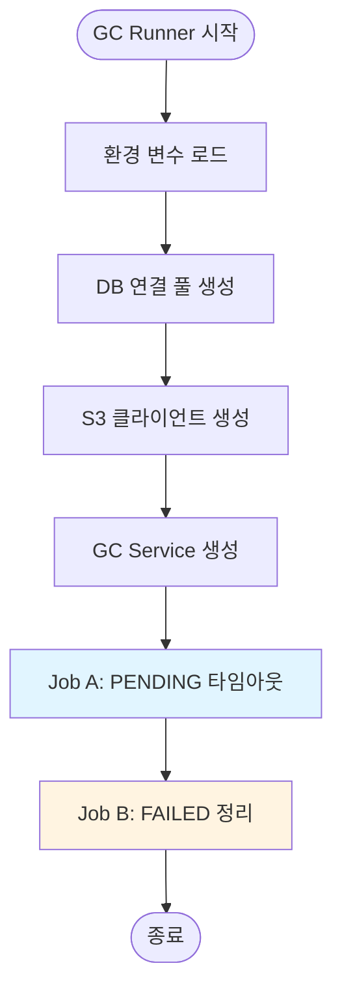
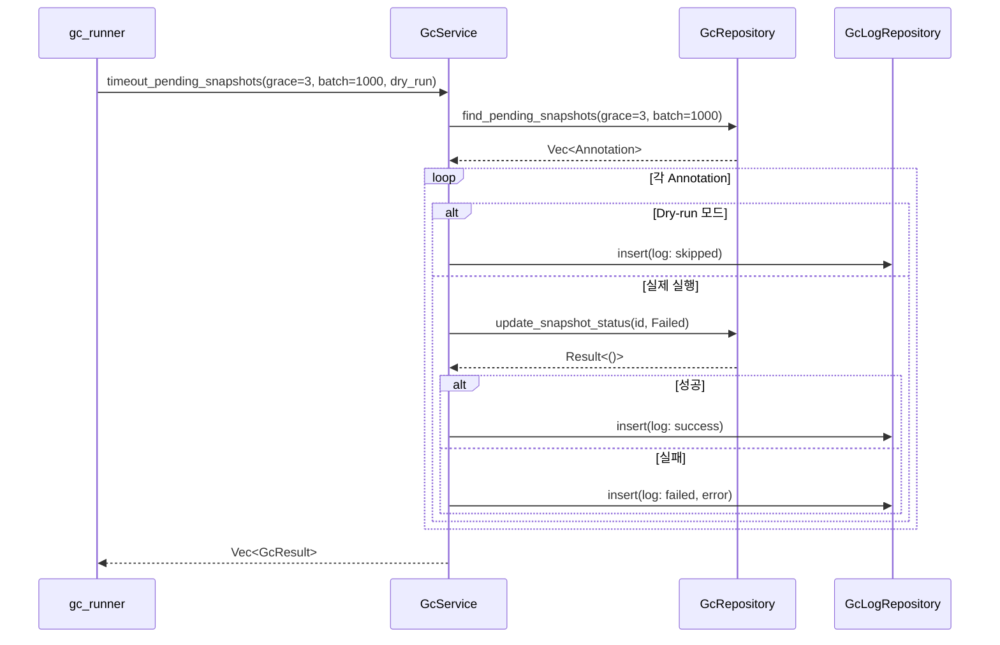
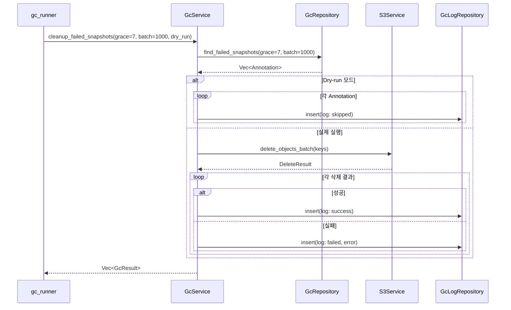

# GC Batch Job - 모듈 설계 및 다이어그램

> **작성일**: 2026-01-12  
> **목적**: 단일 책임 원칙(SRP)에 따른 모듈 설계 및 흐름 검증

---

## 📋 단일 책임 원칙(SRP) 적용

### 모듈별 책임 분리

| 모듈 | 책임 | 의존성 |
|------|------|--------|
| **GcDeletionLog** (Entity) | GC 삭제 로그 데이터 표현 | 없음 |
| **GcRepository** | GC 관련 DB 쿼리 (조회만) | PgPool |
| **GcLogRepository** | GC 로그 DB 쿼리 (삽입만) | PgPool |
| **S3Service** | S3 삭제 작업 | S3Client |
| **GcService** | GC 비즈니스 로직 조율 | GcRepository, GcLogRepository, S3Service |
| **GcRunner** (Binary) | CLI 진입점, 설정 로드 | GcService |

---

## 🏗️ 계층별 모듈 구조

### 1. Domain Layer (도메인 엔티티)

```
src/domain/entities/
└── gc_models.rs
    ├── GcDeletionLog          # GC 삭제 로그 엔티티
    ├── NewGcDeletionLog       # 로그 생성용 DTO
    ├── SnapshotUploadStatus   # Snapshot 상태 ENUM (기존)
    └── MaskUploadStatus       # Mask 상태 ENUM (추후)
```

**책임**: 데이터 구조 정의만

---

### 2. Repository Layer (데이터 접근)

```
src/infrastructure/repositories/
├── gc_repository.rs           # GC 대상 조회 (읽기 전용)
│   ├── find_pending_snapshots()
│   ├── find_failed_snapshots()
│   ├── update_snapshot_status()
│   └── annotation_exists()
│
└── gc_log_repository.rs       # GC 로그 기록 (쓰기 전용)
    └── insert()
```

**책임**: DB 쿼리 실행만 (비즈니스 로직 없음)

---

### 3. Service Layer (비즈니스 로직)

```
src/application/services/
├── gc_service.rs              # GC 비즈니스 로직 조율
│   ├── timeout_pending_snapshots()
│   ├── cleanup_failed_snapshots()
│   └── cleanup_orphan_snapshots()
│
└── s3_service.rs              # S3 작업 (기존 또는 신규)
    ├── delete_object()
    └── delete_objects_batch()
```

**책임**: 비즈니스 규칙 적용, 여러 Repository 조율

---

### 4. Binary Layer (진입점)

```
src/bin/
└── gc_runner.rs               # CLI 진입점
    ├── main()                 # 설정 로드, DI
    ├── run_snapshot_gc()      # Snapshot GC 실행
    ├── run_mask_gc()          # Mask GC 실행
    └── run_orphan_gc()        # Orphan GC 실행
```

**책임**: CLI 인자 파싱, 설정 로드, 서비스 호출만

---

## 📊 Activity Diagram - Snapshot GC 전체 흐름



---

## 🔄 Sequence Diagram - Job A (PENDING 타임아웃)



---

## 🔄 Sequence Diagram - Job B (FAILED Snapshot 정리)



---

## 🧩 의존성 주입 패턴 (현재 코드베이스 스타일)

### main.rs 패턴 (참고용)

```rust
// 현재 pacs-server의 DI 패턴
let annotation_repo = Arc::new(AnnotationRepositoryImpl::new(pool.clone()));
let user_repo = Arc::new(UserRepositoryImpl::new(pool.clone()));
let project_repo = Arc::new(ProjectRepositoryImpl::new(pool.clone()));

let annotation_service = AnnotationServiceImpl::new(
    annotation_repo.clone(),
    user_repo.clone(),
    project_repo.clone(),
);
```

### gc_runner.rs 적용

```rust
// GC 배치의 DI 패턴
let gc_repo = Arc::new(GcRepositoryImpl::new(pool.clone()));
let gc_log_repo = Arc::new(GcLogRepositoryImpl::new(pool.clone()));
let s3_service = Arc::new(S3ServiceImpl::new(s3_client, bucket_name));

let gc_service = GcServiceImpl::new(
    gc_repo,
    gc_log_repo,
    s3_service,
);
```

---

## 📦 모듈별 상세 설계

### 1. Domain Entity (gc_models.rs)

```rust
// src/domain/entities/gc_models.rs
use chrono::{DateTime, Utc};
use serde::{Deserialize, Serialize};

/// GC 삭제 로그 엔티티
#[derive(Debug, Clone, Serialize, Deserialize, sqlx::FromRow)]
pub struct GcDeletionLog {
    pub id: i64,
    pub batch_id: String,
    pub resource_type: String,
    pub s3_key: String,
    
    // 리소스 식별
    pub annotation_id: Option<i64>,
    pub mask_id: Option<i64>,
    pub mask_group_id: Option<i64>,
    pub version: Option<i32>,
    
    // 삭제 이유 및 결과
    pub reason: String,
    pub dry_run: bool,
    pub status: String,
    pub error_code: Option<String>,
    pub error_message: Option<String>,
    
    // 메타데이터
    pub grace_period_days: Option<i32>,
    pub file_size: Option<i64>,
    
    pub created_at: DateTime<Utc>,
}

/// GC 로그 생성용 DTO
#[derive(Debug, Clone)]
pub struct NewGcDeletionLog {
    pub batch_id: String,
    pub resource_type: String,
    pub s3_key: String,
    pub annotation_id: Option<i64>,
    pub mask_id: Option<i64>,
    pub mask_group_id: Option<i64>,
    pub version: Option<i32>,
    pub reason: String,
    pub dry_run: bool,
    pub status: String,
    pub error_code: Option<String>,
    pub error_message: Option<String>,
    pub grace_period_days: Option<i32>,
    pub file_size: Option<i64>,
}
```

**책임**: 데이터 구조 정의만 (로직 없음)

---

## 🔍 누락된 개발 과정 체크리스트

### Phase 1: 기본 구조 (1일)
- [ ] `src/lib.rs` 생성 및 공통 모듈 export
- [ ] `src/domain/entities/gc_models.rs` 생성
- [ ] `Cargo.toml` 멀티 바이너리 설정

### Phase 2: Repository Layer (1일)
- [ ] `src/infrastructure/repositories/gc_repository.rs` 생성
  - [ ] `find_pending_snapshots()` 구현
  - [ ] `find_failed_snapshots()` 구현
  - [ ] `update_snapshot_status()` 구현
  - [ ] `annotation_exists()` 구현
- [ ] `src/infrastructure/repositories/gc_log_repository.rs` 생성
  - [ ] `insert()` 구현
- [ ] `src/infrastructure/repositories/mod.rs` 업데이트

### Phase 3: Service Layer (2일)
- [ ] `src/application/services/gc_service.rs` 생성
  - [ ] Trait 정의 (`GcService`)
  - [ ] Impl 정의 (`GcServiceImpl`)
  - [ ] `timeout_pending_snapshots()` 구현
  - [ ] `cleanup_failed_snapshots()` 구현
- [ ] S3 Service 확인/생성
  - [ ] 기존 S3 Service 재사용 가능 여부 확인
  - [ ] 필요 시 `delete_objects_batch()` 추가
- [ ] `src/application/services/mod.rs` 업데이트

### Phase 4: Binary (1일)
- [ ] `src/bin/gc_runner.rs` 생성
  - [ ] CLI 인자 파싱 (Clap)
  - [ ] 설정 로드 (환경 변수)
  - [ ] DI 컨테이너 구성
  - [ ] Job 실행 함수들

### Phase 5: 테스트 (2일)
- [ ] 단위 테스트
  - [ ] Repository 테스트 (Mock DB)
  - [ ] Service 테스트 (Mock Repository)
- [ ] 통합 테스트
  - [ ] 로컬 DB + MinIO로 E2E 테스트
- [ ] Dry-run 검증

### Phase 6: 배포 (1일)
- [ ] Dockerfile 수정
- [ ] Kubernetes CronJob YAML 작성
- [ ] 프로덕션 배포

---

---

## 🎨 다이어그램 렌더링

위의 Mermaid 다이어그램들이 렌더링되어 표시됩니다:
1. **Activity Diagram** - 전체 GC 흐름
2. **Sequence Diagram (Job A)** - PENDING 타임아웃 상세 흐름
3. **Sequence Diagram (Job B)** - FAILED 정리 상세 흐름

---

## 🔍 누락 검증 결과

### ✅ 완료된 설계
- [x] 단일 책임 원칙 적용 (각 모듈 1개 책임)
- [x] 계층 분리 (Domain, Repository, Service, Binary)
- [x] 의존성 방향 (Binary → Service → Repository → Domain)
- [x] 에러 처리 패턴 (현재 코드베이스와 일치)
- [x] DI 패턴 (현재 코드베이스와 일치)

### ⚠️ 추가 고려 사항

#### 1. S3 Service 재사용 여부
**현재 상태 확인 필요**:
- 기존 `ObjectStorageService` 또는 `SignedUrlService` 재사용 가능?
- `delete_objects_batch()` 메서드 존재 여부?

**권장**:
- 기존 S3 Service가 있다면 재사용
- 없다면 `S3ServiceImpl` 신규 생성

#### 2. 트랜잭션 처리
**현재 설계**: 트랜잭션 없음 (각 작업 독립)

**이유**:
- GC는 멱등성(idempotent) 작업
- 실패 시 다음 실행에서 재시도
- 로그는 별도 테이블이므로 롤백 불필요

**검증**: ✅ 트랜잭션 불필요

#### 3. 배치 크기 제한
**현재 설계**: 1000개 (S3 API 제한)

**검증**:
- S3 DeleteObjects API 최대 1000개 ✅
- DB 쿼리 LIMIT 1000 ✅
- 메모리 사용량 적정 ✅

#### 4. 재시도 로직
**현재 설계**: 재시도 없음

**이유**:
- CronJob이 주기적으로 실행 (매일)
- 실패 건은 다음 실행에서 재처리
- 로그에 실패 기록 → 수동 대응 가능

**검증**: ✅ 재시도 불필요 (CronJob 특성상)

#### 5. 동시 실행 방지
**Kubernetes 설정**:
```yaml
concurrencyPolicy: Forbid  # 동시 실행 방지
```

**검증**: ✅ Kubernetes 레벨에서 처리

---

## 📋 최종 체크리스트

### 설계 검증
- [x] 단일 책임 원칙 적용
- [x] 계층 분리 명확
- [x] 의존성 방향 올바름
- [x] 에러 처리 일관성
- [x] 현재 코드베이스 패턴 준수

### 누락 확인
- [x] DB 마이그레이션 (039_create_gc_deletion_log.sql)
- [x] Entity 정의 (GcDeletionLog)
- [x] Repository 정의 (GcRepository, GcLogRepository)
- [x] Service 정의 (GcService)
- [x] Binary 정의 (gc_runner)
- [x] 설정 관리 (환경 변수)
- [x] 에러 처리
- [x] 로깅
- [x] Dry-run 모드
- [x] 배치 크기 제한
- [x] 동시 실행 방지

### 추가 확인 필요
- [ ] 기존 S3 Service 재사용 가능 여부 확인
- [ ] 기존 Annotation Entity에 `snapshot_upload_status` 필드 확인
- [ ] 기존 ServiceError에 필요한 variant 확인

---

## 🚀 다음 단계

1. **기존 코드 확인** - S3 Service, Annotation Entity
2. **상세 구현 가이드 작성** - 08번 문서
3. **코드 작성 시작** - 체크리스트 순서대로

