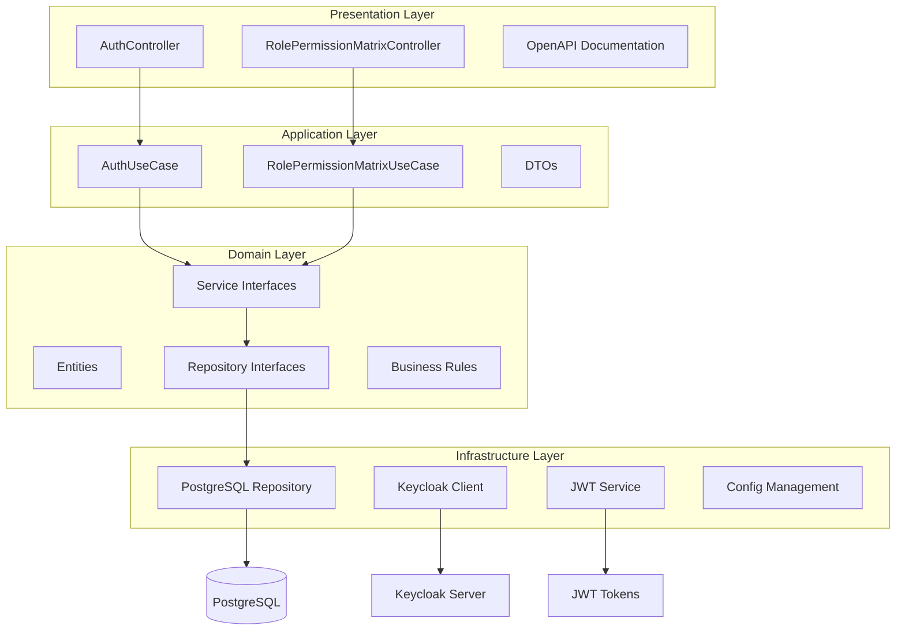
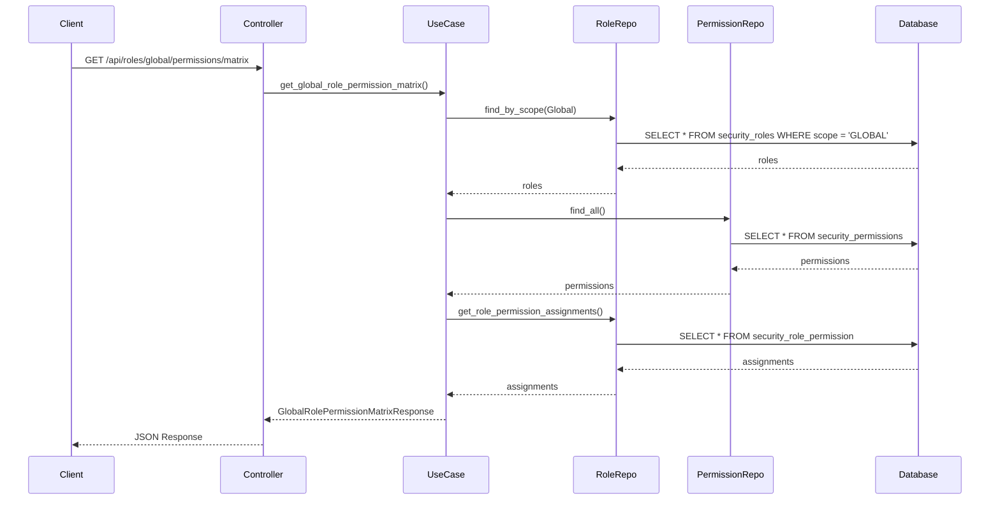
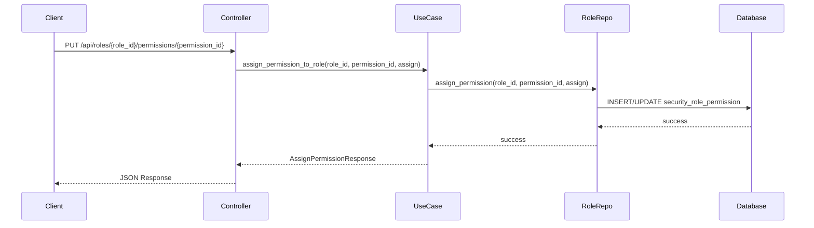
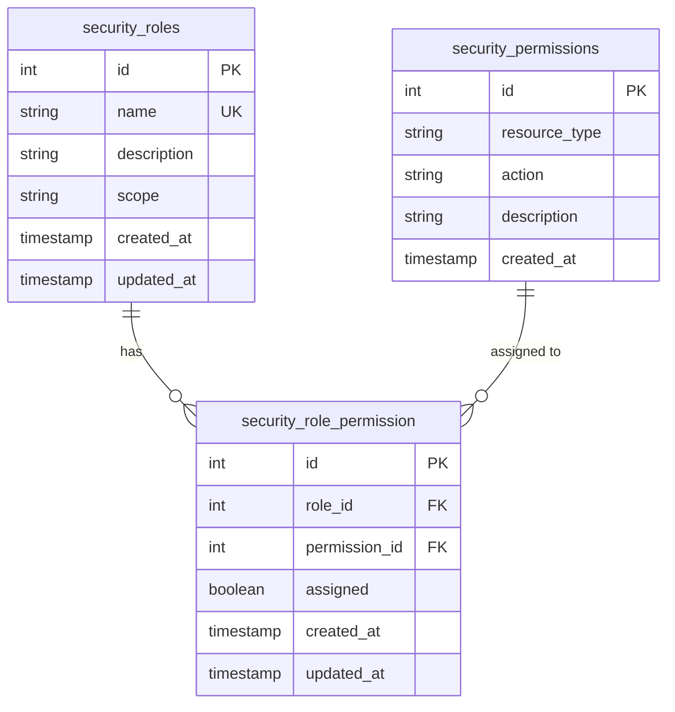
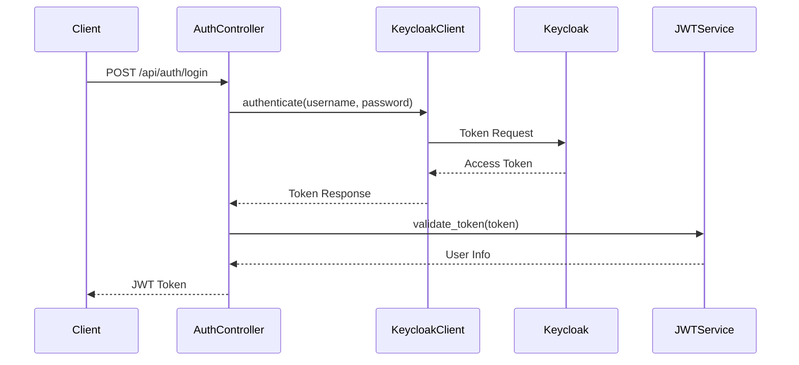
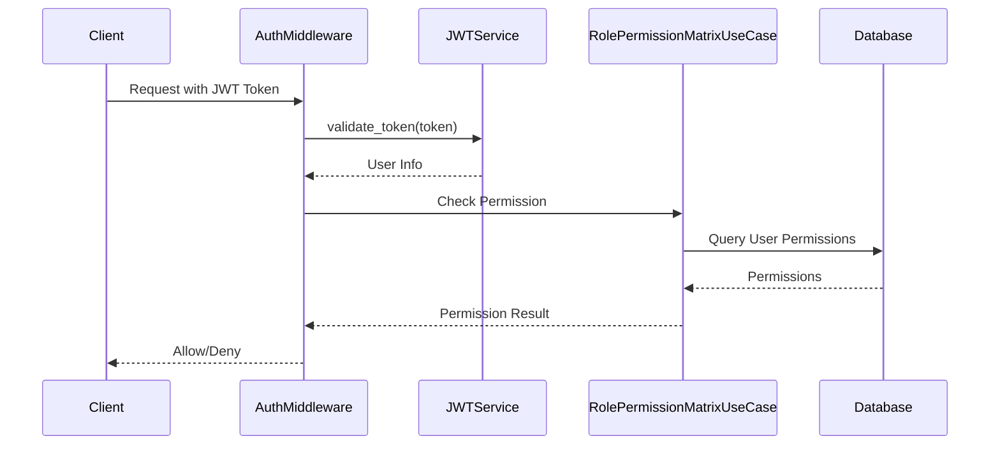

# Role-Permission Matrix API 아키텍처 개요

## 📋 개요

이 문서는 Role-Permission Matrix API의 전체 아키텍처와 설계 원칙을 설명합니다. Clean Architecture 패턴을 기반으로 한 확장 가능하고 유지보수 가능한 권한 관리 시스템입니다.

## 🏗️ 전체 아키텍처



## 🎯 Clean Architecture 계층별 역할

### 1. Presentation Layer (프레젠테이션 계층)

**책임**: HTTP 요청/응답 처리, API 엔드포인트 정의

```rust
// src/presentation/controllers/role_permission_matrix_controller.rs
pub struct RolePermissionMatrixController {
    use_case: Arc<RolePermissionMatrixUseCase>,
}

impl RolePermissionMatrixController {
    /// 글로벌 롤-권한 매트릭스 조회
    pub async fn get_global_role_permission_matrix(
        &self,
        use_case: web::Data<RolePermissionMatrixUseCase>,
    ) -> Result<HttpResponse> {
        // HTTP 요청 처리
        // DTO 변환
        // 에러 처리
    }
}
```

**특징**:
- HTTP 프로토콜과 독립적
- 비즈니스 로직 없음
- DTO 변환만 담당
- 에러를 HTTP 상태 코드로 변환

### 2. Application Layer (애플리케이션 계층)

**책임**: 유스케이스 구현, 애플리케이션 서비스, DTO 정의

```rust
// src/application/use_cases/role_permission_matrix_use_case.rs
pub struct RolePermissionMatrixUseCase {
    role_repository: Arc<dyn RoleRepository>,
    permission_repository: Arc<dyn PermissionRepository>,
}

impl RolePermissionMatrixUseCase {
    /// 글로벌 롤-권한 매트릭스 조회 유스케이스
    pub async fn get_global_role_permission_matrix(
        &self,
    ) -> Result<GlobalRolePermissionMatrixResponse, ServiceError> {
        // 1. 글로벌 롤 조회
        let roles = self.role_repository
            .find_by_scope(RoleScope::Global)
            .await?;
        
        // 2. 권한을 카테고리별로 그룹화
        let permissions = self.permission_repository
            .find_all()
            .await?;
        
        // 3. 롤-권한 할당 상태 조회
        let assignments = self.role_repository
            .get_role_permission_assignments()
            .await?;
        
        // 4. 응답 DTO 생성
        Ok(GlobalRolePermissionMatrixResponse {
            roles: roles.into_iter().map(|r| r.into()).collect(),
            permissions_by_category: group_permissions_by_category(permissions),
            assignments: assignments.into_iter().map(|a| a.into()).collect(),
        })
    }
}
```

**특징**:
- 비즈니스 로직 오케스트레이션
- 도메인 서비스 조합
- 트랜잭션 관리
- DTO 변환

### 3. Domain Layer (도메인 계층)

**책임**: 비즈니스 로직, 엔티티, 리포지토리 인터페이스

```rust
// src/domain/entities/role.rs
#[derive(Debug, Clone, Serialize, Deserialize, sqlx::FromRow)]
pub struct Role {
    pub id: i32,
    pub name: String,
    pub description: Option<String>,
    pub scope: RoleScope,
    pub created_at: DateTime<Utc>,
    pub updated_at: DateTime<Utc>,
}

#[derive(Debug, Clone, Serialize, Deserialize, PartialEq)]
pub enum RoleScope {
    Global,
    Project,
}

// src/domain/repositories/role_repository.rs
#[async_trait::async_trait]
pub trait RoleRepository: Send + Sync {
    async fn find_by_id(&self, id: i32) -> Result<Option<Role>, sqlx::Error>;
    async fn find_by_scope(&self, scope: RoleScope) -> Result<Vec<Role>, sqlx::Error>;
    async fn get_role_permission_assignments(&self) -> Result<Vec<RolePermissionAssignment>, sqlx::Error>;
}
```

**특징**:
- 비즈니스 규칙 캡슐화
- 외부 의존성 없음
- 인터페이스 정의
- 도메인 모델

### 4. Infrastructure Layer (인프라스트럭처 계층)

**책임**: 데이터베이스 구현, 외부 서비스 연동, 설정 관리

```rust
// src/infrastructure/repositories/role_repository_impl.rs
pub struct RoleRepositoryImpl {
    pool: PgPool,
}

#[async_trait::async_trait]
impl RoleRepository for RoleRepositoryImpl {
    async fn find_by_scope(&self, scope: RoleScope) -> Result<Vec<Role>, sqlx::Error> {
        sqlx::query_as!(
            Role,
            "SELECT * FROM security_roles WHERE scope = $1 ORDER BY name",
            scope.to_string()
        )
        .fetch_all(&self.pool)
        .await
    }
    
    async fn get_role_permission_assignments(&self) -> Result<Vec<RolePermissionAssignment>, sqlx::Error> {
        sqlx::query_as!(
            RolePermissionAssignment,
            r#"
            SELECT 
                rp.role_id,
                rp.permission_id,
                rp.assigned
            FROM security_role_permission rp
            ORDER BY rp.role_id, rp.permission_id
            "#
        )
        .fetch_all(&self.pool)
        .await
    }
}
```

**특징**:
- 구체적인 기술 구현
- 데이터베이스 쿼리
- 외부 API 호출
- 설정 로딩

## 🔄 데이터 흐름

### 1. 롤-권한 매트릭스 조회 흐름



### 2. 권한 할당/제거 흐름



## 🗄️ 데이터베이스 설계

### 1. 엔티티 관계도



### 2. 인덱스 전략

```sql
-- 성능 최적화를 위한 인덱스
CREATE INDEX idx_security_roles_scope ON security_roles(scope);
CREATE INDEX idx_security_permissions_resource_action ON security_permissions(resource_type, action);
CREATE INDEX idx_security_role_permission_role_id ON security_role_permission(role_id);
CREATE INDEX idx_security_role_permission_permission_id ON security_role_permission(permission_id);
CREATE UNIQUE INDEX idx_security_role_permission_unique ON security_role_permission(role_id, permission_id);
```

## 🔐 보안 아키텍처

### 1. 인증 흐름



### 2. 권한 검증 흐름



## 🚀 확장성 고려사항

### 1. 수평적 확장

```rust
// 로드 밸런서를 통한 다중 인스턴스 지원
// 상태 없는 설계로 인스턴스 간 공유 상태 없음
// 데이터베이스 연결 풀링으로 연결 관리
```

### 2. 캐싱 전략

```rust
// Redis를 사용한 권한 정보 캐싱
pub struct CachedRolePermissionMatrixUseCase {
    use_case: RolePermissionMatrixUseCase,
    cache: Arc<RedisCache>,
    cache_ttl: Duration,
}

impl CachedRolePermissionMatrixUseCase {
    pub async fn get_global_role_permission_matrix(&self) -> Result<GlobalRolePermissionMatrixResponse, ServiceError> {
        // 1. 캐시에서 조회
        if let Some(cached) = self.cache.get("role_permission_matrix").await? {
            return Ok(cached);
        }
        
        // 2. 캐시 미스 시 데이터베이스에서 조회
        let result = self.use_case.get_global_role_permission_matrix().await?;
        
        // 3. 캐시에 저장
        self.cache.set("role_permission_matrix", &result, self.cache_ttl).await?;
        
        Ok(result)
    }
}
```

### 3. 비동기 처리

```rust
// 권한 변경 이벤트를 비동기로 처리
pub struct PermissionChangeEvent {
    pub role_id: i32,
    pub permission_id: i32,
    pub assigned: bool,
    pub changed_by: i32,
    pub timestamp: DateTime<Utc>,
}

pub struct PermissionChangeHandler {
    event_sender: mpsc::Sender<PermissionChangeEvent>,
}

impl PermissionChangeHandler {
    pub async fn handle_permission_change(&self, event: PermissionChangeEvent) {
        // 1. 감사 로그 기록
        self.audit_logger.log_permission_change(&event).await;
        
        // 2. 캐시 무효화
        self.cache.invalidate_pattern("role_permission_*").await;
        
        // 3. 실시간 알림 (WebSocket)
        self.notification_service.notify_permission_change(&event).await;
    }
}
```

## 🧪 테스트 전략

### 1. 테스트 피라미드

```
        /\
       /  \
      / E2E \     <- 통합 테스트 (API 전체)
     /______\
    /        \
   /  Unit    \   <- 단위 테스트 (개별 컴포넌트)
  /____________\
```

### 2. 테스트 구조

```rust
// 단위 테스트
#[cfg(test)]
mod unit_tests {
    use super::*;
    use mockall::mock;
    
    mock! {
        RoleRepository {}
        
        #[async_trait]
        impl RoleRepository for RoleRepository {
            async fn find_by_scope(&self, scope: RoleScope) -> Result<Vec<Role>, sqlx::Error>;
        }
    }
    
    #[tokio::test]
    async fn test_get_global_role_permission_matrix() {
        // Given
        let mut mock_repo = MockRoleRepository::new();
        mock_repo.expect_find_by_scope()
            .with(eq(RoleScope::Global))
            .times(1)
            .returning(|| Ok(vec![create_test_role()]));
        
        // When
        let use_case = RolePermissionMatrixUseCase::new(Arc::new(mock_repo));
        let result = use_case.get_global_role_permission_matrix().await;
        
        // Then
        assert!(result.is_ok());
    }
}

// 통합 테스트
#[cfg(test)]
mod integration_tests {
    use super::*;
    use actix_web::{test, web, App};
    
    #[actix_web::test]
    async fn test_role_permission_matrix_api() {
        // Given
        let app = test::init_service(
            App::new()
                .app_data(web::Data::new(create_test_use_case()))
                .service(role_permission_matrix_controller::configure_routes)
        ).await;
        
        // When
        let req = test::TestRequest::get()
            .uri("/api/roles/global/permissions/matrix")
            .to_request();
        let resp = test::call_service(&app, req).await;
        
        // Then
        assert!(resp.status().is_success());
    }
}
```

## 📊 모니터링 및 로깅

### 1. 로깅 전략

```rust
use tracing::{info, warn, error, instrument};

#[instrument(skip(self))]
impl RolePermissionMatrixUseCase {
    pub async fn get_global_role_permission_matrix(&self) -> Result<GlobalRolePermissionMatrixResponse, ServiceError> {
        info!("Getting global role permission matrix");
        
        let start = std::time::Instant::now();
        let result = self.fetch_matrix_data().await;
        let duration = start.elapsed();
        
        match &result {
            Ok(_) => info!("Successfully retrieved role permission matrix in {:?}", duration),
            Err(e) => error!("Failed to retrieve role permission matrix: {:?}", e),
        }
        
        result
    }
}
```

### 2. 메트릭 수집

```rust
use prometheus::{Counter, Histogram, Registry};

pub struct Metrics {
    pub requests_total: Counter,
    pub request_duration: Histogram,
    pub errors_total: Counter,
}

impl Metrics {
    pub fn new(registry: &Registry) -> Self {
        Self {
            requests_total: Counter::new("role_permission_requests_total", "Total number of requests")
                .register(registry)
                .unwrap(),
            request_duration: Histogram::new("role_permission_request_duration_seconds", "Request duration")
                .register(registry)
                .unwrap(),
            errors_total: Counter::new("role_permission_errors_total", "Total number of errors")
                .register(registry)
                .unwrap(),
        }
    }
}
```

## 🔧 설정 관리

### 1. 환경별 설정

```toml
# config/development.toml
[server]
host = "127.0.0.1"
port = 8080

[database]
host = "localhost"
port = 5432
username = "pacs_dev"
password = "dev_password"

# config/production.toml
[server]
host = "0.0.0.0"
port = 8080

[database]
host = "prod-db.example.com"
port = 5432
username = "pacs_prod"
password = "prod_password"
```

### 2. 환경 변수 우선순위

```
1. 환경 변수 (APP_*)
2. .env 파일
3. config/{environment}.toml
4. config/default.toml
```

## 🎯 성능 최적화

### 1. 데이터베이스 최적화

```sql
-- 쿼리 최적화
EXPLAIN ANALYZE SELECT 
    r.id, r.name, r.scope,
    p.id as permission_id, p.resource_type, p.action,
    rp.assigned
FROM security_roles r
CROSS JOIN security_permissions p
LEFT JOIN security_role_permission rp ON r.id = rp.role_id AND p.id = rp.permission_id
WHERE r.scope = 'GLOBAL'
ORDER BY r.name, p.resource_type, p.action;
```

### 2. 메모리 최적화

```rust
// 대용량 데이터 처리 시 스트리밍 사용
use futures_util::stream::StreamExt;

pub async fn get_large_role_permission_matrix(&self) -> Result<impl Stream<Item = RolePermissionRow>, ServiceError> {
    let stream = sqlx::query_as!(
        RolePermissionRow,
        "SELECT r.id, r.name, p.id as permission_id, p.resource_type, p.action, rp.assigned
         FROM security_roles r
         CROSS JOIN security_permissions p
         LEFT JOIN security_role_permission rp ON r.id = rp.role_id AND p.id = rp.permission_id
         WHERE r.scope = 'GLOBAL'"
    )
    .fetch(&self.pool);
    
    Ok(stream)
}
```

---

이 아키텍처 개요를 통해 Role-Permission Matrix API의 전체 구조와 설계 원칙을 이해할 수 있습니다. Clean Architecture 패턴을 따르면서도 실용적이고 확장 가능한 시스템을 구축했습니다.
