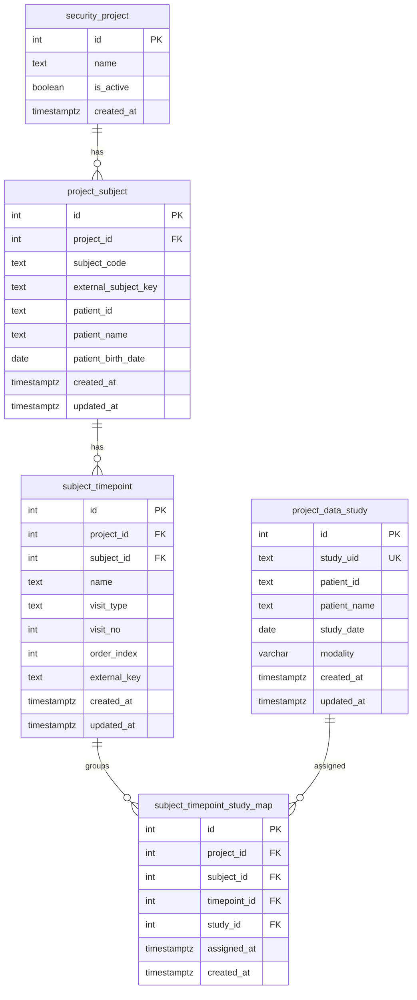
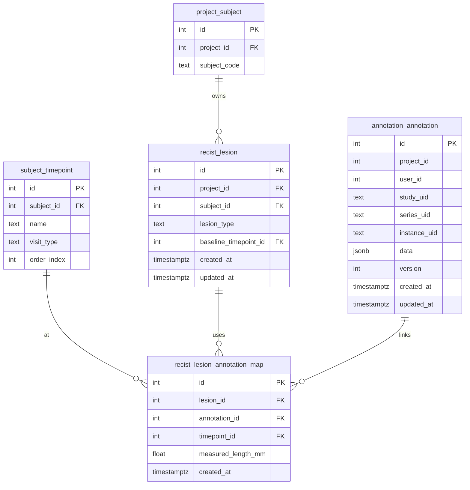

아래는 **지금까지 확정된 방향(Subject/TimePoint, fallback, CTIMS 대비, lesion role 분리)**을 기준으로,
“앞으로 다시 해야 할 작업들”을 **기술문서 형태로 한 번에** 정리한 거야.
(ERD + API + 마이그레이션/구현 작업 목록까지 포함)

---

# 📘 RECIST TimePoint & Lesion Role (Target/Non-target/New)

## Fallback 단계 구현을 위한 작업 정리 기술문서 (ERD + API 포함)

---

## 1. 목적

본 문서는 웹 PACS Viewer + RECIST Report 기능을 완성하기 위해 필요한 **추가 작업 범위**를 정리한다.

현재 상황:

* CTIMS 연동이 **최종 목표**
* 하지만 현 시점은 **fallback(미연동) 단계**
* Worklist(기존 PACS 흐름)는 유지해야 함
* 사용자가 **Study를 TimePoint로 분류하는 보드 UI**를 구현 완료
* 이제 **DB/백엔드 설계**를 보강해야 함:

  * Subject/TimePoint 모델
  * Study-TimePoint 매핑
  * Annotation에 대한 RECIST 역할(Target/Non-target/New lesion) 모델

---

## 2. 핵심 도메인 정리 (확정 사항)

### 2.1 계층 구조 (정답 모델)

```
Project(연구) → Subject(환자) → TimePoint(BL/TP1/TP2...) → Study(1..N)
```

* **Baseline은 프로젝트가 아니라 Subject 단위로 1개**
* **TimePoint는 Subject 단위**
* 하나의 TimePoint는 **1개 이상의 Study로 구성 가능**
* Study는 fallback에서 **관리 UI로 TimePoint 재분류 가능**

  * (Annotation UI에서 직접 변경 ❌)

---

## 3. DB/ERD 작업 (필수)

### 3.1 신규 테이블 추가: Subject / TimePoint / Study Map

#### (A) `project_subject`

* Project 내 Subject(환자) 정의
* CTIMS 연동 대비 key 저장

#### (B) `subject_timepoint`

* Subject 단위 TimePoint 정의

#### (C) `subject_timepoint_study_map`

* Study를 TimePoint에 매핑하는 핵심 테이블
* Unassigned는 map row가 없는 상태로 표현

---

## 4. ERD (Mermaid)

> 아래 ERD는 **현재 ERD( security_project / project_data_study )에 최소 침습으로 추가**되는 구조임



---

## 5. DB 제약조건 (필수)

### 5.1 Subject당 Baseline 1개

```sql
-- subject_id 기준 Baseline(visit_type='Baseline') 1개
CREATE UNIQUE INDEX ux_subject_baseline
ON subject_timepoint(subject_id)
WHERE visit_type = 'Baseline';
```

### 5.2 Study는 Subject 내에서 한 TimePoint만

```sql
CREATE UNIQUE INDEX ux_subject_study_unique
ON subject_timepoint_study_map(subject_id, study_id);
```

---

## 6. RECIST Lesion Role 설계 (Target / Non-target / New lesion)

### 6.1 왜 annotation에 바로 role을 넣지 않는가

* annotation_annotation은 “도형/마스크” 데이터
* RECIST role은 “의학적 해석 컨텍스트”
* TimePoint 이동/보정/CTIMS 연동 시 **의미가 깨지지 않게 하려면 분리해야 함**

따라서:

* **Lesion 레이어(RECIST 병변 개념)를 별도 모델로 둔다**

---

## 7. RECIST Lesion ERD (추가 테이블 2개)

### 7.1 테이블

#### (D) `recist_lesion`

* 병변 엔티티
* lesion_type: TARGET | NON_TARGET | NEW
* TARGET/NON_TARGET는 Baseline 연결을 가짐
* NEW는 Baseline 연결 없음

#### (E) `recist_lesion_annotation_map`

* 특정 TimePoint에서 해당 병변을 표현하는 annotation 연결

---

## 8. RECIST Lesion ERD (Mermaid)



---

## 9. Lesion 규칙 (필수)

### 9.1 lesion_type 별 규칙

| lesion_type | baseline_timepoint_id |
| ----------- | --------------------- |
| TARGET      | 필수                    |
| NON_TARGET  | 필수                    |
| NEW         | NULL                  |

### 9.2 New lesion은 Follow-up에서만 생성 가능

* Baseline TimePoint에서는 `lesion_type=NEW` 생성 금지 (서버 검증)

### 9.3 어노테이션 timepoint는 사용자 입력이 아니라 “컨텍스트 자동 상속”

* Viewer가 현재 보고 있는 study/timepoint 컨텍스트로 서버에서 자동 주입
* 사용자가 timepoint를 직접 선택하는 UI는 제공하지 않음

---

## 10. API 작업 (필수)

### 10.1 TimePoint 보드용 API (기존 + 수정 필요)

#### ✅ 필수 수정 사항

* 모든 API는 project_id를 **필수 스코프**로 사용
* Subject 스코프가 추가되며 timepoint는 subject_id 기준

### 10.2 권장 API 목록

#### (1) Subject 목록 조회

* `GET /api/subjects?project_id=...`
* 보드 UI 진입 시 subject 선택/확인용

#### (2) Subject 생성/매핑 (fallback)

* `POST /api/subjects`
* 환자(patient_id) ↔ subject_code 매핑

#### (3) TimePoint 목록 조회 (subject 기준)

* `GET /api/timepoints?project_id=...&subject_id=...`

#### (4) TimePoint 생성/수정/삭제 (subject 기준)

* `POST /api/timepoints`
* `PUT /api/timepoints/{id}`
* `DELETE /api/timepoints/{id}`

#### (5) Study 할당/제거 (subject 기준)

* `POST /api/timepoints/assign-studies`
* `POST /api/timepoints/remove-studies`

---

## 11. RECIST Role API (필수)

### 11.1 어노테이션 생성 시 role 지정 (권장 패턴)

* `POST /api/annotations`

요청 예시:

```json
{
  "study_uid": "...",
  "series_uid": "...",
  "instance_uid": "...",
  "data": { "...": "..." },
  "recist": {
    "lesion_type": "NEW",
    "lesion_id": null
  }
}
```

서버 동작:

* lesion_type이 NEW면:

  * recist_lesion 생성
  * recist_lesion_annotation_map 생성 (timepoint 자동)
* lesion_type이 TARGET/NON_TARGET면:

  * lesion_id 선택 또는 생성(필요 시)
  * map 생성

---

## 12. TimePoint 재분류(변경) 정책 (fallback 단계)

### 12.1 지금 단계

* 관리 UI에서 Study의 TimePoint 변경 가능
* 변경 시:

  * `subject_timepoint_study_map` 업데이트
  * 해당 Study에 속한 lesion_annotation_map도 같이 이동시키는 옵션 제공(운영 편의)

### 12.2 나중(CTIMS 연동/고도화)

* 판독 기록은 immutable 방향으로 전환 가능
* 변경은 audit log 필수

---

## 13. 구현해야 할 작업 체크리스트

### 13.1 DB/마이그레이션 ✅ **완료**

* [x] project_subject 테이블 추가 ✅
* [x] subject_timepoint 테이블 추가 ✅
* [x] subject_timepoint_study_map 추가 ✅
* [x] recist_lesion 추가 ✅
* [x] recist_lesion_annotation_map 추가 ✅
* [x] 인덱스/제약조건 추가 ✅

**마이그레이션 파일:**
- `migrations/20250118_01_create_subject_timepoint_tables.sql`
- `migrations/20250118_02_create_recist_lesion_tables.sql`

### 13.2 API ✅ **완료**

* [x] Subject CRUD (최소: 목록/생성) ✅
* [x] TimePoint CRUD를 subject 스코프로 변경 ✅
* [x] assign/remove API를 subject/timepoint 기준으로 구현 ✅
* [x] RECIST Lesion CRUD API 구현 ✅
* [x] Annotation 연결 API 구현 ✅
* [x] New lesion 생성 제한(베이스라인 금지) ✅

**구현된 API 엔드포인트:**
- `POST /api/subjects/{subject_id}/recist-lesions` - Lesion 생성
- `GET /api/subjects/{subject_id}/recist-lesions` - Lesion 목록 조회
- `GET /api/recist-lesions/{id}` - Lesion 상세 조회
- `PUT /api/recist-lesions/{id}` - Lesion 수정
- `DELETE /api/recist-lesions/{id}` - Lesion 삭제
- `POST /api/recist-lesions/{id}/annotations` - Annotation 연결

### 13.3 Testing ✅ **완료**

* [x] E2E 테스트 작성 (Python) ✅
* [x] RECIST 1.1 비즈니스 규칙 검증 테스트 ✅
* [x] 에러 케이스 테스트 ✅

**테스트 파일:**
- `tests/e2e/test_07_recist_lesion.py` (16개 테스트 케이스)
- `tests/e2e/run_recist_lesion.py` (테스트 실행기)
- `tests/e2e/RECIST_LESION_TEST.md` (테스트 문서)

### 13.4 Viewer/Frontend 연동 ⚠️ **보류**

* [ ] Annotation 생성 요청 시 recist role 전달
* [ ] timepoint는 UI 입력 없이 context에서 자동
* [ ] 보드 UI에서 Study 재분류 시 서버 반영

**Note:** Frontend 연동은 백엔드 API 완성 후 진행 예정

### 13.5 Report 연동(후속) ⚠️ **보류**

* [ ] TimePoint별 lesion 목록 조회 API
* [ ] Target 합산/Non-target 상태/New lesion 이벤트 반영

**Note:** Report 기능은 Phase 2로 연기

---

## 14. 산출물(Deliverables) ✅ **완료**

* ✅ 최종 ERD 다이어그램
* ✅ DB DDL (Postgres)
* ✅ API 명세서 (TimePoint + Subject + Recist role)
* ✅ 트랜잭션 시나리오 문서 (assign / reassign / delete)
* ✅ E2E 테스트 코드 (Python, 16개 테스트)
* ✅ OpenAPI/Swagger 문서

---

원하면 다음으로 바로 이어서 해줄 수 있어:

1. **이 문서 기준으로 “Postgres DDL” 생성**
2. **API 명세를 실제 엔드포인트/DTO 형태로 더 구체화**
3. **Report 화면에서 필요한 “lesion 조회 API”까지 확장**

원하는 순서만 말해줘.
