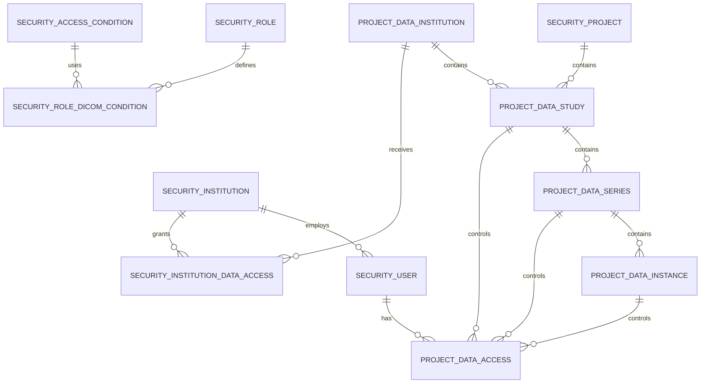

# 📘 DICOM RBAC Gateway 스키마 설계서

**문서 버전:** v1.0  
**작성일:** 2025-01-27  
**작성자:** PACS Extension Server Team  

---

## 1️⃣ 설계 목적

본 문서는 DICOM Web RBAC Gateway를 위한 데이터베이스 스키마 설계를 정의합니다.

### 핵심 요구사항
- **다기관 환경 지원**: 사용자 기관과 데이터 기관 분리
- **계층적 접근 제어**: Study → Series → Instance 레벨 제어
- **명시적 + 룰 기반 결합**: 성능과 유연성 동시 확보
- **기존 구조 확장**: 현재 `project_data_*` 테이블 기반 확장

---

## 2️⃣ 설계 원칙

| 항목 | 설명 |
|------|------|
| **기존 구조 보존** | `project_data_*` 테이블 기반 확장 |
| **명명 규칙 통일** | `security_*` (보안), `project_data_*` (데이터) |
| **이중 기관 구조** | 사용자 기관 vs 데이터 기관 분리 |
| **계층적 상속** | Study → Series → Instance 권한 상속 |
| **성능 우선** | 명시적 접근 제어 우선, 룰 기반 보조 |

---

## 3️⃣ 테이블 구조 개요

### 3.1 기관 관리 테이블
| 테이블 | 역할 | 스키마 |
|--------|------|--------|
| `security_institution` | 사용자 소속 기관 | Security |
| `project_data_institution` | 데이터 소속 기관 | Project Data |

### 3.2 데이터 계층 테이블
| 테이블 | 역할 | 레벨 |
|--------|------|------|
| `project_data_study` | Study 메타데이터 | Study |
| `project_data_series` | Series 메타데이터 | Series |
| `project_data_instance` | Instance 메타데이터 | Instance |

### 3.3 접근 제어 테이블
| 테이블 | 역할 | 방식 |
|--------|------|------|
| `project_data_access` | 명시적 접근 제어 | 테이블 기반 |
| `security_access_condition` | 룰 기반 접근 제어 | 조건 기반 |

---

## 4️⃣ 상세 설계

### 🏥 4.1 기관 정보 테이블

#### `security_institution` (사용자 기관)
```sql
CREATE TABLE security_institution (
    id INTEGER GENERATED ALWAYS AS IDENTITY PRIMARY KEY,
    institution_code VARCHAR(128) UNIQUE NOT NULL,
    institution_name VARCHAR(255) NOT NULL,
    institution_type VARCHAR(50) DEFAULT 'HOSPITAL', -- HOSPITAL, CLINIC, RESEARCH
    address TEXT,
    phone VARCHAR(50),
    email VARCHAR(255),
    is_active BOOLEAN DEFAULT true,
    created_at TIMESTAMPTZ NOT NULL DEFAULT CURRENT_TIMESTAMP,
    updated_at TIMESTAMPTZ NOT NULL DEFAULT CURRENT_TIMESTAMP
);
```

#### `project_data_institution` (데이터 기관)
```sql
CREATE TABLE project_data_institution (
    id INTEGER GENERATED ALWAYS AS IDENTITY PRIMARY KEY,
    institution_code VARCHAR(128) UNIQUE NOT NULL,
    institution_name VARCHAR(255) NOT NULL,
    institution_type VARCHAR(50) DEFAULT 'HOSPITAL',
    address TEXT,
    phone VARCHAR(50),
    email VARCHAR(255),
    is_active BOOLEAN DEFAULT true,
    created_at TIMESTAMPTZ NOT NULL DEFAULT CURRENT_TIMESTAMP,
    updated_at TIMESTAMPTZ NOT NULL DEFAULT CURRENT_TIMESTAMP
);
```

### 🧬 4.2 데이터 계층 테이블 확장

#### `project_data_study` 확장
```sql
-- 기존 테이블에 추가 필드
ALTER TABLE project_data_study 
ADD COLUMN data_institution_id INTEGER REFERENCES project_data_institution(id),
ADD COLUMN institution_code VARCHAR(128),
ADD COLUMN accession_no VARCHAR(255),
ADD COLUMN modality VARCHAR(64),
ADD COLUMN patient_sex CHAR(1),
ADD COLUMN study_time VARCHAR(32),
ADD COLUMN referring_physician VARCHAR(255),
ADD COLUMN performing_physician VARCHAR(255),
ADD COLUMN series_count INTEGER DEFAULT 0,
ADD COLUMN instance_count INTEGER DEFAULT 0,
ADD COLUMN is_active BOOLEAN DEFAULT true,
ADD COLUMN sync_status VARCHAR(20) DEFAULT 'PENDING';
```

#### `project_data_series` 확장
```sql
-- 기존 테이블에 추가 필드
ALTER TABLE project_data_series 
ADD COLUMN body_part VARCHAR(128),
ADD COLUMN station_name VARCHAR(255),
ADD COLUMN series_time VARCHAR(32),
ADD COLUMN performing_physician VARCHAR(255),
ADD COLUMN protocol_name VARCHAR(255),
ADD COLUMN instance_count INTEGER DEFAULT 0,
ADD COLUMN is_active BOOLEAN DEFAULT true,
ADD COLUMN sync_status VARCHAR(20) DEFAULT 'PENDING';
```

#### `project_data_instance` 신규 생성
```sql
CREATE TABLE project_data_instance (
    id INTEGER GENERATED ALWAYS AS IDENTITY PRIMARY KEY,
    series_id INTEGER NOT NULL REFERENCES project_data_series(id) ON DELETE CASCADE,
    instance_uid VARCHAR(255) NOT NULL,
    sop_class_uid VARCHAR(255),
    instance_number INTEGER,
    content_date VARCHAR(32),
    content_time VARCHAR(32),
    is_active BOOLEAN DEFAULT true,
    sync_status VARCHAR(20) DEFAULT 'PENDING',
    created_at TIMESTAMPTZ NOT NULL DEFAULT CURRENT_TIMESTAMP,
    UNIQUE (series_id, instance_uid)
);
```

### 🔐 4.3 접근 제어 테이블

#### `project_data_access` 확장 (명시적 접근 제어)
```sql
-- 기존 테이블에 추가 필드
ALTER TABLE project_data_access 
ADD COLUMN instance_id INTEGER REFERENCES project_data_instance(id) ON DELETE CASCADE,
ADD COLUMN user_institution_id INTEGER REFERENCES security_institution(id),
ADD COLUMN data_institution_id INTEGER REFERENCES project_data_institution(id),
ADD COLUMN access_scope VARCHAR(50) DEFAULT 'FULL', -- FULL, LIMITED, READ_ONLY
ADD COLUMN expires_at TIMESTAMPTZ,
ADD COLUMN granted_by INTEGER REFERENCES security_user(id),
ADD COLUMN granted_at TIMESTAMPTZ;
```

#### `security_access_condition` 확장 (룰 기반 접근 제어)
```sql
-- 기존 테이블에 추가 필드
ALTER TABLE security_access_condition 
ADD COLUMN institution_id INTEGER REFERENCES project_data_institution(id),
ADD COLUMN patient_id VARCHAR(255),
ADD COLUMN study_uid_pattern VARCHAR(255),
ADD COLUMN series_uid_pattern VARCHAR(255),
ADD COLUMN modality VARCHAR(64),
ADD COLUMN date_range_start DATE,
ADD COLUMN date_range_end DATE;
```

#### 기관 간 접근 권한 테이블
```sql
CREATE TABLE security_institution_data_access (
    id INTEGER GENERATED ALWAYS AS IDENTITY PRIMARY KEY,
    user_institution_id INTEGER NOT NULL REFERENCES security_institution(id),
    data_institution_id INTEGER NOT NULL REFERENCES project_data_institution(id),
    access_level VARCHAR(20) DEFAULT 'READ', -- READ, WRITE, ADMIN
    is_active BOOLEAN DEFAULT true,
    created_at TIMESTAMPTZ NOT NULL DEFAULT CURRENT_TIMESTAMP,
    UNIQUE (user_institution_id, data_institution_id)
);
```

#### Role별 DICOM 접근 조건
```sql
CREATE TABLE security_role_dicom_condition (
    id INTEGER GENERATED ALWAYS AS IDENTITY PRIMARY KEY,
    role_id INTEGER NOT NULL REFERENCES security_role(id) ON DELETE CASCADE,
    access_condition_id INTEGER NOT NULL REFERENCES security_access_condition(id) ON DELETE CASCADE,
    priority INTEGER DEFAULT 0, -- 우선순위 (높을수록 먼저 평가)
    created_at TIMESTAMPTZ NOT NULL DEFAULT CURRENT_TIMESTAMP,
    UNIQUE (role_id, access_condition_id)
);
```

#### Project별 DICOM 접근 조건
```sql
CREATE TABLE security_project_dicom_condition (
    id INTEGER GENERATED ALWAYS AS IDENTITY PRIMARY KEY,
    project_id INTEGER NOT NULL REFERENCES security_project(id) ON DELETE CASCADE,
    access_condition_id INTEGER NOT NULL REFERENCES security_access_condition(id) ON DELETE CASCADE,
    priority INTEGER DEFAULT 0,
    created_at TIMESTAMPTZ NOT NULL DEFAULT CURRENT_TIMESTAMP,
    UNIQUE (project_id, access_condition_id)
);
```

---

## 5️⃣ ER 다이어그램



---

## 6️⃣ 접근 제어 로직

### 6.1 명시적 + 룰 기반 결합 흐름

```rust
pub async fn check_dicom_access_combined(
    &self,
    user_id: i32,
    resource_level: ResourceLevel,
    resource_id: i32,
) -> Result<bool, ServiceError> {
    // 1. 명시적 접근 제어 확인 (빠름)
    let explicit_access = self.project_data_access_repo
        .find_by_user_and_resource(user_id, resource_level, resource_id)
        .await?;
    
    if let Some(access) = explicit_access {
        // 명시적으로 DENIED면 즉시 거부
        if access.status == DataAccessStatus::Denied {
            return Ok(false);
        }
        // 명시적으로 APPROVED면 즉시 허용
        if access.status == DataAccessStatus::Approved {
            return Ok(true);
        }
    }
    
    // 2. 룰 기반 접근 제어 평가 (동적)
    let resource = self.get_dicom_resource(resource_level, resource_id).await?;
    let rule_decision = self.evaluate_dicom_access(user_id, resource_level, &resource).await?;
    
    match rule_decision {
        AccessDecision::Allow => Ok(true),
        AccessDecision::Deny => Ok(false),
        AccessDecision::Limited => Ok(false), // 또는 추가 검증
        AccessDecision::Neutral => Ok(false), // 기본 정책: 거부
    }
}
```

### 6.2 계층적 접근 제어 상속

```rust
async fn check_study_access(&self, user_id: i32, study: &ProjectDataStudy) -> Result<bool, ServiceError> {
    // Study 레벨 접근 권한 확인
    self.check_resource_access(user_id, ResourceLevel::Study, study.id).await
}

async fn check_series_access(&self, user_id: i32, series: &ProjectDataSeries) -> Result<bool, ServiceError> {
    // 1. 상위 Study 접근 권한 확인
    let study_access = self.check_study_access(user_id, series.study_id).await?;
    if !study_access {
        return Ok(false);
    }
    
    // 2. Series 레벨 접근 권한 확인 (없으면 Study 권한 상속)
    self.check_resource_access(user_id, ResourceLevel::Series, series.id).await
}

async fn check_instance_access(&self, user_id: i32, instance: &ProjectDataInstance) -> Result<bool, ServiceError> {
    // 1. 상위 Series 접근 권한 확인
    let series_access = self.check_series_access(user_id, instance.series_id).await?;
    if !series_access {
        return Ok(false);
    }
    
    // 2. Instance 레벨 접근 권한 확인 (없으면 Series 권한 상속)
    self.check_resource_access(user_id, ResourceLevel::Instance, instance.id).await
}
```

### 6.3 기관 간 접근 제어

```rust
async fn check_institution_access(
    &self,
    user_institution_id: i32,
    data_institution_id: i32,
) -> Result<bool, ServiceError> {
    // 동일 기관이면 자동 허용
    if user_institution_id == data_institution_id {
        return Ok(true);
    }
    
    // 기관 간 접근 권한 확인
    let access = self.institution_access_repo
        .find_by_institutions(user_institution_id, data_institution_id)
        .await?;
    
    Ok(access.is_some() && access.unwrap().is_active)
}
```

---

## 7️⃣ 성능 최적화

### 7.1 인덱스 설계

```sql
-- 기관 관련 인덱스
CREATE INDEX idx_security_user_institution ON security_user(institution_id);
CREATE INDEX idx_project_data_study_institution ON project_data_study(data_institution_id);

-- 접근 제어 인덱스
CREATE INDEX idx_project_data_access_user_resource ON project_data_access(user_id, resource_level, study_id, series_id, instance_id);
CREATE INDEX idx_project_data_access_status ON project_data_access(status);

-- 룰 기반 인덱스
CREATE INDEX idx_security_role_dicom_condition_role ON security_role_dicom_condition(role_id);
CREATE INDEX idx_security_project_dicom_condition_project ON security_project_dicom_condition(project_id);
```

### 7.2 룰 캐싱

```rust
// Role별 조건을 메모리에 캐싱
struct CachedRules {
    role_id: i32,
    allow_conditions: Vec<AccessCondition>,
    deny_conditions: Vec<AccessCondition>,
    limit_conditions: Vec<AccessCondition>,
}

// Redis 또는 in-memory cache에 저장
async fn get_cached_rules(&self, role_id: i32) -> Result<Vec<AccessCondition>, ServiceError> {
    // 캐시에서 조회, 없으면 DB에서 로드 후 캐싱
}
```

---

## 8️⃣ 마이그레이션 계획

### 8.1 1단계: 기관 정보 추가
```sql
-- 1. security_institution 테이블 생성
-- 2. project_data_institution 테이블 생성
-- 3. security_user에 institution_id 추가
-- 4. project_data_study에 data_institution_id 추가
```

### 8.2 2단계: 데이터 계층 확장
```sql
-- 1. project_data_study 필드 확장
-- 2. project_data_series 필드 확장
-- 3. project_data_instance 테이블 생성
```

### 8.3 3단계: 접근 제어 확장
```sql
-- 1. project_data_access 필드 확장
-- 2. security_access_condition 필드 확장
-- 3. 기관 간 접근 권한 테이블 생성
-- 4. Role/Project별 DICOM 조건 테이블 생성
```

### 8.4 4단계: 인덱스 및 제약조건
```sql
-- 1. 성능 최적화 인덱스 추가
-- 2. 외래 키 제약조건 추가
-- 3. 데이터 무결성 검증
```

---

## 9️⃣ 결론

### 9.1 핵심 장점

| 항목 | 설명 |
|------|------|
| **성능** | 명시적 접근 제어 우선으로 빠른 응답 |
| **유연성** | 룰 기반 접근 제어로 동적 정책 지원 |
| **확장성** | 기존 구조 기반으로 점진적 확장 |
| **다기관 지원** | 사용자 기관과 데이터 기관 분리 |
| **계층적 제어** | Study → Series → Instance 권한 상속 |

### 9.2 구현 우선순위

1. **1단계**: 기관 정보 테이블 및 기본 연결
2. **2단계**: 데이터 계층 확장 (Instance 레벨 추가)
3. **3단계**: 접근 제어 확장 (명시적 + 룰 기반)
4. **4단계**: 성능 최적화 및 캐싱

### 9.3 예상 효과

- **다기관 환경**: 완전한 기관별 데이터 격리 및 접근 제어
- **세밀한 제어**: Study/Series/Instance 레벨별 접근 권한 관리
- **성능 보장**: 명시적 접근 제어로 빠른 응답 시간
- **정책 유연성**: 룰 기반 접근 제어로 동적 정책 변경 지원

---

> ✅ 이 설계는 기존 PACS Extension Server 구조를 최대한 보존하면서도 다기관 RBAC DICOM Gateway의 모든 요구사항을 충족합니다.

