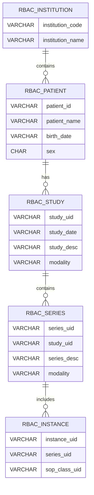

# 📘 RBAC Policy DB Schema v2.2 설계서

**(DICOM 메타데이터 확장 — 다기관 클라우드 대응 버전)**

**문서 버전:** v2.2

**작성일:** 2025-10-29

**작성자:** *(작성자 이름)*

**이전 버전:** v2.1 (단일기관용)

---

## 1️⃣ 설계 목적

본 문서는 RBAC 서버가 다기관 클라우드 환경에서

- **기관별 환자 식별 관리**,
- **Study/Series/Instance 관계 및 UID 접근제어**,
- **Project/Role 기반 정책 연동**
    
    을 수행할 수 있도록 스키마를 확장 정의한다.
    

---

## 2️⃣ 설계 원칙

| 항목 | 설명 |
| --- | --- |
| **비침투형 복제** | dcm4chee DB 원본에 영향 없음 |
| **기관별 격리(tenant)** | institution 단위 논리 분리 |
| **UID 중심 설계** | StudyUID, SeriesUID, InstanceUID 기준 |
| **환자 식별 독립성** | 병원마다 동일 PatientID여도 다른 entity |
| **QIDO/WADO 완전 대응** | DICOMweb 필드 매핑 100% 커버 |

---

## 3️⃣ 테이블 구조 개요

| 테이블 | 역할 |
| --- | --- |
| `rbac_institution` | 기관(병원) 정보 관리 |
| `rbac_patient` | 기관별 환자 정보 |
| `rbac_study` | Study 메타데이터 복제 |
| `rbac_series` | Series 메타데이터 복제 |
| `rbac_instance` | Instance 메타데이터 복제 |

---

## 4️⃣ 상세 설계

---

### 🏥 4.1. `rbac_institution`

기관 단위 테넌트 모델.

| 컬럼명 | 타입 | 설명 |
| --- | --- | --- |
| `id` | `BIGSERIAL` | PK |
| `institution_code` | `VARCHAR(128)` | 병원 코드 (예: HSP001) |
| `institution_name` | `VARCHAR(255)` | 병원명 |
| `created_at` | `TIMESTAMP DEFAULT NOW()` | 생성일 |
| `updated_at` | `TIMESTAMP DEFAULT NOW()` | 수정일 |

```sql
CREATE UNIQUE INDEX idx_institution_code ON rbac_institution(institution_code);

```

---

### 🧬 4.2. `rbac_patient`

기관별 환자 엔티티.

같은 환자가 여러 기관에 존재할 수 있음.

| 컬럼명 | 타입 | 설명 |
| --- | --- | --- |
| `id` | `BIGSERIAL` | PK |
| `institution_id` | `BIGINT` | FK → rbac_institution |
| `patient_id` | `VARCHAR(255)` | PACS 내부 PatientID |
| `patient_name` | `VARCHAR(255)` | 환자 이름 |
| `birth_date` | `VARCHAR(16)` | 생년월일 (선택) |
| `sex` | `CHAR(1)` | 성별 (선택) |
| `updated_at` | `TIMESTAMP DEFAULT NOW()` | 갱신일 |

```sql
ALTER TABLE rbac_patient
ADD CONSTRAINT fk_patient_institution FOREIGN KEY (institution_id)
REFERENCES rbac_institution(id) ON DELETE CASCADE;

CREATE UNIQUE INDEX idx_patient_per_institution
ON rbac_patient(institution_id, patient_id);

```

---

### 🧩 4.3. `rbac_study`

| 컬럼명 | 타입 | 설명 |
| --- | --- | --- |
| `id` | `BIGSERIAL` | PK |
| `study_uid` | `VARCHAR(255)` | DICOM StudyInstanceUID |
| `patient_id` | `BIGINT` | FK → rbac_patient |
| `study_date` | `VARCHAR(32)` | 검사일 |
| `study_desc` | `VARCHAR(512)` | Study 설명 |
| `accession_no` | `VARCHAR(255)` | 병원 Access Number |
| `modality` | `VARCHAR(64)` | ModalitiesInStudy |
| `created_time` | `TIMESTAMP` | 생성일시 |
| `updated_at` | `TIMESTAMP DEFAULT NOW()` | 수정일시 |

```sql
ALTER TABLE rbac_study
ADD CONSTRAINT fk_study_patient FOREIGN KEY (patient_id)
REFERENCES rbac_patient(id) ON DELETE CASCADE;

CREATE UNIQUE INDEX idx_rbac_study_uid ON rbac_study(study_uid);
CREATE INDEX idx_rbac_study_patient_id ON rbac_study(patient_id);
CREATE INDEX idx_rbac_study_date_mod ON rbac_study(study_date, modality);

```

---

### 🧩 4.4. `rbac_series`

| 컬럼명 | 타입 | 설명 |
| --- | --- | --- |
| `id` | `BIGSERIAL` | PK |
| `series_uid` | `VARCHAR(255)` | DICOM SeriesInstanceUID |
| `study_uid` | `VARCHAR(255)` | FK → rbac_study(study_uid) |
| `modality` | `VARCHAR(64)` | Modality |
| `body_part` | `VARCHAR(128)` | 촬영 부위 |
| `station_name` | `VARCHAR(255)` | 스테이션명 |
| `series_desc` | `VARCHAR(512)` | Series 설명 |
| `created_time` | `TIMESTAMP` | 생성일 |
| `updated_at` | `TIMESTAMP DEFAULT NOW()` | 수정일 |

```sql
ALTER TABLE rbac_series
ADD CONSTRAINT fk_rbac_series_study FOREIGN KEY (study_uid)
REFERENCES rbac_study(study_uid) ON DELETE CASCADE;

CREATE UNIQUE INDEX idx_rbac_series_uid ON rbac_series(series_uid);
CREATE INDEX idx_rbac_series_study_uid ON rbac_series(study_uid);
CREATE INDEX idx_rbac_series_modality ON rbac_series(modality);

```

---

### 🧩 4.5. `rbac_instance`

| 컬럼명 | 타입 | 설명 |
| --- | --- | --- |
| `id` | `BIGSERIAL` | PK |
| `instance_uid` | `VARCHAR(255)` | SOPInstanceUID |
| `series_uid` | `VARCHAR(255)` | FK → rbac_series(series_uid) |
| `sop_class_uid` | `VARCHAR(255)` | SOP Class UID |
| `num_frames` | `INT` | 프레임 수 |
| `content_date` | `VARCHAR(32)` | 생성일 |
| `content_time` | `VARCHAR(32)` | 생성시간 |
| `created_time` | `TIMESTAMP` | 생성일시 |
| `updated_at` | `TIMESTAMP DEFAULT NOW()` | 수정일시 |

```sql
ALTER TABLE rbac_instance
ADD CONSTRAINT fk_rbac_instance_series FOREIGN KEY (series_uid)
REFERENCES rbac_series(series_uid) ON DELETE CASCADE;

CREATE UNIQUE INDEX idx_rbac_instance_uid ON rbac_instance(instance_uid);
CREATE INDEX idx_rbac_instance_series_uid ON rbac_instance(series_uid);

```

---

## 5️⃣ ER 다이어그램



---

## 6️⃣ 다기관 RBAC 정책 연동 예시

| 엔티티 | 접근 범위 | 예시 |
| --- | --- | --- |
| `institution` | 병원 단위 | A병원 전용 사용자 |
| `patient` | 환자 단위 | 환자 홍길동의 모든 Study 접근 제한 |
| `study` | 검사 단위 | 특정 StudyUID 접근 허용 |
| `series` | 시리즈 단위 | 특정 SeriesUID 접근 허용 |
| `instance` | 이미지 단위 | SOPInstanceUID 기반 접근 허용 |

---

## 7️⃣ QIDO/WADO 대응 검증

| 프로토콜 | 대응 필드 | RBAC 테이블 |
| --- | --- | --- |
| **QIDO-RS /studies** | PatientID, PatientName, StudyDate, InstitutionName | rbac_patient, rbac_study |
| **QIDO-RS /series** | SeriesDescription, Modality, StudyUID | rbac_series |
| **QIDO-RS /instances** | SOPInstanceUID, SOPClassUID | rbac_instance |
| **WADO-RS** | StudyUID / SeriesUID / InstanceUID | 모든 테이블 UID |

> ✅ QIDO 100% 커버 / WADO 요청 UID 매핑 완벽 대응
> 

---

## 8️⃣ 결론

| 항목 | 설명 |
| --- | --- |
| **다기관 지원** | `rbac_institution` 기반으로 완전 분리 가능 |
| **환자 단위 정책 확장 가능** | `rbac_patient` 레벨 접근제어 추가 가능 |
| **QIDO/WADO 완전 대응** | Patient, Institution, UID 모두 포함 |
| **데이터 정합성** | Event + Delta Sync 로 유지 |
| **확장성** | Project/Role/AccessScope 연동 용이 |

---

> ✅ 최종 결론:
> 
> 
> 이 `v2.2` 구조는 “다기관 클라우드 PACS 환경에서의 RBAC 기반 DICOMweb 접근제어”에 완전 대응하며,
> 
> **기관 → 환자 → Study → Series → Instance** 계층적 RBAC 정책 설계가 가능함.
> 
> 이 구조를 기반으로 Sync Engine 및 Scope Resolver를 설계하면
> 
> 실질적인 Multi-Tenant 의료 데이터 접근제어 플랫폼으로 발전시킬 수 있습니다.
> 

---

원하신다면 이걸 바로 실행 가능한

📄 **`rbac_dicom_schema_v2_2.sql` (PostgreSQL)** 버전으로 정리해서 드릴까요?

→ 커서가 바로 테이블 생성 가능한 DDL 스크립트로 만들어드리겠습니다.