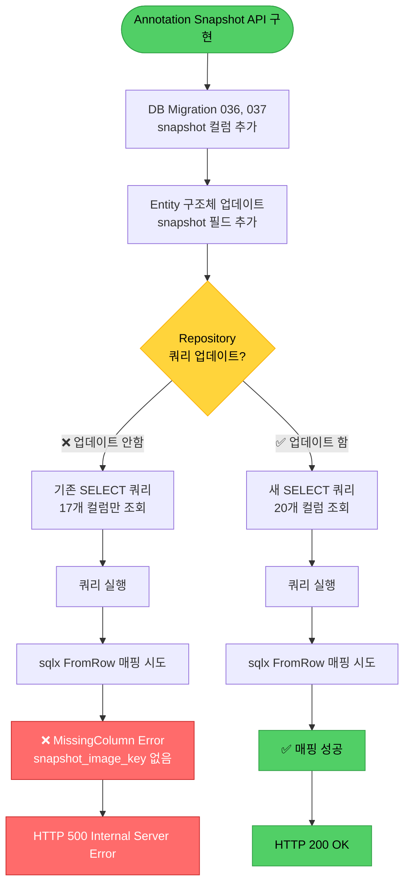
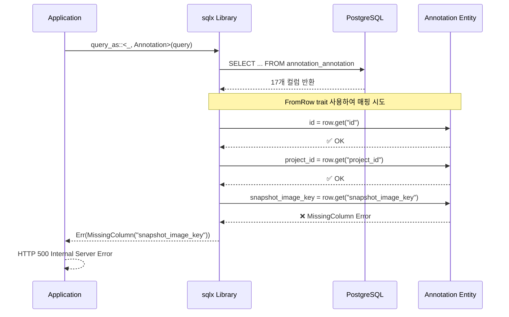
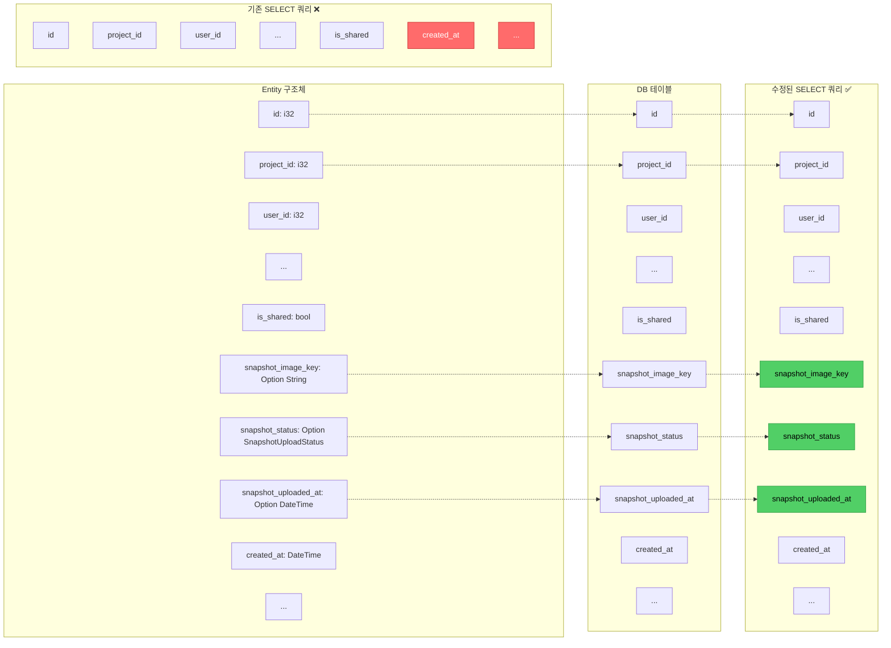
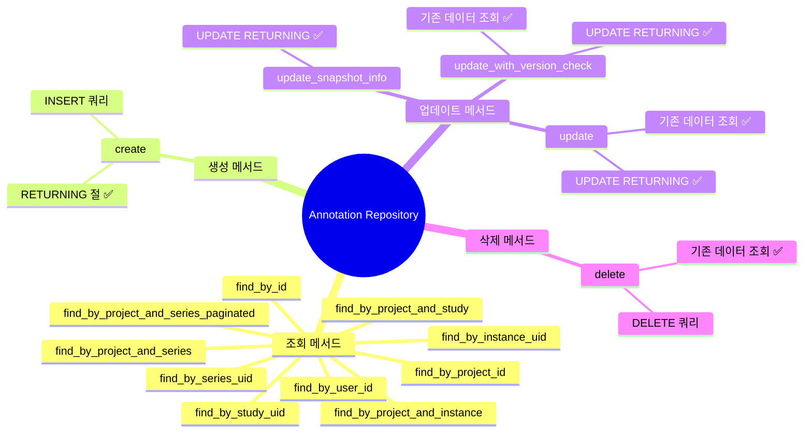
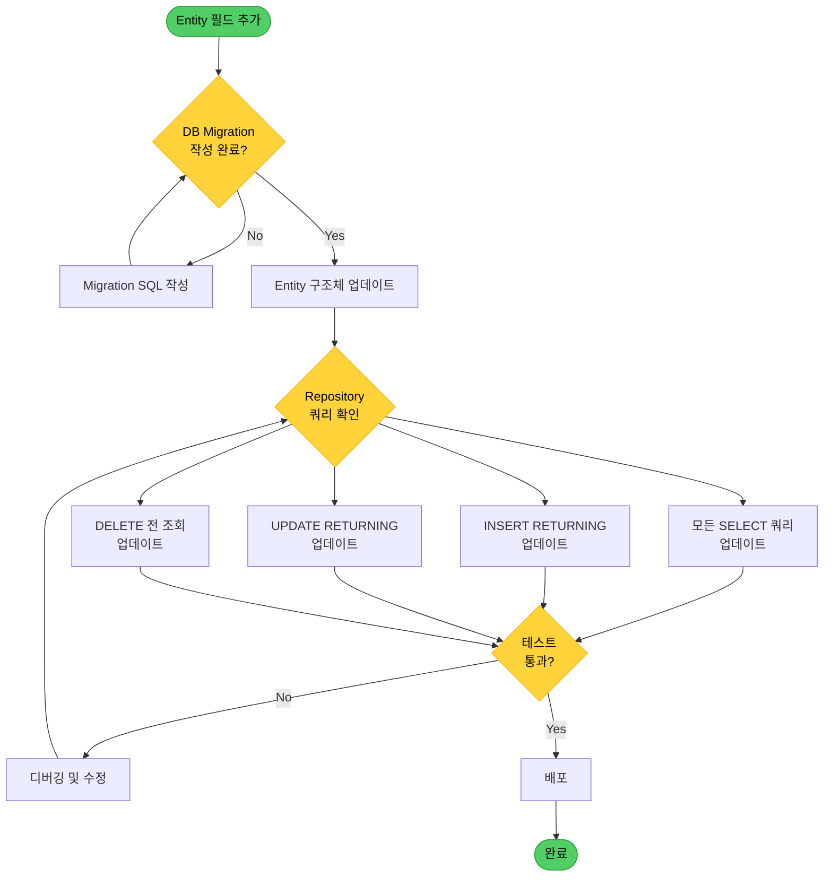
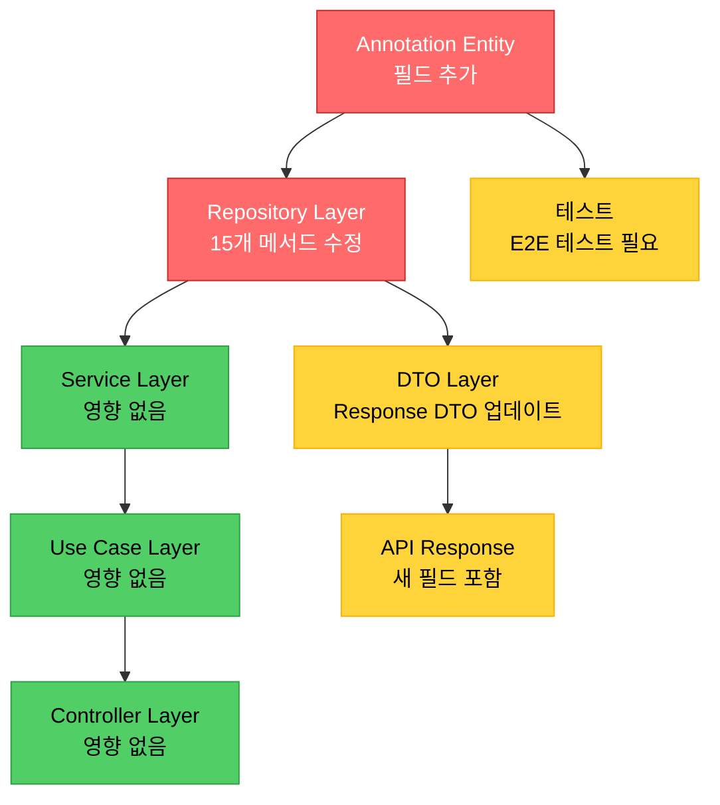

# 다이어그램

## 🔄 문제 발생 흐름

```mermaid
flowchart TD
    Start([Annotation Snapshot API 구현]) --> Migration[DB Migration 036, 037<br/>snapshot 컬럼 추가]
    Migration --> Entity[Entity 구조체 업데이트<br/>snapshot 필드 추가]
    Entity --> Problem{Repository<br/>쿼리 업데이트?}
    
    Problem -->|❌ 업데이트 안함| OldQuery[기존 SELECT 쿼리<br/>17개 컬럼만 조회]
    Problem -->|✅ 업데이트 함| NewQuery[새 SELECT 쿼리<br/>20개 컬럼 조회]
    
    OldQuery --> Execute[쿼리 실행]
    Execute --> Mapping[sqlx FromRow 매핑 시도]
    Mapping --> Error[❌ MissingColumn Error<br/>snapshot_image_key 없음]
    Error --> API500[HTTP 500 Internal Server Error]
    
    NewQuery --> Execute2[쿼리 실행]
    Execute2 --> Mapping2[sqlx FromRow 매핑 시도]
    Mapping2 --> Success[✅ 매핑 성공]
    Success --> API200[HTTP 200 OK]
    
    style Start fill:#51cf66,stroke:#2f9e44,color:#000
    style Problem fill:#ffd43b,stroke:#fab005,color:#000
    style Error fill:#ff6b6b,stroke:#c92a2a,color:#fff
    style API500 fill:#ff6b6b,stroke:#c92a2a,color:#fff
    style Success fill:#51cf66,stroke:#2f9e44,color:#000
    style API200 fill:#51cf66,stroke:#2f9e44,color:#000
```

---

## 🔍 sqlx 매핑 메커니즘

```mermaid
sequenceDiagram
    participant App as Application
    participant sqlx as sqlx Library
    participant DB as PostgreSQL
    participant Entity as Annotation Entity

    App->>sqlx: query_as::<_, Annotation>(query)
    sqlx->>DB: SELECT ... FROM annotation_annotation
    DB-->>sqlx: 17개 컬럼 반환
    
    Note over sqlx,Entity: FromRow trait 사용하여 매핑 시도
    
    sqlx->>Entity: id = row.get("id")
    Entity-->>sqlx: ✅ OK
    
    sqlx->>Entity: project_id = row.get("project_id")
    Entity-->>sqlx: ✅ OK
    
    sqlx->>Entity: snapshot_image_key = row.get("snapshot_image_key")
    Entity-->>sqlx: ❌ MissingColumn Error
    
    sqlx-->>App: Err(MissingColumn("snapshot_image_key"))
    App-->>App: HTTP 500 Internal Server Error
```

---

## 📊 Entity vs DB vs Query 비교

```mermaid
graph LR
    subgraph "Entity 구조체"
        E1[id: i32]
        E2[project_id: i32]
        E3[user_id: i32]
        E4[...]
        E5[is_shared: bool]
        E6[snapshot_image_key: Option String]
        E7[snapshot_status: Option SnapshotUploadStatus]
        E8[snapshot_uploaded_at: Option DateTime]
        E9[created_at: DateTime]
        E10[...]
    end
    
    subgraph "DB 테이블"
        D1[id]
        D2[project_id]
        D3[user_id]
        D4[...]
        D5[is_shared]
        D6[snapshot_image_key]
        D7[snapshot_status]
        D8[snapshot_uploaded_at]
        D9[created_at]
        D10[...]
    end
    
    subgraph "기존 SELECT 쿼리 ❌"
        Q1[id]
        Q2[project_id]
        Q3[user_id]
        Q4[...]
        Q5[is_shared]
        Q6[created_at]
        Q7[...]
    end
    
    subgraph "수정된 SELECT 쿼리 ✅"
        N1[id]
        N2[project_id]
        N3[user_id]
        N4[...]
        N5[is_shared]
        N6[snapshot_image_key]
        N7[snapshot_status]
        N8[snapshot_uploaded_at]
        N9[created_at]
        N10[...]
    end
    
    E1 -.-> D1
    E2 -.-> D2
    E6 -.-> D6
    E7 -.-> D7
    E8 -.-> D8
    
    D1 -.-> N1
    D2 -.-> N2
    D6 -.-> N6
    D7 -.-> N7
    D8 -.-> N8
    
    style Q6 fill:#ff6b6b,stroke:#c92a2a,color:#fff
    style Q7 fill:#ff6b6b,stroke:#c92a2a,color:#fff
    style N6 fill:#51cf66,stroke:#2f9e44,color:#000
    style N7 fill:#51cf66,stroke:#2f9e44,color:#000
    style N8 fill:#51cf66,stroke:#2f9e44,color:#000
```

---

## 🔧 수정 범위

```mermaid
mindmap
  root((Annotation Repository))
    조회 메서드
      find_by_id
      find_by_project_id
      find_by_user_id
      find_by_study_uid
      find_by_series_uid
      find_by_instance_uid
      find_by_project_and_study
      find_by_project_and_series
      find_by_project_and_instance
      find_by_project_and_series_paginated
    생성 메서드
      create
        INSERT 쿼리
        RETURNING 절 ✅
    업데이트 메서드
      update
        기존 데이터 조회 ✅
        UPDATE RETURNING ✅
      update_with_version_check
        기존 데이터 조회 ✅
        UPDATE RETURNING ✅
      update_snapshot_info
        UPDATE RETURNING ✅
    삭제 메서드
      delete
        기존 데이터 조회 ✅
        DELETE 쿼리
```

---

## 📈 수정 전후 비교

```mermaid
graph TB
    subgraph "Before (오류 발생)"
        B1[Entity: 20개 필드]
        B2[DB: 20개 컬럼]
        B3[SELECT: 17개 컬럼 ❌]
        B4[sqlx 매핑 실패]
        B5[HTTP 500 Error]
        
        B1 --> B2
        B2 --> B3
        B3 --> B4
        B4 --> B5
    end
    
    subgraph "After (정상 동작)"
        A1[Entity: 20개 필드]
        A2[DB: 20개 컬럼]
        A3[SELECT: 20개 컬럼 ✅]
        A4[sqlx 매핑 성공]
        A5[HTTP 200 OK]
        
        A1 --> A2
        A2 --> A3
        A3 --> A4
        A4 --> A5
    end
    
    style B3 fill:#ff6b6b,stroke:#c92a2a,color:#fff
    style B4 fill:#ff6b6b,stroke:#c92a2a,color:#fff
    style B5 fill:#ff6b6b,stroke:#c92a2a,color:#fff
    style A3 fill:#51cf66,stroke:#2f9e44,color:#000
    style A4 fill:#51cf66,stroke:#2f9e44,color:#000
    style A5 fill:#51cf66,stroke:#2f9e44,color:#000
```

---

## 🎯 Entity 변경 시 체크 플로우

```mermaid
flowchart TD
    Start([Entity 필드 추가]) --> Migration{DB Migration<br/>작성 완료?}
    Migration -->|No| WriteMigration[Migration SQL 작성]
    WriteMigration --> Migration
    Migration -->|Yes| EntityUpdate[Entity 구조체 업데이트]
    
    EntityUpdate --> RepoCheck{Repository<br/>쿼리 확인}
    
    RepoCheck --> Select[모든 SELECT 쿼리<br/>업데이트]
    RepoCheck --> Insert[INSERT RETURNING<br/>업데이트]
    RepoCheck --> Update[UPDATE RETURNING<br/>업데이트]
    RepoCheck --> Delete[DELETE 전 조회<br/>업데이트]
    
    Select --> Test{테스트<br/>통과?}
    Insert --> Test
    Update --> Test
    Delete --> Test
    
    Test -->|No| Debug[디버깅 및 수정]
    Debug --> RepoCheck
    
    Test -->|Yes| Deploy[배포]
    Deploy --> End([완료])
    
    style Start fill:#51cf66,stroke:#2f9e44,color:#000
    style Migration fill:#ffd43b,stroke:#fab005,color:#000
    style RepoCheck fill:#ffd43b,stroke:#fab005,color:#000
    style Test fill:#ffd43b,stroke:#fab005,color:#000
    style End fill:#51cf66,stroke:#2f9e44,color:#000
```

---

## 📊 영향 범위 분석

```mermaid
graph TD
    Entity[Annotation Entity<br/>필드 추가] --> Repo[Repository Layer<br/>15개 메서드 수정]
    
    Repo --> Service[Service Layer<br/>영향 없음]
    Service --> UseCase[Use Case Layer<br/>영향 없음]
    UseCase --> Controller[Controller Layer<br/>영향 없음]
    
    Repo --> DTO[DTO Layer<br/>Response DTO 업데이트]
    DTO --> API[API Response<br/>새 필드 포함]
    
    Entity --> Test[테스트<br/>E2E 테스트 필요]
    
    style Entity fill:#ff6b6b,stroke:#c92a2a,color:#fff
    style Repo fill:#ff6b6b,stroke:#c92a2a,color:#fff
    style Service fill:#51cf66,stroke:#2f9e44,color:#000
    style UseCase fill:#51cf66,stroke:#2f9e44,color:#000
    style Controller fill:#51cf66,stroke:#2f9e44,color:#000
    style DTO fill:#ffd43b,stroke:#fab005,color:#000
    style API fill:#ffd43b,stroke:#fab005,color:#000
    style Test fill:#ffd43b,stroke:#fab005,color:#000
```

