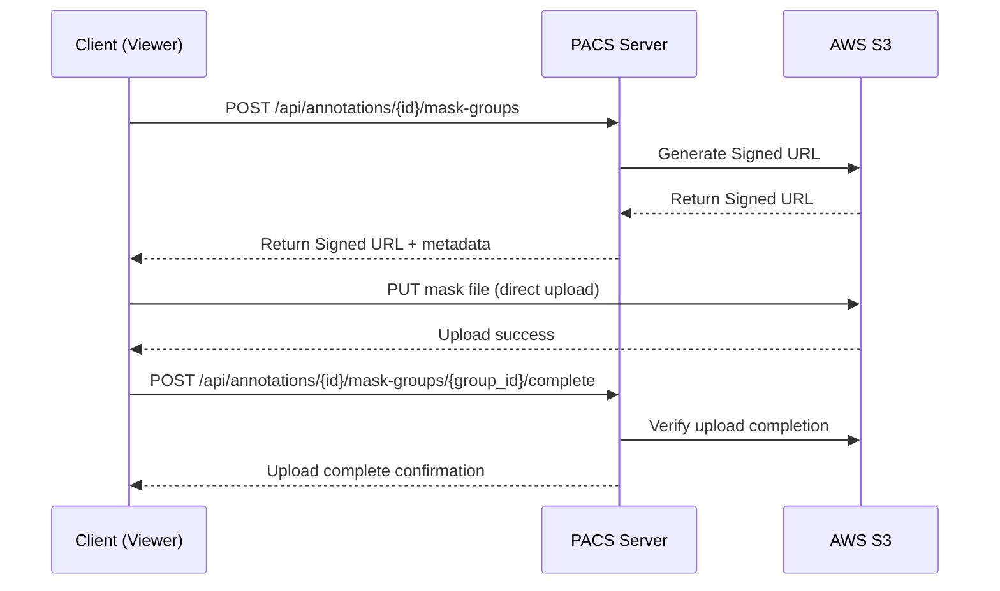

# 🚀 AWS S3 연동 기술문서

## 📋 개요

PACS Extension Server에 AWS S3 연동 기능을 추가하여 마스크 업로드 시스템의 Object Storage 기능을 구현했습니다. 이 문서는 S3 연동의 기술적 구현과 설정 방법을 상세히 설명합니다.

## 🏗️ 아키텍처 설계

### 1. **직접 업로드 패턴 (Direct Upload Pattern)**
```
Client (Viewer) → PACS Server → S3 Signed URL → Client → S3 Direct Upload
```

**장점:**
- 서버 부하 최소화 (파일 I/O 없음)
- 대역폭 효율성 (서버를 거치지 않음)
- 확장성 (서버 리소스 독립적)

### 2. **보안 모델**
- **Signed URL**: 시간 제한된 업로드 권한 (기본 10분)
- **IAM 정책**: 특정 경로(`mask/*`)에만 접근 허용
- **CORS 설정**: 허용된 도메인에서만 업로드 가능

## 🔧 기술적 구현

### 1. **의존성 추가**

#### Cargo.toml
```toml
[dependencies]
aws-sdk-s3 = "1.0"        # AWS S3 클라이언트
aws-config = "1.0"        # AWS 설정 관리
tokio-util = { version = "0.7", features = ["codec"] }  # 비동기 유틸리티
```

### 2. **설정 구조체 설계**

#### ObjectStorageConfig
```rust
#[derive(Debug, Deserialize, Clone)]
pub struct ObjectStorageConfig {
    pub provider: String,      // "s3" or "minio"
    pub bucket_name: String,   // S3 버킷 이름
    pub region: String,        // AWS 리전
    pub endpoint: String,      // MinIO 엔드포인트 (AWS S3는 빈 문자열)
    pub access_key: String,    // AWS Access Key ID
    pub secret_key: String,    // AWS Secret Access Key
}
```

#### SignedUrlConfig
```rust
#[derive(Debug, Deserialize, Clone)]
pub struct SignedUrlConfig {
    pub default_ttl: u64,  // 기본 만료 시간 (초)
    pub max_ttl: u64,      // 최대 만료 시간 (초)
}
```

### 3. **설정 파일 구조**

#### config/default.toml
```toml
[object_storage]
provider = "s3"  # "s3" or "minio"
bucket_name = "pacs-masks"
region = "us-east-1"
endpoint = ""  # MinIO endpoint (leave empty for AWS S3)
access_key = ""
secret_key = ""

[signed_url]
default_ttl = 600  # 10 minutes
max_ttl = 3600     # 1 hour
```

## ⚙️ 환경 설정

### 1. **AWS S3 설정**

#### 환경변수 (.env)
```bash
# AWS S3 설정
APP_OBJECT_STORAGE__PROVIDER=s3
APP_OBJECT_STORAGE__BUCKET_NAME=pacs-masks
APP_OBJECT_STORAGE__REGION=ap-northeast-2
APP_OBJECT_STORAGE__ENDPOINT=
APP_OBJECT_STORAGE__ACCESS_KEY=AKIA...
APP_OBJECT_STORAGE__SECRET_KEY=...

# Signed URL 설정
APP_SIGNED_URL__DEFAULT_TTL=600
APP_SIGNED_URL__MAX_TTL=3600
```

#### MinIO 설정 (로컬 개발용)
```bash
# MinIO 설정
APP_OBJECT_STORAGE__PROVIDER=minio
APP_OBJECT_STORAGE__BUCKET_NAME=pacs-masks
APP_OBJECT_STORAGE__REGION=us-east-1
APP_OBJECT_STORAGE__ENDPOINT=http://localhost:9000
APP_OBJECT_STORAGE__ACCESS_KEY=minioadmin
APP_OBJECT_STORAGE__SECRET_KEY=minioadmin
```

### 2. **AWS IAM 정책 설정**

#### 최소 권한 정책
```json
{
    "Version": "2012-10-17",
    "Statement": [
        {
            "Effect": "Allow",
            "Action": [
                "s3:PutObject",
                "s3:GetObject",
                "s3:DeleteObject"
            ],
            "Resource": "arn:aws:s3:::pacs-masks/mask/*"
        },
        {
            "Effect": "Allow",
            "Action": "s3:ListBucket",
            "Resource": "arn:aws:s3:::pacs-masks"
        }
    ]
}
```

### 3. **S3 버킷 CORS 설정**

```json
[
    {
        "AllowedHeaders": ["*"],
        "AllowedMethods": ["GET", "PUT", "POST", "DELETE"],
        "AllowedOrigins": [
            "http://localhost:3000",
            "http://localhost:8080",
            "https://your-domain.com"
        ],
        "ExposeHeaders": ["ETag"],
        "MaxAgeSeconds": 3000
    }
]
```

## 🔄 데이터 플로우

### 1. **마스크 업로드 플로우**



### 2. **파일 경로 구조**

```
pacs-masks/
└── mask/
    └── {annotation_id}/
        └── {group_id}/
            ├── 0001_liver.png
            ├── 0002_liver.png
            ├── 0001_spleen.png
            └── metadata.json
```

## 🛠️ 구현 세부사항

### 1. **Object Storage Service Trait**

```rust
#[async_trait]
pub trait ObjectStorageService: Send + Sync {
    async fn generate_upload_url(
        &self,
        file_path: &str,
        mime_type: &str,
        ttl_seconds: u64,
    ) -> Result<String, Box<dyn std::error::Error + Send + Sync>>;
    
    async fn generate_download_url(
        &self,
        file_path: &str,
        ttl_seconds: u64,
    ) -> Result<String, Box<dyn std::error::Error + Send + Sync>>;
    
    async fn delete_file(&self, file_path: &str) -> Result<(), Box<dyn std::error::Error + Send + Sync>>;
    
    async fn get_file_metadata(
        &self,
        file_path: &str,
    ) -> Result<UploadedFile, Box<dyn std::error::Error + Send + Sync>>;
}
```

### 2. **S3 Service 구현**

```rust
pub struct S3ObjectStorageService {
    client: S3Client,
    config: ObjectStorageConfig,
}

impl S3ObjectStorageService {
    pub fn new(client: S3Client, config: ObjectStorageConfig) -> Self {
        Self { client, config }
    }
}

#[async_trait]
impl ObjectStorageService for S3ObjectStorageService {
    async fn generate_upload_url(
        &self,
        file_path: &str,
        mime_type: &str,
        ttl_seconds: u64,
    ) -> Result<String, Box<dyn std::error::Error + Send + Sync>> {
        let presigning_config = PresigningConfig::expires_in(Duration::from_secs(ttl_seconds))?;
        
        let request = self
            .client
            .put_object()
            .bucket(&self.config.bucket_name)
            .key(file_path)
            .content_type(mime_type)
            .set_acl(Some(ObjectCannedAcl::Private))
            .presigned(presigning_config)
            .await?;

        Ok(request.uri().to_string())
    }
    // ... 다른 메서드들
}
```

## 🧪 테스트 방법

### 1. **AWS CLI 테스트**

```bash
# AWS CLI 설정
aws configure

# 버킷 접근 테스트
aws s3 ls s3://pacs-masks

# 파일 업로드 테스트
echo "test" > test.txt
aws s3 cp test.txt s3://pacs-masks/mask/test/test.txt
aws s3 rm s3://pacs-masks/mask/test/test.txt
```

### 2. **Rust 코드 테스트**

```rust
#[tokio::test]
async fn test_s3_connection() {
    let region_provider = RegionProviderChain::default_provider().or_else("ap-northeast-2");
    let config = aws_config::from_env().region(region_provider).load().await;
    let client = S3Client::new(&config);
    
    // 버킷 리스트 조회
    let response = client.list_buckets().send().await.unwrap();
    assert!(!response.buckets().unwrap().is_empty());
}
```

## 🔒 보안 고려사항

### 1. **접근 제어**
- **IAM 정책**: 최소 권한 원칙 적용
- **경로 제한**: `mask/*` 경로에만 접근 허용
- **시간 제한**: Signed URL 기본 10분, 최대 1시간

### 2. **데이터 보호**
- **암호화**: S3 서버 측 암호화 (SSE-S3) 사용
- **HTTPS**: 모든 통신은 HTTPS 강제
- **CORS**: 허용된 도메인에서만 업로드 가능

### 3. **비용 최적화**
- **스토리지 클래스**: Standard (자주 접근)
- **수명 주기**: 90일 후 IA, 1년 후 Glacier
- **버전 관리**: 비활성화 (마스크는 덮어쓰기)

## 📊 모니터링 및 로깅

### 1. **CloudWatch 메트릭**
- S3 요청 수 (PutObject, GetObject, DeleteObject)
- 데이터 전송량 (Bytes)
- 에러율 (4xx, 5xx)

### 2. **알람 설정**
```yaml
# CloudWatch 알람 예시
- MetricName: "4xxErrors"
  Threshold: 5
  ComparisonOperator: "GreaterThanThreshold"
  
- MetricName: "5xxErrors"  
  Threshold: 1
  ComparisonOperator: "GreaterThanThreshold"
```

### 3. **애플리케이션 로깅**
```rust
// 업로드 성공 로그
log::info!("File uploaded successfully: {}", file_path);

// 에러 로그
log::error!("Upload failed: {}", error);

// 성능 로그
log::debug!("Upload completed in {}ms", duration.as_millis());
```

## 🚨 문제 해결

### 1. **일반적인 오류**

#### Access Denied
```bash
# IAM 정책 확인
aws iam get-user-policy --user-name pacs-mask-uploader --policy-name S3MaskPolicy

# 버킷 정책 확인
aws s3api get-bucket-policy --bucket pacs-masks
```

#### CORS 오류
```bash
# CORS 설정 확인
aws s3api get-bucket-cors --bucket pacs-masks

# CORS 설정 업데이트
aws s3api put-bucket-cors --bucket pacs-masks --cors-configuration file://cors.json
```

#### 리전 불일치
- Access Key와 버킷이 같은 리전에 있는지 확인
- `ap-northeast-2` (서울) 권장

### 2. **성능 최적화**

#### 병렬 업로드
```rust
// 여러 파일 동시 업로드
let upload_tasks: Vec<_> = files
    .into_iter()
    .map(|file| upload_file_async(file))
    .collect();

let results = futures::future::join_all(upload_tasks).await;
```

#### 청크 업로드
```rust
// 대용량 파일 청크 단위 업로드
let mut upload = client
    .create_multipart_upload()
    .bucket(&bucket)
    .key(&key)
    .send()
    .await?;

// 각 청크 업로드
for (part_number, chunk) in chunks.enumerate() {
    let part = client
        .upload_part()
        .bucket(&bucket)
        .key(&key)
        .upload_id(&upload.upload_id)
        .part_number(part_number as i32 + 1)
        .body(chunk.into())
        .send()
        .await?;
}
```

## 📈 확장성 고려사항

### 1. **수평 확장**
- **CDN 연동**: CloudFront로 다운로드 가속화
- **지역 분산**: 여러 리전에 버킷 복제
- **로드 밸런싱**: 여러 서버 인스턴스

### 2. **수직 확장**
- **인스턴스 타입**: 더 큰 인스턴스로 업그레이드
- **네트워크**: 더 빠른 네트워크 대역폭
- **메모리**: 더 많은 메모리로 캐싱

## 🔄 마이그레이션 전략

### 1. **기존 파일 마이그레이션**
```bash
# S3로 기존 파일 마이그레이션
aws s3 sync /local/masks/ s3://pacs-masks/mask/ --delete
```

### 2. **점진적 마이그레이션**
- **Phase 1**: 새로운 업로드만 S3 사용
- **Phase 2**: 기존 파일 점진적 마이그레이션
- **Phase 3**: 로컬 스토리지 제거

## 📝 체크리스트

### **개발 환경 설정**
- [ ] AWS 계정 생성/로그인
- [ ] IAM 사용자 생성 (`pacs-mask-uploader`)
- [ ] IAM 정책 적용 (S3 마스크 업로드 권한)
- [ ] Access Key ID 및 Secret Key 복사
- [ ] S3 버킷 생성 (`pacs-masks`)
- [ ] CORS 설정
- [ ] 환경변수 설정 (`.env`)
- [ ] AWS CLI 테스트
- [ ] Rust 코드 테스트

### **프로덕션 배포**
- [ ] 프로덕션 환경변수 설정
- [ ] IAM 정책 프로덕션 버전 적용
- [ ] S3 버킷 프로덕션 설정
- [ ] 모니터링 및 알람 설정
- [ ] 백업 및 복구 절차 수립
- [ ] 보안 감사 수행

---

**📅 문서 작성일**: 2025-10-07  
**👨‍💻 작성자**: AI Assistant  
**🔄 마지막 업데이트**: 2025-10-07  
**📋 버전**: 1.0
