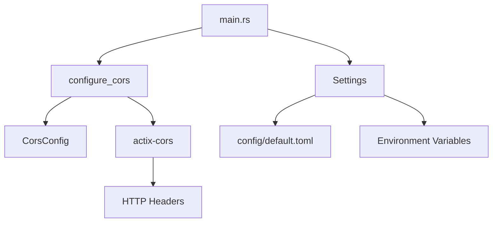

# CORS 개발 가이드

## 📋 목차
1. [개요](#개요)
2. [아키텍처 설계](#아키텍처-설계)
3. [구현 세부사항](#구현-세부사항)
4. [설정 관리](#설정-관리)
5. [보안 고려사항](#보안-고려사항)
6. [테스트 전략](#테스트-전략)
7. [운영 가이드](#운영-가이드)
8. [문제 해결](#문제-해결)

## 개요

### CORS란?
Cross-Origin Resource Sharing (CORS)는 웹 브라우저의 동일 출처 정책(Same-Origin Policy)을 우회하여 다른 도메인에서 리소스에 접근할 수 있도록 하는 메커니즘입니다.

### 프로젝트에서의 CORS 구현 목표
- **보안 우선**: 기본값으로 CORS 비활성화
- **유연성**: 환경별 설정 가능
- **성능**: Preflight 요청 최적화
- **개발자 경험**: 명확한 설정 옵션

## 아키텍처 설계

### 1. 계층 구조

```
┌─────────────────────────────────────┐
│           Presentation Layer        │
│  ┌─────────────────────────────────┐│
│  │        Actix Web App           ││
│  │  ┌─────────────────────────────┐││
│  │  │      CORS Middleware        │││
│  │  └─────────────────────────────┘││
│  │  ┌─────────────────────────────┐││
│  │  │    Cache Middleware         │││
│  │  └─────────────────────────────┘││
│  └─────────────────────────────────┘│
└─────────────────────────────────────┘
┌─────────────────────────────────────┐
│        Infrastructure Layer         │
│  ┌─────────────────────────────────┐│
│  │      CORS Configuration        ││
│  │  ┌─────────────────────────────┐││
│  │  │    Settings Management      │││
│  │  └─────────────────────────────┘││
│  └─────────────────────────────────┘│
└─────────────────────────────────────┘
```

### 2. 의존성 관계



## 구현 세부사항

### 1. CORS 설정 구조체

```rust
#[derive(Debug, Deserialize, Clone)]
pub struct CorsConfig {
    pub enabled: bool,                    // CORS 활성화 여부
    pub allowed_origins: Vec<String>,     // 허용된 오리진 목록
    pub allowed_methods: Vec<String>,     // 허용된 HTTP 메서드
    pub allowed_headers: Vec<String>,     // 허용된 헤더
    pub expose_headers: Vec<String>,      // 노출할 헤더
    pub max_age: u64,                     // Preflight 캐시 시간
}
```

### 2. CORS 미들웨어 구현

#### 핵심 로직
```rust
pub fn configure_cors(cors_config: &CorsConfig) -> Cors {
    if !cors_config.enabled {
        // CORS 비활성화 시 기본 설정 (모든 오리진 허용)
        return Cors::default()
            .allow_any_origin()
            .allowed_methods(vec!["GET", "POST", "PUT", "DELETE", "OPTIONS"])
            .allowed_headers(vec![
                header::AUTHORIZATION,
                header::ACCEPT,
                header::CONTENT_TYPE,
            ])
            .max_age(3600);
    }

    // CORS 활성화 시 설정에 따른 정책 적용
    let mut cors = Cors::default();
    
    // 오리진 설정
    if cors_config.allowed_origins.is_empty() {
        cors = cors.allow_any_origin();
    } else if cors_config.allowed_origins.contains(&"*".to_string()) {
        cors = cors.allow_any_origin();
    } else {
        for origin in &cors_config.allowed_origins {
            cors = cors.allowed_origin(origin.as_str());
        }
    }
    
    // 메서드 설정
    let methods: Vec<&str> = cors_config.allowed_methods.iter().map(|s| s.as_str()).collect();
    cors = cors.allowed_methods(methods);
    
    // 헤더 설정
    let headers: Vec<header::HeaderName> = cors_config
        .allowed_headers
        .iter()
        .filter_map(|h| h.parse().ok())
        .collect();
    
    if headers.is_empty() {
        cors = cors.allowed_headers(vec![
            header::AUTHORIZATION,
            header::ACCEPT,
            header::CONTENT_TYPE,
        ]);
    } else {
        cors = cors.allowed_headers(headers);
    }
    
    // 노출 헤더 설정
    if !cors_config.expose_headers.is_empty() {
        let expose_headers: Vec<header::HeaderName> = cors_config
            .expose_headers
            .iter()
            .filter_map(|h| h.parse().ok())
            .collect();
        cors = cors.expose_headers(expose_headers);
    }
    
    // Preflight 캐시 시간 설정
    cors = cors.max_age(cors_config.max_age as usize);
    
    cors
}
```

### 3. 설정 통합

#### main.rs에서의 적용
```rust
// 설정 로드
let settings = Settings::new().expect("Failed to load configuration");

// CORS 설정 출력
println!("✅ {} (Origins: {:?})", 
    if settings.cors.enabled { "Enabled" } else { "Disabled" }, 
    settings.cors.allowed_origins
);

// 미들웨어 적용
HttpServer::new(move || {
    App::new()
        .wrap(configure_cors(&settings.cors))  // CORS 미들웨어
        .wrap(CacheHeaders::new(cache_enabled, cache_ttl))
        // ... 기타 미들웨어
})
```

## 설정 관리

### 1. 기본 설정 (config/default.toml)

```toml
[cors]
enabled = false  # 기본값: CORS 비활성화
allowed_origins = ["http://localhost:3000", "http://localhost:8080"]
allowed_methods = ["GET", "POST", "PUT", "DELETE", "OPTIONS"]
allowed_headers = ["Content-Type", "Authorization", "X-Requested-With"]
expose_headers = ["Content-Length", "X-Total-Count"]
max_age = 3600
```

### 2. 환경별 설정

#### 개발 환경 (config/development.toml)
```toml
[cors]
enabled = true
allowed_origins = ["http://localhost:3000", "http://localhost:3001", "http://127.0.0.1:3000"]
```

#### 프로덕션 환경 (config/production.toml)
```toml
[cors]
enabled = true
allowed_origins = ["https://myapp.com", "https://www.myapp.com"]
max_age = 86400  # 24시간
```

### 3. 환경 변수 오버라이드

```bash
# 환경 변수로 CORS 설정
export APP_CORS__ENABLED=true
export APP_CORS__ALLOWED_ORIGINS='["https://myapp.com"]'
export APP_CORS__MAX_AGE=7200
```

### 4. 설정 우선순위

1. **환경 변수** (최고 우선순위)
2. **환경별 설정 파일** (config/{environment}.toml)
3. **기본 설정 파일** (config/default.toml)

## 보안 고려사항

### 1. 기본 보안 정책

#### CORS 비활성화 시
```rust
// 모든 오리진 허용 (개발용)
Cors::default()
    .allow_any_origin()
    .allowed_methods(vec!["GET", "POST", "PUT", "DELETE", "OPTIONS"])
    .max_age(3600);
```

#### CORS 활성화 시
```rust
// 명시적으로 허용된 오리진만 허용
for origin in &cors_config.allowed_origins {
    cors = cors.allowed_origin(origin.as_str());
}
```

### 2. 보안 모범 사례

#### 오리진 검증
```rust
// 와일드카드 오리진 처리
if cors_config.allowed_origins.contains(&"*".to_string()) {
    cors = cors.allow_any_origin();
} else {
    // 정확한 오리진만 허용
    for origin in &cors_config.allowed_origins {
        cors = cors.allowed_origin(origin.as_str());
    }
}
```

#### 헤더 검증
```rust
// 안전한 기본 헤더 설정
if headers.is_empty() {
    cors = cors.allowed_headers(vec![
        header::AUTHORIZATION,
        header::ACCEPT,
        header::CONTENT_TYPE,
    ]);
}
```

### 3. 프로덕션 보안 체크리스트

- [ ] 와일드카드 오리진(`*`) 사용 금지
- [ ] HTTPS 오리진만 허용
- [ ] 불필요한 헤더 노출 방지
- [ ] 적절한 Preflight 캐시 시간 설정
- [ ] 정기적인 오리진 목록 검토

## 테스트 전략

### 1. 단위 테스트

```rust
#[cfg(test)]
mod tests {
    use super::*;

    #[test]
    fn test_cors_disabled() {
        let config = CorsConfig {
            enabled: false,
            allowed_origins: vec![],
            allowed_methods: vec![],
            allowed_headers: vec![],
            expose_headers: vec![],
            max_age: 0,
        };

        let cors = configure_cors(&config);
        assert!(cors.max_age().is_some());
    }

    #[test]
    fn test_cors_enabled_with_origins() {
        let config = CorsConfig {
            enabled: true,
            allowed_origins: vec!["http://localhost:3000".to_string()],
            allowed_methods: vec!["GET".to_string(), "POST".to_string()],
            allowed_headers: vec!["Content-Type".to_string()],
            expose_headers: vec!["Content-Length".to_string()],
            max_age: 3600,
        };

        let cors = configure_cors(&config);
        assert!(cors.max_age().is_some());
        assert_eq!(cors.max_age().unwrap(), 3600);
    }
}
```

### 2. 통합 테스트

#### 허용된 오리진 테스트
```bash
# 허용된 오리진으로 OPTIONS 요청
curl -X OPTIONS http://localhost:8080/api/annotations \
  -H "Origin: http://localhost:3000" \
  -v

# 예상 응답 헤더:
# access-control-allow-origin: http://localhost:3000
# access-control-expose-headers: x-total-count, content-length
# vary: Origin, Access-Control-Request-Method, Access-Control-Request-Headers
```

#### 차단된 오리진 테스트
```bash
# 허용되지 않은 오리진으로 OPTIONS 요청
curl -X OPTIONS http://localhost:8080/api/annotations \
  -H "Origin: http://example.com" \
  -v

# 예상 응답: access-control-allow-origin 헤더 없음
```

#### 실제 요청 테스트
```bash
# GET 요청으로 CORS 헤더 확인
curl -X GET http://localhost:8080/api/annotations?user_id=336 \
  -H "Origin: http://localhost:3000" \
  -v
```

### 3. 성능 테스트

#### Preflight 캐시 테스트
```bash
# 첫 번째 OPTIONS 요청
time curl -X OPTIONS http://localhost:8080/api/annotations \
  -H "Origin: http://localhost:3000" \
  -v

# 두 번째 OPTIONS 요청 (캐시된 응답)
time curl -X OPTIONS http://localhost:8080/api/annotations \
  -H "Origin: http://localhost:3000" \
  -v
```

## 운영 가이드

### 1. 환경별 배포 설정

#### 개발 환경
```bash
# 개발 서버 시작
export RUN_ENV=development
cargo run

# CORS 활성화 확인
curl -X OPTIONS http://localhost:8080/api/annotations \
  -H "Origin: http://localhost:3000" \
  -v
```

#### 스테이징 환경
```bash
# 스테이징 환경 설정
export RUN_ENV=staging
export APP_CORS__ENABLED=true
export APP_CORS__ALLOWED_ORIGINS='["https://staging.myapp.com"]'
cargo run --release
```

#### 프로덕션 환경
```bash
# 프로덕션 환경 설정
export RUN_ENV=production
export APP_CORS__ENABLED=true
export APP_CORS__ALLOWED_ORIGINS='["https://myapp.com", "https://www.myapp.com"]'
export APP_CORS__MAX_AGE=86400
cargo run --release
```

### 2. 모니터링

#### CORS 헤더 모니터링
```bash
# CORS 헤더 확인 스크립트
#!/bin/bash
echo "Testing CORS configuration..."

# 허용된 오리진 테스트
echo "Testing allowed origin..."
curl -s -X OPTIONS http://localhost:8080/api/annotations \
  -H "Origin: http://localhost:3000" \
  -I | grep -i "access-control"

# 차단된 오리진 테스트
echo "Testing blocked origin..."
curl -s -X OPTIONS http://localhost:8080/api/annotations \
  -H "Origin: http://malicious.com" \
  -I | grep -i "access-control"
```

#### 로그 모니터링
```rust
// CORS 설정 로그
println!("🌐 Configuring CORS... ");
let cors_enabled = settings.cors.enabled;
println!("✅ {} (Origins: {:?})", 
    if cors_enabled { "Enabled" } else { "Disabled" }, 
    settings.cors.allowed_origins
);
```

### 3. 설정 변경 절차

#### 1단계: 설정 파일 수정
```toml
# config/production.toml
[cors]
enabled = true
allowed_origins = ["https://myapp.com", "https://newdomain.com"]
```

#### 2단계: 설정 검증
```bash
# 설정 로드 테스트
cargo run --bin config_test
```

#### 3단계: 스테이징 배포
```bash
# 스테이징 환경에서 테스트
export RUN_ENV=staging
cargo run
```

#### 4단계: 프로덕션 배포
```bash
# 프로덕션 배포
export RUN_ENV=production
cargo run --release
```

## 문제 해결

### 1. 일반적인 문제

#### CORS 헤더가 없는 경우
**증상**: 브라우저에서 CORS 오류 발생
**원인**: CORS 미들웨어가 적용되지 않음
**해결책**:
```rust
// main.rs에서 미들웨어 순서 확인
App::new()
    .wrap(configure_cors(&settings.cors))  // 첫 번째로 적용
    .wrap(CacheHeaders::new(cache_enabled, cache_ttl))
```

#### OPTIONS 요청이 404를 반환하는 경우
**증상**: Preflight 요청 실패
**원인**: 라우팅 설정 문제
**해결책**:
```rust
// 모든 HTTP 메서드 허용 확인
allowed_methods = ["GET", "POST", "PUT", "DELETE", "OPTIONS"]
```

#### 특정 오리진이 차단되는 경우
**증상**: 허용된 오리진인데도 CORS 오류
**원인**: 오리진 문자열 불일치
**해결책**:
```rust
// 정확한 오리진 문자열 확인
allowed_origins = ["https://myapp.com"]  // http vs https 주의
```

### 2. 디버깅 도구

#### CORS 헤더 확인
```bash
# curl로 CORS 헤더 확인
curl -X OPTIONS http://localhost:8080/api/annotations \
  -H "Origin: http://localhost:3000" \
  -v 2>&1 | grep -i "access-control"
```

#### 설정 값 확인
```rust
// 런타임 설정 출력
println!("CORS Config: {:?}", settings.cors);
```

#### 브라우저 개발자 도구
```javascript
// 브라우저 콘솔에서 CORS 요청 테스트
fetch('http://localhost:8080/api/annotations?user_id=336', {
    method: 'GET',
    headers: {
        'Origin': 'http://localhost:3000'
    }
})
.then(response => {
    console.log('CORS Headers:', response.headers);
    return response.json();
})
.then(data => console.log('Data:', data));
```

### 3. 성능 최적화

#### Preflight 캐시 최적화
```toml
# config/production.toml
[cors]
max_age = 86400  # 24시간 캐시
```

#### 불필요한 헤더 제거
```toml
# 최소한의 헤더만 노출
expose_headers = ["Content-Length"]  # X-Total-Count 제거
```

#### 메서드 최적화
```toml
# 실제 사용하는 메서드만 허용
allowed_methods = ["GET", "POST", "PUT", "DELETE"]  # OPTIONS 제거 가능
```

## 결론

이 CORS 구현은 다음과 같은 특징을 가집니다:

1. **보안 우선**: 기본값으로 CORS 비활성화
2. **유연성**: 환경별 설정 가능
3. **성능**: Preflight 캐시 최적화
4. **개발자 친화적**: 명확한 설정 옵션과 디버깅 도구

이 가이드를 따라 CORS를 안전하고 효율적으로 관리할 수 있습니다.

---

**문서 버전**: 1.0  
**최종 업데이트**: 2025-10-08  
**작성자**: PACS Extension Server Development Team
